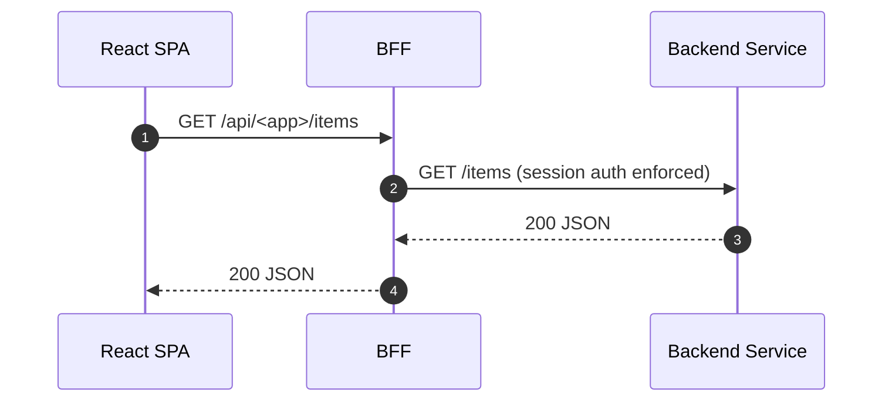

Audience: React SPA developers building a new app or migrating to the BFF.

What you’ll do

- Configure your SPA to talk only to the BFF (no direct service URLs)
- Wire `@empowernow/bff-auth-react` for session-based auth
- Use the shared API client that relies on cookies (no Authorization headers)
- Call canonical `/api/...` routes that the BFF maps to backend services
- Align the Neon Flux UI using `@empowernow/ui`

Important conventions
- No `@bff/...` alias: use `@empowernow/bff-auth-react` and set the base URL.
- Avoid double `/api`: either call `apiClient.get('/crud/...')` with baseUrl set to `/api`, or call `fetch('/api/crud/...')` directly. Do not combine both (which leads to `/api/api/...`).

Environment variables

- `VITE_BFF_BASE_URL`: e.g., `https://bff.ocg.labs.empowernow.ai` or `/api` for same-origin. Both `idp_ui` and `pdp_ui` set this and default to `/api`.
- OIDC values stay in the platform; BFF handles OAuth (no browser SDK needed).

App wiring (verified)

```ts title="src/main.tsx (pattern used in idp_ui and pdp_ui)"
import { AuthProvider, setBaseUrl } from '@empowernow/bff-auth-react'

setBaseUrl(import.meta.env.VITE_BFF_BASE_URL || '/api')

createRoot(document.getElementById('root')!).render(
  <AuthProvider baseUrl={import.meta.env.VITE_BFF_BASE_URL || '/api'} pollIntervalMs={300000}>
    <App />
  </AuthProvider>
)
```

Route guarding (verified)

```tsx title="src/components/auth/AuthGuard.tsx"
import { useAuth } from '@empowernow/bff-auth-react'
// Redirect unauthenticated users to /login, preserve returnUrl
```

Calling APIs (verified)

- Use your app’s `fetchWithAuth` wrapper which delegates to `apiClient` from `@empowernow/bff-auth-react`.
- It strips a leading `/api` and relies on cookies; no Authorization header required.

```ts title="lib/api/base.ts"
import { apiClient } from '@empowernow/bff-auth-react'

// Option A: apiClient with baseUrl '/api'
apiClient.get('/crud/forms')
apiClient.post('/crud/workflows', payload)

// Option B: native fetch with explicit '/api' prefix
await fetch('/api/crud/forms', { credentials: 'include' })
```

UI theming (verified)

- Import `@empowernow/ui/dist/index.css` and tokens; use components like `GlassCard`, `HeaderNav`.

```ts
import '@empowernow/ui/dist/index.css'
```

How the BFF routes your calls (verified)

- BFF maps canonical SPA paths to backend services per `routes.yaml`:
  - `/api/crud/forms/*` → `crud_service` (auth: `session`)
  - `/api/idp/admin/*` → `idp_service` (auth: `session`)
  - `/api/v1/analytics/*` → `analytics_service` (auth: `session`)

Snippet from configuration

```yaml
- id: "crud-forms"
  path: "/api/crud/forms/*"
  target_service: "crud_service"
  upstream_path: "/forms/{path}"
  methods: ["GET", "POST", "PUT", "DELETE", "OPTIONS"]
  auth: "session"
```

Routing diagram (at a glance)

```mermaid
flowchart LR
  UI[SPA] -->|GET /api/myapp/items/123 (cookie)| Traefik
  Traefik --> BFF
  subgraph BFF
    R[(routes.yaml: path→upstream_path)]
  end
  BFF -->|GET /items/123 + Authorization + X-Correlation-ID| SVC[my_service]
  SVC --> BFF --> UI
```

Mental model

- `/api` is the BFF entrypoint. The SPA calls `/api/<app>/...`, and the BFF translates that to the real backend path per `routes.yaml`.

Automation Studio (Visual Designer) specifics

- App: React SPA front end for CRUDService.
- Paths it calls (same origin):
  - CRUD and SSE: `/api/crud/...` (EventSource updated to use same-origin base)
  - PDP (AuthZEN): `/access/v1/evaluation` and `/access/v1/evaluations` (preserved path)
- Traefik routes those requests to the BFF; the BFF proxies per `ServiceConfigs/BFF/config/routes.yaml`:
  - CRUD via `crud_service`
  - PDP via `pdp_service` with `preserve_path: true`
- Cookies/credentials: ensure they are included
  - fetch: `credentials: 'include'`
  - axios: `{ withCredentials: true }`
  - EventSource (dev cross-origin): `new EventSource(url, { withCredentials: true })` (same-origin sends cookies automatically)

Examples

```ts
// fetch (same-origin or cross-origin dev)
await fetch('/api/crud/items', { method: 'GET', credentials: 'include' });

// axios
await axios.post('/access/v1/evaluation', body, { withCredentials: true });

// SSE
const es = new EventSource('/api/crud/sse/stream'); // same-origin
// cross-origin dev
const esDev = new EventSource('http://localhost:8000/api/crud/sse/stream', { withCredentials: true });
```

Add your app’s API surface

1) Add a backend service under `services` with `base_url`.
2) Add route entries under `routes` with your canonical `/api/<app>/*` paths, `auth: session`, and an `upstream_path` to your backend.

Request flow



Do and don’t

- Do: set `VITE_BFF_BASE_URL` and let the BFF handle auth and cookies
- Do: call `/api/...` only; avoid hard-coding service URLs
- Don’t: manually attach `Authorization` headers for same-origin BFF calls

Local development

- When the SPA is hosted separately, set `VITE_BFF_BASE_URL` to the BFF origin (e.g., `http://localhost:3000/api`) and ensure CORS allows your UI origin.

Troubleshooting

- 401/redirect loops: confirm `AuthProvider` is wrapping `<App />` and baseUrl is correct
- 403: PDP denied; verify your account roles/permissions and the route’s `auth: session`
- Network errors: ensure your route exists in `routes.yaml` and upstream service is reachable

Automation Studio (Visual Designer) checklist

- [ ] SPA uses same-origin endpoints only
  - [ ] CRUD + SSE: `/api/crud/...`
  - [ ] PDP (AuthZEN): `/access/v1/evaluation` and `/access/v1/evaluations`
- [ ] `routes.yaml` contains required entries
  - [ ] CRUD routes → `crud_service`
  - [ ] PDP routes → `pdp_service` with `preserve_path: true`
- [ ] Browser credentials included
  - [ ] fetch: `credentials: 'include'`
  - [ ] axios: `{ withCredentials: true }`
  - [ ] SSE cross-origin dev: `{ withCredentials: true }`
- [ ] Dev vs Prod base URL
  - [ ] Dev: `VITE_BFF_BASE_URL` points at BFF origin; CORS allows UI
  - [ ] Prod: `VITE_BFF_BASE_URL` = `/api`


