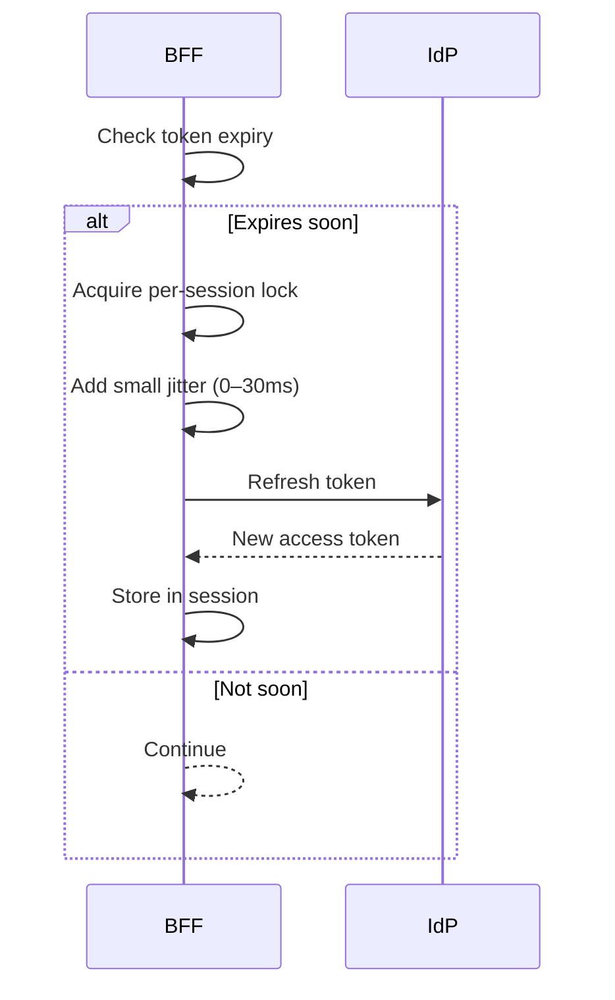

The architecture docs specify refreshing access tokens a few minutes before expiry, with singleflight locks and jitter to prevent thundering herds.

Flow (from docs)



What to adjust

- Refresh window (per‑request): configured as `token_refresh_threshold` in `ms_bff_spike/ms_bff/src/core/config.py` (default 300 seconds = 5 minutes). You can change the default or wire an env var in your settings loader.
- Background sweep interval: `BackgroundTokenRefresh(check_interval=300)` in `ms_bff_spike/ms_bff/src/services/token_refresh.py`, started in `infrastructure/startup.py`. Pass a different interval to adjust.
- Singleflight behavior: implemented in `ms_bff_spike/ms_bff/src/services/session_manager.py` (locks and in‑flight tracking). No tuning needed unless customizing concurrency.
- Jitter: keep small (tens of ms) to avoid synchronized refreshes if you add it; current implementation relies on singleflight primarily.

Examples

Increase background sweep to every 2 minutes (more aggressive):

```python
# ms_bff_spike/ms_bff/src/infrastructure/startup.py
from ms_bff.src.services.token_refresh import BackgroundTokenRefresh
token_refresh = BackgroundTokenRefresh(check_interval=120)
await token_refresh.start()
```

Lower per‑request threshold to 2 minutes (120s):

```python
# ms_bff_spike/ms_bff/src/core/config.py
class BFFServiceConfig(BaseModel):
    token_refresh_threshold: int = 120
```

Verify

- Check logs for refresh attempts and success/fail counters.
- Simulate near‑expiry sessions and ensure only one refresh happens per session window.
- Watch metrics `bff_token_refresh_success_total` and `bff_token_refresh_failed_total`.

References

- Code: `core/config.py`, `services/session_manager.py`, `services/token_refresh.py`, `services/idp_client.py`
- Reference: Observability (metrics)


