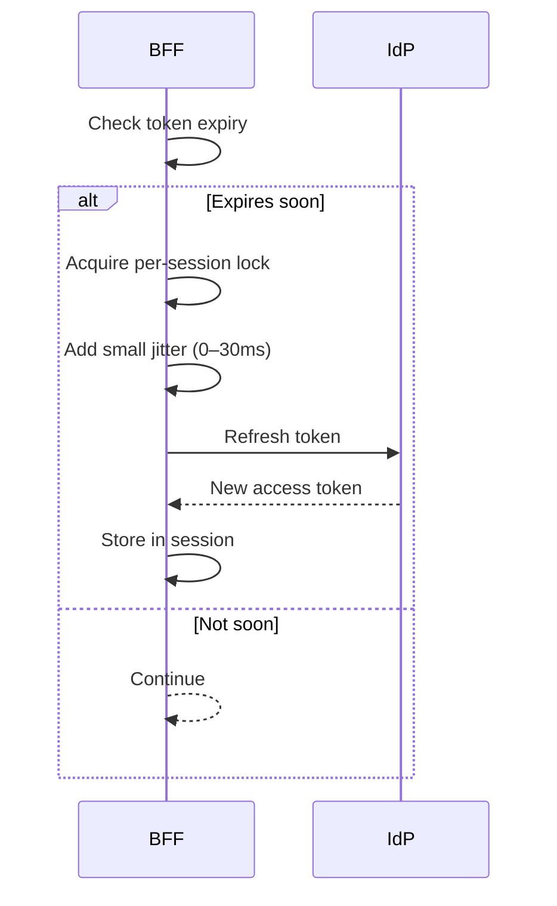

The architecture docs specify refreshing access tokens a few minutes before expiry, with singleflight locks and jitter to prevent thundering herds.

Flow (from docs)

What to adjust

- Refresh window: default ~5 minutes (per docs). Increase if IdP is slow; decrease for short‑lived sessions.
- Jitter: keep small (tens of ms) to avoid synchronized refreshes.

Verify

- Check logs for refresh attempts and success/fail counters (see metrics page).
- Simulate near‑expiry sessions and ensure only one refresh happens per session window.

