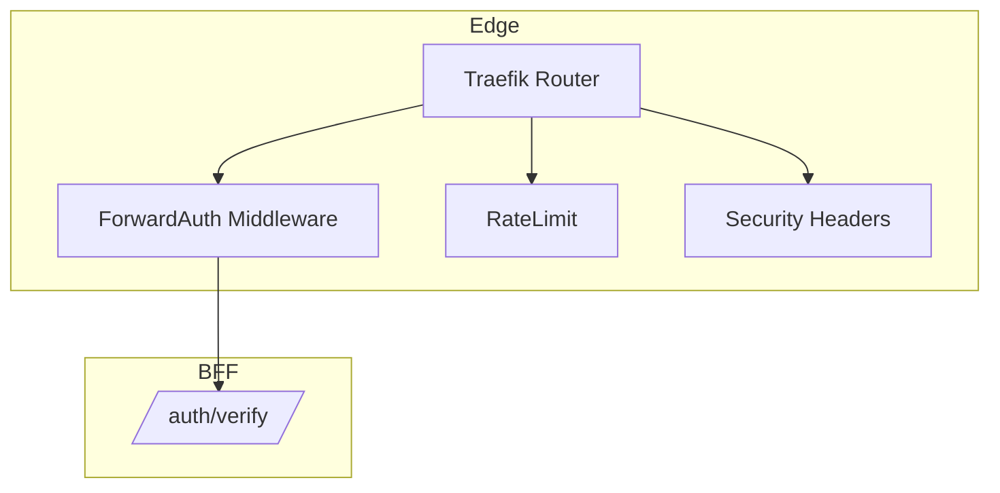

Verified Traefik config for BFF authentication.

Key fields (from `k8s/ingress.yaml`):
- Middleware (CRD):
  - `forwardAuth.address: http://bff-service.empowernow.svc.cluster.local:8000/auth/verify`
  - `forwardAuth.trustForwardHeader: true`
  - `forwardAuth.authResponseHeaders: ["X-User-ID", "X-Session-ID", "X-Auth-Time", ...]`
  - `forwardAuth.authRequestHeaders: ["Cookie", "User-Agent", "X-Forwarded-For", ...]`
- Ingress annotations link the ForwardAuth and rate limit middlewares
- TLS via cert-manager issuer

Notes:
- Use the alias `/auth/forward` if configured; code provides `/auth/verify` endpoint.
- Don’t apply ForwardAuth to static SPA assets.
