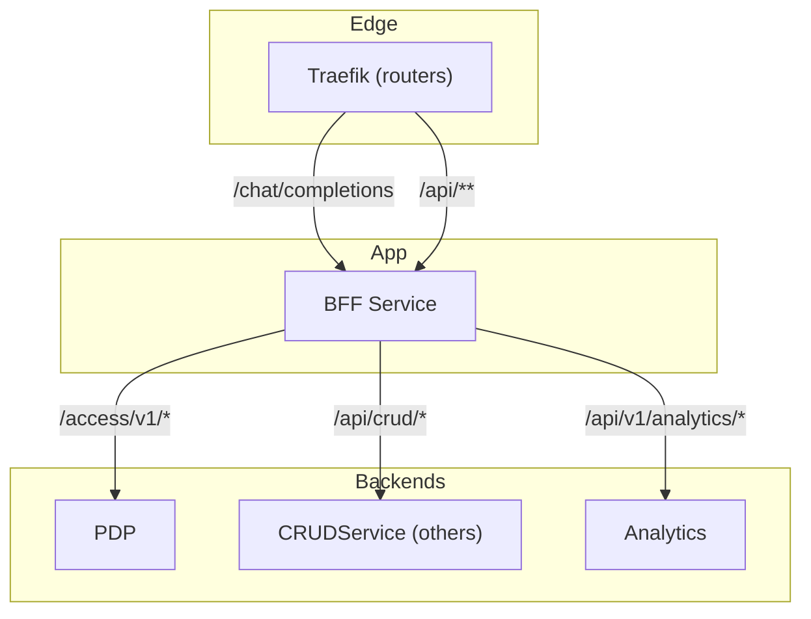
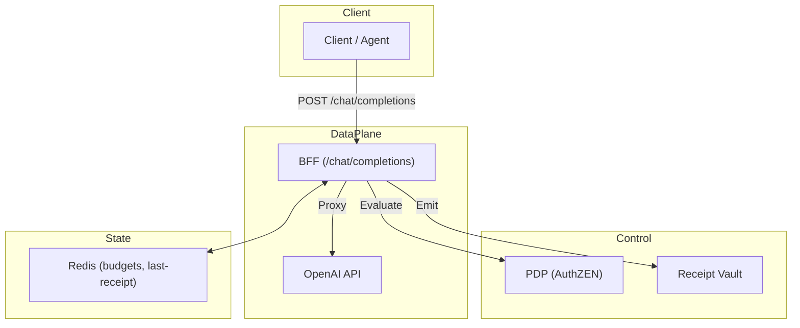
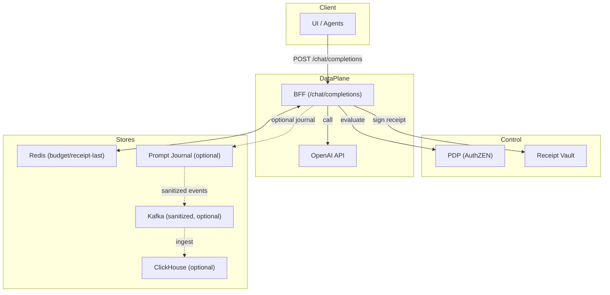
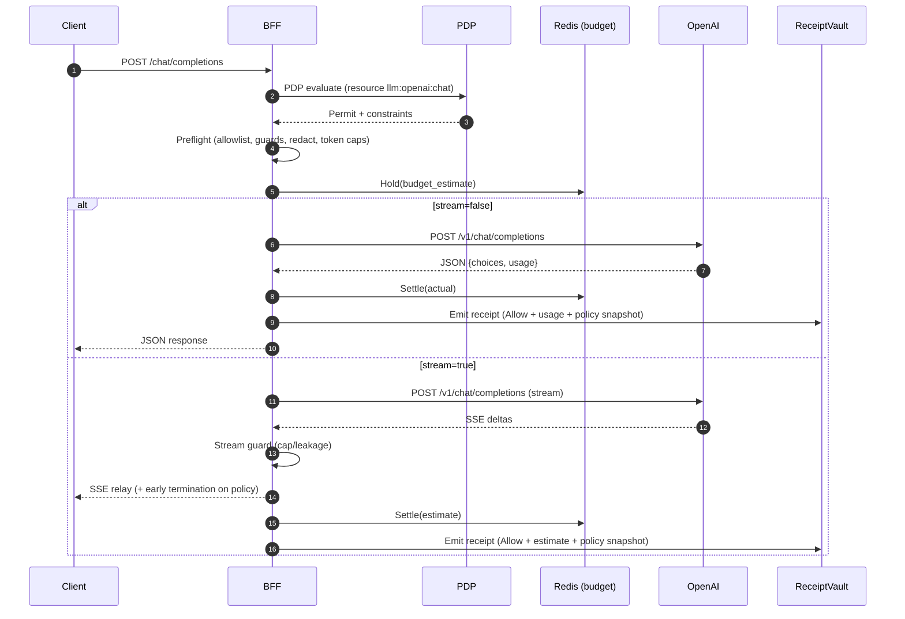
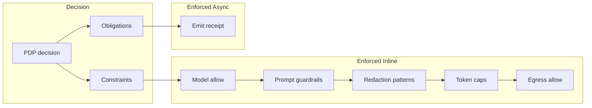
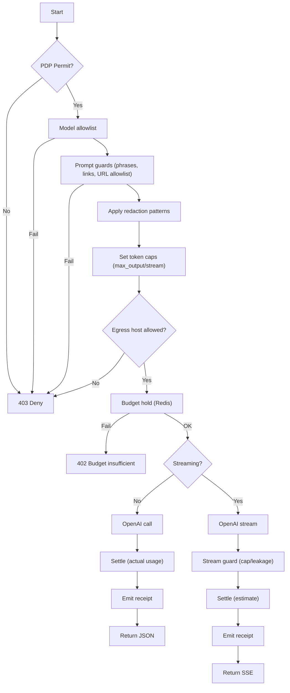

## ARIA AI Agent Proxied Policy Enforcement

### Overview
- The BFF provides a governed, OpenAI-compatible `/chat/completions` endpoint. It authenticates users, authorizes via PDP (AuthZEN), enforces preflight rules (model allowlist, guardrails, redaction, token caps), pins egress, manages budget holds/settlements in Redis, proxies to the provider, and emits tamper-evident receipts. An optional journaling pipeline can persist masked prompts and feed sanitized analytics to ClickHouse.

### Edge routing & topology

### Purpose
- **What**: How the BFF gates and governs `/chat/completions` using PDP (AuthZEN) constraints and obligations, then enforces preflight rules, egress, budgets, streaming caps, and emits receipts.
- **Who**: Software developers and architects; cloud and AI security architects; product and technical product marketing managers.
- **Status**: Implemented for OpenAI; Anthropic is a roadmap extension.

### Core enforcement architecture (implemented)

### Full architecture with optional journaling & analytics

### Non-stream and stream flows (with inline enforcement)

### Constraints vs obligations (policy → runtime)

### Enforcement pipeline (step-by-step)

### Implementation anchors (code)
- Endpoint, PDP evaluate, egress allow, preflight, budget, proxy, settle, receipt, streaming
  - `ms_bff_spike/ms_bff/src/api/v1/endpoints/llm.py`
- Preflight rules (allowlist, guards, redaction, token caps)
  - `ms_bff_spike/ms_bff/src/services/llm_enforcement.py`
- Stream-time guard (leakage and caps)
  - `ms_bff_spike/ms_bff/src/services/llm_sse.py`
- Budgeting (hold/settle/release)
  - `ms_bff_spike/ms_bff/src/services/llm_budget.py`
- Receipts (non-blocking, hash-chained; Vault optional)
  - `ms_bff_spike/ms_bff/src/services/llm_receipts.py`
- PDP policy (models, token limits, egress allow)
  - `ServiceConfigs/pdp/config/policies/applications/aria-bff/openai-chat.yaml`

### Interfaces and headers
- Request (OpenAI-compatible): `{ model, messages[], stream?, max_tokens? }`
- Response
  - Non-stream: OpenAI JSON passthrough; headers may include `x-aria-decision-id`.
  - Stream: SSE datums; early termination with warning when caps/guards trigger.

### Security posture
- PDP-driven, centralized policy for model selection, egress, token caps, and guardrails.
- Fail-secure: missing mapping or PDP errors → 403. Budget insufficiency → 402.
- No prompt content in receipts; journaling (if enabled separately) stores masked content only.
- Egress pinning eliminates provider endpoint drift.

### Configuration (runtime)
- `OPENAI_BASE` default `https://api.openai.com/v1`
- `OPENAI_API_KEY` (supports secret pointers)
- `RECEIPT_VAULT_URL` (optional; dev fallback when unset)
- PDP client credentials from BFF settings (enterprise SDK)

### Metrics to watch
- `LLM_CALLS_TOTAL{mode,result}`
- `BFF_LLM_BUDGET_DENIED_TOTAL`
- `BFF_LLM_STREAM_TRUNCATIONS_TOTAL`

### Scope and roadmap
- Implemented: OpenAI proxy with PDP, enforcement, budgets, receipts, streaming guard.
- Roadmap: Anthropic (`/v1/messages`, `x-api-key`, `anthropic-version`), provider selection logic, additional constraints/obligations (consent/DLP), optional prompt journaling pipeline.

