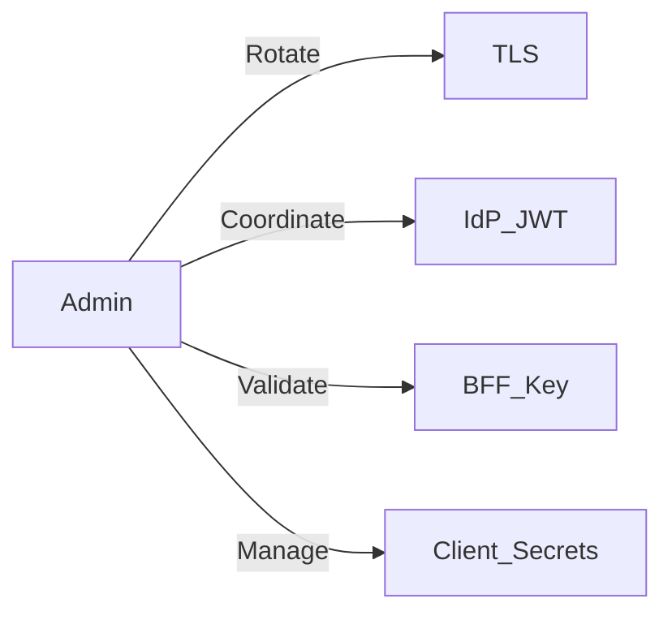

Admin responsibilities (verified sources: compose file, IdP docs):
- Ensure wildcard TLS cert installed for `*.ocg.labs.empowernow.ai`
- Track IdP JWT signing key ID (e.g., `idp-signing-1`) and plan annual rotation
- Maintain BFF key presence (`/app/keys/bff-sig-001.pem` via volume)
- Keep client secrets up to date (IdP clients, service clients)

Key actions
- TLS renewal schedule (90 days), coordinate Traefik reloads
- JWT key rotation window: publish new JWKS, update `TOKEN_KEY_ID`, keep old key active until tokens expire
- Secrets hygiene: use Docker secrets; avoid plaintext env for sensitive material

Quick map

