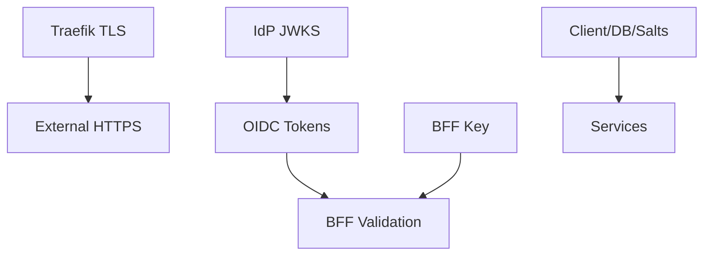

Evidence sources (verified):
- Traefik TLS files mounted from `IdP/certs`
- IdP JWKS endpoint publishing key IDs (e.g., `idp-signing-1`)
- BFF key location `/app/keys/bff-sig-001.pem` (volume-backed)
- Compose secrets under `CRUDService/config_secrets/` (file-based)

Controls mapping
- Key lifecycle: documented rotation for TLS, JWT, BFF, client secrets
- Storage: Docker secrets for sensitive material; volumes with restricted perms
- Algorithms: RS256 for JWT; FIPS mode variables available when required

Audit checklist
- Collect JWKS snapshot and key IDs
- Verify TLS cert validity and expiry window
- Confirm secrets not present in env; only via file mounts/secrets
- Review rotation logs and procedures executed in last period

Dependency overview

