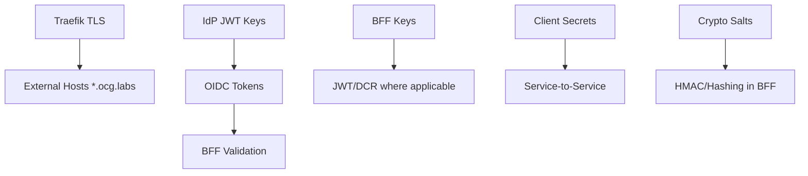

This page summarizes certificate and secret management relevant to the BFF stack (compose + K8s), verified from `docker-compose-authzen4.yml` and the Certificate Management Guide.

## Inventory (stack subset)
- Traefik TLS: wildcard cert for `*.ocg.labs.empowernow.ai` (mounted under `../IdP/certs`)
- IdP JWT signing keys: `idp-signing-1` (JWKS), used for OIDC tokens
- BFF service keys: `/app/keys/bff-sig-001.pem` (volume `bff-keys`)
- Client secrets (compose secrets dir): `oidc-client-secret.txt`, `pdp-client-secret.txt`, etc.
- Cryptographic salts: `token-hash-salt.txt`, `ua-hash-salt.txt` (mounted to BFF via Docker secrets)

## Where they are wired (compose)
- Traefik mounts: `../IdP/certs:/certs:ro`
- BFF env:
  - `BFF_JWT_SIGNING_KEY=/app/keys/bff-sig-001.pem`
  - `TOKEN_HASH_SALT=file:/run/secrets/token-hash-salt`
  - `UA_HASH_SALT=file:/run/secrets/ua-hash-salt`
- IdP JWT: `JWT_SIGNING_KEY` secret, `TOKEN_KEY_ID`, JWKS published by IdP

## Dependency map

## Rotation (high-level)
- Traefik TLS: renew every 90 days; hot-reload via Traefik restart
- IdP JWT keys: rotate annually; update `TOKEN_KEY_ID` and JWKS; maintain overlap window
- BFF keys: rotate annually; update volume key file and env; restart BFF
- Client secrets: rotate 6 months; update secret files and IdP client; restart affected services
- Salts: rotate per policy; update Docker secrets; restart BFF

## Monitoring
- Add expiry checks (openssl) for PEM files under `IdP/certs` and any custom keys
- Prom scrape enabled on BFF (`/metrics`) for auth-related counters

## Emergency
- If TLS outage: deploy temporary self-signed, restart Traefik, then replace with CA-issued
- If JWT compromise: generate new key, publish JWKS, rotate clients, invalidate sessions as needed
