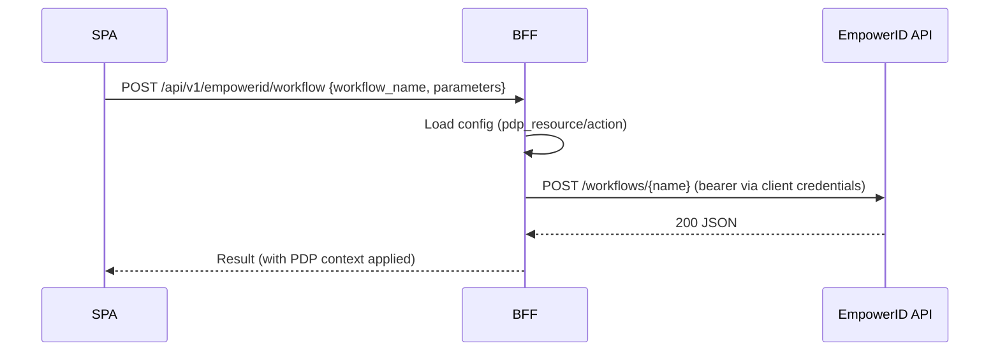

Purpose: call EmpowerID workflows and WebUI API directly via the BFF with OAuth token injection and PDP-aware context.

- Code: `ms_bff_spike/ms_bff/src/api/v1/empowerid/routes.py`
- Config: `ServiceConfigs/BFF/config/empowerid_endpoints.yaml`
  - `auth`: `EMPOWERID_CLIENT_ID`, `EMPOWERID_CLIENT_SECRET`, `EMPOWERID_TOKEN_URL`, `EMPOWERID_API_KEY`
  - `workflows.*`: each with `pdp_resource`, `pdp_action`, and input structure
  - `webui_endpoints.*`: types, methods, parameters, and `included_properties`

Auth: session cookie required (BFF session). PDP context is populated from the config hints.

Authentication model
- Front-door: BFF session (cookie) gates all endpoints in this group.
- Upstream to EmpowerID:
  - Workflows: BFF uses client-credential OAuth via the `auth` block in `empowerid_endpoints.yaml` to obtain a bearer to call EmpowerID on behalf of the user (subject passed separately).
  - WebUI: current implementation expects a Bearer token on the request (Authorization header). In same-origin SPAs our API client supplies this automatically from session; for manual calls (curl), include a bearer or switch the route to use the same client-credential flow.

For SPA developers

- Same-origin usage (recommended): call these paths directly; cookies flow automatically and the client injects any required headers.
  ```ts
  // Execute a workflow
  await apiClient.post('/api/v1/empowerid/workflow', {
    workflow_name: 'PersonDelete',
    parameters: { PersonID: '<GUID>' }
  });

  // Call a WebUI method
  await apiClient.post('/api/v1/empowerid/webui', {
    type_name: 'PersonView',
    method_name: 'GetByLogin',
    parameters: { login: 'ada' }
  });
  ```
- Cross-origin dev: set `VITE_BFF_BASE_URL` to the BFF origin and ensure `credentials: 'include'` so cookies are sent. Do not attach OAuth tokens from the browser.
- Catalog discovery from the UI (handy for DX):
  ```bash
  curl -s --cookie "_eid_sid=..." https://.../api/v1/empowerid/workflows | jq .
  curl -s --cookie "_eid_sid=..." https://.../api/v1/empowerid/webui/types | jq .
  curl -s --cookie "_eid_sid=..." https://.../api/v1/empowerid/webui/types/PersonView/methods | jq .
  ```

Endpoints
- POST `/api/v1/empowerid/workflow`: Execute a configured workflow
- POST `/api/v1/empowerid/webui`: Call a WebUI API method
- GET `/api/v1/empowerid/workflows`: List configured workflows
- GET `/api/v1/empowerid/webui/types`: List WebUI types
- GET `/api/v1/empowerid/webui/types/{type_name}/methods`: List methods for a type

Examples
```bash
curl -X POST https://.../api/v1/empowerid/workflow \
  -H "Content-Type: application/json" \
  --cookie "_eid_sid=..." \
  -d '{"workflow_name":"PersonCreateNonResourceManager","parameters":{"Person":{"FirstName":"Ada","LastName":"Lovelace","Email":"ada@example.com","UserName":"ada"}}}'

curl -X POST https://.../api/v1/empowerid/webui \
  -H "Content-Type: application/json" \
  --cookie "_eid_sid=..." \
  -d '{"type_name":"PersonView","method_name":"GetByLogin","parameters":{"login":"ada"}}'
```

Mermaid


Failure modes
- Missing catalog entry: ensure `workflows.*` or `webui_endpoints.*` exists
- PDP deny: check mapped `pdp_resource`/`pdp_action`
- Token errors: verify `EMPOWERID_*` envs and IdP reachability
 - WebUI 401: if calling manually, include a bearer Authorization header; SPAs should not hand-craft tokens.

Observability
- Request/latency counters emitted by the BFF metrics module; correlation id header `X-Correlation-ID` is added when present

Change control
- Edit `ServiceConfigs/BFF/config/empowerid_endpoints.yaml`; keep `pdp_resource`/`pdp_action` accurate. Promote via the normal config SOP.

Config provenance
- Loaded via `settings.empowerid_config_path` (defaults to `config/empowerid_endpoints.yaml` inside the BFF container). In Docker Compose/K8s we mount `ServiceConfigs/BFF/config/empowerid_endpoints.yaml` to that path.

See also: `../how-to/run-empowerid-workflow`, `../how-to/call-empowerid-webui`, `./pdp-mapping`


