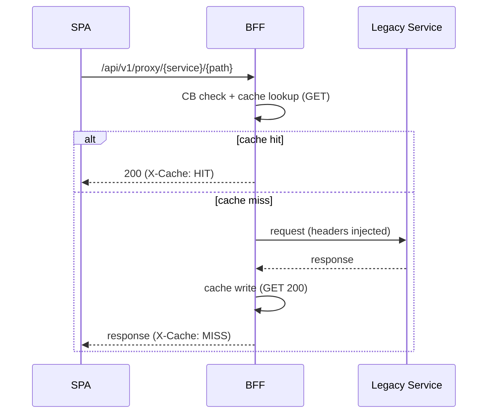

Purpose: stable façade to legacy C# microservices with circuit breaker, caching, limits, and metrics.

- Code: `ms_bff_spike/ms_bff/src/api/v1/endpoints/legacy_proxy.py`
- Config: `ServiceConfigs/BFF/config/legacy_services.yaml`
  - `legacy_services`: service→base URL (override via `LEGACY_SERVICE_{NAME}_URL`)
  - `legacy_service_timeouts`: per‑service timeouts
  - `circuit_breaker.threshold`, `circuit_breaker.reset_time`
  - `response_cache.enabled`, `default_ttl`, `max_size`
  - `request_limits.max_body_size`

Auth: BFF session required. BFF injects downstream bearer and headers.

Authentication model
- Front-door: requires a valid BFF session (cookie). Requests are rejected before proxying otherwise.
- Downstream: the proxy injects `Authorization: Bearer ...` when a user token is available in request state; services relying on EmpowerID API key receive `X-EmpowerID-Api-Key` if configured.
- Identity propagation: when an ARN is available, `X-Original-User` is added for auditing/attribution.

Endpoints
- Any method `/api/v1/proxy/{service}/{path}`
- GET `/api/v1/proxy/health` (proxy health and cache stats)

Headers injected
- `X-Correlation-ID` when available
- `X-Original-User` when ARN present
- `Authorization: Bearer ...` from BFF state when available
- For `service=empowerid`, `X-EmpowerID-Api-Key` if configured

Examples
```bash
curl "https://.../api/v1/proxy/res-admin/services/v1/resadmin/resources/people/getsearch?top=25" \
  --cookie "_eid_sid=..."

curl -X POST "https://.../api/v1/proxy/res-admin/services/v1/resadmin/resources/People/create" \
  -H "Content-Type: application/json" \
  --cookie "_eid_sid=..." \
  -d '{"FirstName":"Ada","LastName":"Lovelace","Email":"ada@example.com","UserName":"ada"}'
```

Mermaid


Failure modes
- Circuit open: 503 with `Retry-After`
- Body too large: 413 based on `max_body_size`
- Unknown service: 404 from proxy

Observability
- Prometheus counters/timers for requests/errors/CB state and cache hits/misses

Change control
- Add a service in `legacy_services` with base URL, optional timeout; adjust CB/cache as needed. Promote via config SOP.

See also: `../how-to/add-legacy-service`, `../how-to/tune-legacy-circuit-cache`


For SPA developers

- How to call from React (same-origin recommended):
  ```ts
  // GET with query params (cookies sent automatically)
  const res = await apiClient.get(
    '/api/v1/proxy/res-admin/services/v1/resadmin/resources/people/getsearch',
    { params: { top: 25 } }
  );

  // POST JSON
  await apiClient.post(
    '/api/v1/proxy/res-admin/services/v1/resadmin/resources/People/create',
    { FirstName: 'Ada', LastName: 'Lovelace', Email: 'ada@example.com', UserName: 'ada' }
  );

  // POST file upload (watch 10MB default body limit)
  const form = new FormData();
  form.append('file', file);
  await apiClient.post('/api/v1/proxy/my-service/upload', form);
  ```

- Cross-origin dev: set `VITE_BFF_BASE_URL` to the BFF origin and ensure your client uses `credentials: 'include'` so cookies flow. See Dev vs Prod setup.
- Do not add Authorization headers in the browser; the BFF injects downstream credentials.
- Prefer YAML-driven canonical routes under `/api/...` when available; the legacy proxy is a compatibility bridge.

Common errors and UX

| Status | Meaning | Suggested UX |
| --- | --- | --- |
| 401 | No/expired session | Redirect to login |
| 403 | PDP/authorization deny | Show Access Denied (no retry) |
| 413 | Body too large | Show guidance; split upload or contact admin |
| 502 | Upstream error | Toast error; log correlation ID; retry optional |
| 503 | Circuit open/backoff | Show retry with backoff; try later |

Helpful links: `../how-to/uploads-downloads-streaming`, `../reference/frontend-errors`, `../how-to/dev-vs-prod-setup`, `./proxy-yaml-reference`.


