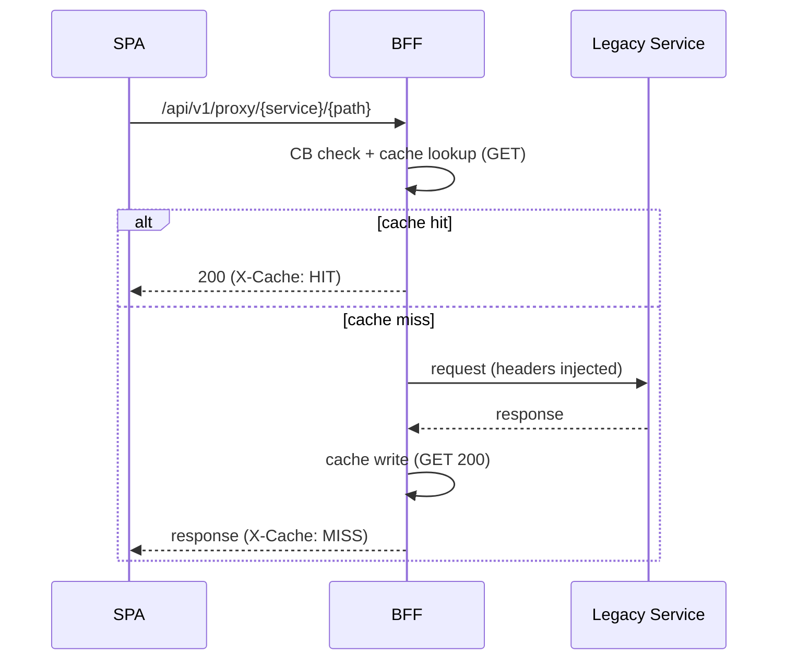

Purpose: stable façade to legacy C# microservices with circuit breaker, caching, limits, and metrics.

- Code: `ms_bff_spike/ms_bff/src/api/v1/endpoints/legacy_proxy.py`
- Config: `ServiceConfigs/BFF/config/legacy_services.yaml`
  - `legacy_services`: service→base URL (override via `LEGACY_SERVICE_{NAME}_URL`)
  - `legacy_service_timeouts`: per‑service timeouts
  - `circuit_breaker.threshold`, `circuit_breaker.reset_time`
  - `response_cache.enabled`, `default_ttl`, `max_size`
  - `request_limits.max_body_size`

Auth: BFF session or bearer token. The legacy route accepts either an authenticated BFF session (cookie) or a caller-supplied EmpowerID bearer token. BFF injects downstream bearer and headers.

Authentication model
- Front-door: the legacy route is protected by `Depends(get_current_user)`; callers can authenticate with either a valid BFF session (cookie) or by sending `Authorization: Bearer <access_token>` from EmpowerID.
- Downstream: the proxy forwards the caller's token unchanged in `Authorization: Bearer ...` when `request.state.token` exists; for `service=empowerid`, it also injects `X-EmpowerID-Api-Key` if configured.
- Identity propagation: when a validated user ARN is available, `X-Original-User` is added for auditing/attribution. The provider segment in ARNs prefers the IdP entry `provider` alias (falls back to `name`), stabilizing identities across audiences of the same issuer.

Endpoints
- Any method `/api/v1/proxy/{service}/{path}`
- GET `/api/v1/proxy/health` (proxy health and cache stats)

Headers injected
- `X-Correlation-ID` when available
- `X-Original-User` when ARN present
- `Authorization: Bearer ...` from BFF state when available (caller token pass-through)
- For `service=empowerid`, `X-EmpowerID-Api-Key` if configured

How SPA, BFF, and EmpowerID work together (legacy route)

- SPA login (EmpowerID IdP)
  - Use OIDC Authorization Code + PKCE to authenticate against EmpowerID.
  - After login, you have two options to call the BFF:
    - Bearer mode: SPA sends `Authorization: Bearer <access_token_from_EmpowerID>` to the BFF.
    - Session mode (recommended for SPAs): BFF does the code exchange server-side and issues an HttpOnly secure session cookie; SPA calls the BFF without storing tokens.

- Auth to the BFF
  - The legacy route requires `Depends(get_current_user)`; the BFF accepts either the user's bearer token or an authenticated session.
  - The BFF then exposes the user info as `TokenPayload` and sets `request.state.token` (when available).

- Calling EmpowerID through the legacy route
  - SPA calls the BFF at `/{service_name}/{path}` with `service_name = empowerid` (e.g., `/api/v1/proxy/empowerid/v1/users/me`).
  - The BFF's proxy behavior:
    - Forwards the caller's token unchanged in `Authorization: Bearer <token>` if `request.state.token` exists.
    - Injects `X-EmpowerID-Api-Key` when `service_name == 'empowerid'` and `settings.empowerid_api_key` is set.
    - Adds `X-Original-User` with the validated user ARN for audit.
  - There is no token exchange; it is pass-through of the user's EmpowerID token plus an API key.

Examples
```bash
curl "https://.../api/v1/proxy/res-admin/services/v1/resadmin/resources/people/getsearch?top=25" \
  --cookie "_eid_sid=..."

curl -X POST "https://.../api/v1/proxy/res-admin/services/v1/resadmin/resources/People/create" \
  -H "Content-Type: application/json" \
  --cookie "_eid_sid=..." \
  -d '{"FirstName":"Ada","LastName":"Lovelace","Email":"ada@example.com","UserName":"ada"}'
```

Minimal SPA example (legacy EmpowerID via BFF)

```javascript
// After OIDC login with EmpowerID (Auth Code + PKCE)
// Bearer mode
const res = await fetch('/api/v1/proxy/empowerid/v1/users/me', {
  method: 'GET',
  headers: { Authorization: `Bearer ${accessToken}` }
});

// Session mode: omit Authorization, include cookies
const resSession = await fetch('/api/v1/proxy/empowerid/v1/users/me', {
  credentials: 'include'
});
```

Mermaid


Failure modes
- Circuit open: 503 with `Retry-After`
- Body too large: 413 based on `max_body_size`
- Unknown service: 404 from proxy

Observability
- Prometheus counters/timers for requests/errors/CB state and cache hits/misses

Change control
- Add a service in `legacy_services` with base URL, optional timeout; adjust CB/cache as needed. Promote via config SOP.

See also: `../how-to/add-legacy-service`, `../how-to/tune-legacy-circuit-cache`


For SPA developers

- How to call from React (same-origin recommended):
  ```ts
  // GET with query params (cookies sent automatically)
  const res = await apiClient.get(
    '/api/v1/proxy/res-admin/services/v1/resadmin/resources/people/getsearch',
    { params: { top: 25 } }
  );

  // POST JSON
  await apiClient.post(
    '/api/v1/proxy/res-admin/services/v1/resadmin/resources/People/create',
    { FirstName: 'Ada', LastName: 'Lovelace', Email: 'ada@example.com', UserName: 'ada' }
  );

  // POST file upload (watch 10MB default body limit)
  const form = new FormData();
  form.append('file', file);
  await apiClient.post('/api/v1/proxy/my-service/upload', form);
  ```

- Cross-origin dev: set `VITE_BFF_BASE_URL` to the BFF origin and ensure your client uses `credentials: 'include'` so cookies flow. See Dev vs Prod setup.
- If using session mode, do not add Authorization headers in the browser; the BFF injects downstream credentials. If using bearer mode, include your EmpowerID access token in the `Authorization` header.
- Prefer YAML-driven canonical routes under `/api/...` when available; the legacy proxy is a compatibility bridge.

Common errors and UX

| Status | Meaning | Suggested UX |
| --- | --- | --- |
| 401 | No/expired session | Redirect to login |
| 403 | PDP/authorization deny | Show Access Denied (no retry) |
| 413 | Body too large | Show guidance; split upload or contact admin |
| 502 | Upstream error | Toast error; log correlation ID; retry optional |
| 503 | Circuit open/backoff | Show retry with backoff; try later |

Helpful links: `../how-to/uploads-downloads-streaming`, `../reference/frontend-errors`, `../how-to/dev-vs-prod-setup`, `./proxy-yaml-reference`.


