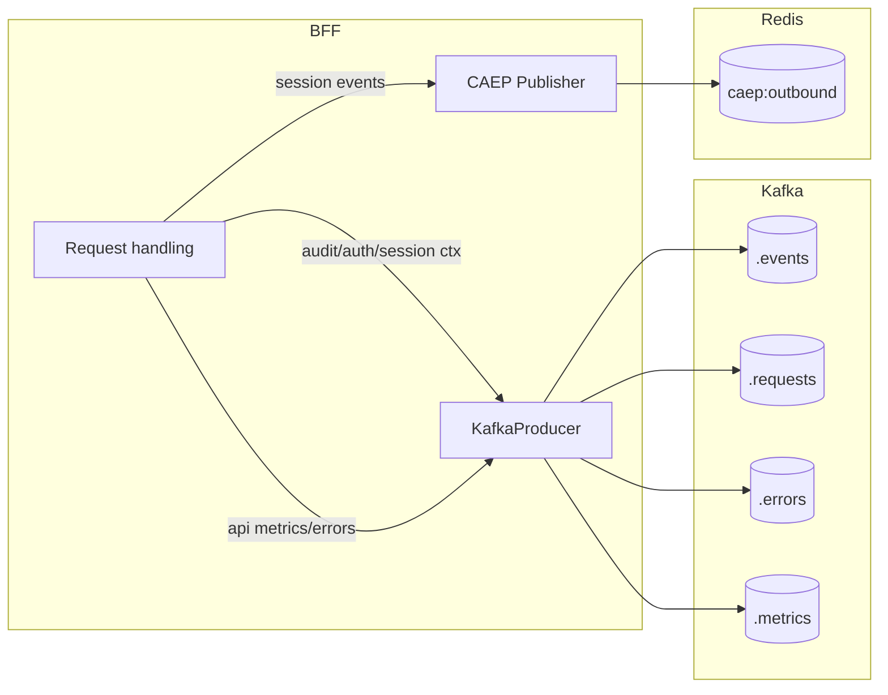

This page documents what the BFF logs and where it sends events, based on the current code.

Kafka producers (two layers)

- Platform producer wrapper (`ms_bff_spike/ms_bff/src/core/kafka_producer.py`)
  - Publishes structured events via a shared platform utility (`publish_structured`)
  - Topic names used:
    - `empowernow.bff.audit`
    - `empowernow.bff.auth`
    - `empowernow.bff.sessions`
  - Helper functions (async):
    - `publish_audit_event(event_type, payload)`
    - `publish_auth_event(event_type, request_context)`
    - `publish_session_event(event_type, session_context)`
  - Expected context keys are visible in the helpers (e.g., `user_id`, `session_id`, `correlation_id`).

- Application producer (`ms_bff_spike/ms_bff/src/services/kafka_producer.py`)
  - Uses `aiokafka.AIOKafkaProducer`
  - Standard topics (prefixed):
    - `events` → `<prefix>.events`
    - `requests` → `<prefix>.requests`
    - `errors` → `<prefix>.errors`
    - `metrics` → `<prefix>.metrics`
  - Event envelope (from `publish_event`):
    - `event_id` (uuid)
    - `event_type` (string)
    - `timestamp` (ISO-8601, UTC)
    - `correlation_id` (uuid)
    - `service` = `ms-bff`
    - `data` (payload)
  - API events (`publish_api_event`): method, path, status_code, elapsed_ms, optional `user_id`; sent to `requests` topic; partition key defaults to `path`.
  - Error events (`publish_error`): type, message, source, optional details; sent to `errors` topic; partition key `<source>:<error_type>`.
  - Metrics (`publish_metrics`): `metric_type`, `values`; sent to `metrics` topic; partition key `metric_type`.
  - JSON serializer: handles `datetime` (UTC ISO), `Enum`, `UUID`, sets, pydantic models, and circular references.
  - Lifecycle: `init_kafka_producer(...)` creates a singleton; `start()` must be called to connect; `stop()` closes the producer.

CAEP publisher (Redis queue)

- Module: `ms_bff_spike/ms_bff/src/shared_signals/publisher.py`
- Queue: Redis list `caep:outbound`
- Functions enqueue CAEP events (async):
  - `send_session_created(user_id, session_id)` → event type `.../session-created`
  - `send_session_terminated(user_id, session_id, everywhere=False)` → `.../session-terminated`
  - `send_token_rotated(user_id, session_id)` → `.../token-claims-change`
- Payload format:
  - If `CAEP_SIGNING_KEY` is set: a signed JWT is produced with claims `{ iss: BFF_BASE_URL, iat, jti, events: { <type>: payload } }` (alg RS256, header `kid` from `CAEP_KID`, default `bff-caep`).
  - Otherwise: JSON object `{ event_type, payload, ts }`.
- Metrics: Prometheus counter `caep_enqueued_total{event_type=...}` increments per enqueued event.

Configuration (relevant keys)

- Kafka (see `settings.yaml` and environment):
  - `kafka.bootstrap_servers`, `kafka.client_id`, `kafka.topic_prefix`, `kafka.acks`, `kafka.compression_type`, `kafka.enabled`
  - Environment examples: `KAFKA_BOOTSTRAP_SERVERS`, `KAFKA_CLIENT_ID`, `KAFKA_TOPIC_PREFIX`, `KAFKA_ACKS`, `KAFKA_COMPRESSION_TYPE`
- CAEP:
  - `CAEP_SIGNING_KEY` (PEM/JWK), `CAEP_KID` (default `bff-caep`), `BFF_BASE_URL` for `iss`

Operational notes

- Start/stop: the application startup should call `init_kafka_producer(...)` and then `start()`; shutdown path calls `stop()`.
- Partitioning: API events use path as key; errors use `<source>:<type>`; metrics use metric type — this keeps related data co‑located.
- Backpressure: Producer uses `send_and_wait` (awaits broker ACKs per `acks`).



Example payloads

- Generic event envelope (Kafka `<prefix>.events`):

```json
{
  "event_id": "5a3b9e2e-2d7e-4d7f-9a6a-0a1e9e5b2d17",
  "event_type": "session_created",
  "timestamp": "2025-08-10T22:01:02.345Z",
  "correlation_id": "c46e5bb1-9c3a-4a3a-9c8a-0e5b8c2f1a77",
  "service": "ms-bff",
  "data": {
    "user_id": "user@example.com",
    "session_id": "abc123def",
    "ip": "203.0.113.10"
  }
}
```

- API request event (`<prefix>.requests`):

```json
{
  "event_id": "e2f0b4c3-2fd2-4c9e-9a9d-1a2b3c4d5e6f",
  "event_type": "api_request",
  "timestamp": "2025-08-10T22:02:10.100Z",
  "correlation_id": "a2d4e6f8-10ab-42cd-9ef0-112233445566",
  "service": "ms-bff",
  "data": {
    "method": "GET",
    "path": "/api/crud/workflows",
    "status_code": 200,
    "elapsed_ms": 42.7,
    "user_id": "user@example.com"
  }
}
```

- Error event (`<prefix>.errors`):

```json
{
  "event_id": "1f2e3d4c-5b6a-7081-92a3-b4c5d6e7f809",
  "event_type": "error",
  "timestamp": "2025-08-10T22:03:55.000Z",
  "correlation_id": "c0ffee00-1234-4abc-9def-777777777777",
  "service": "ms-bff",
  "data": {
    "error_type": "UpstreamTimeout",
    "message": "crud_service: /workflows timed out",
    "source": "proxy",
    "timestamp": "2025-08-10T22:03:55.000Z",
    "details": {
      "target_service": "crud_service",
      "path": "/workflows",
      "timeout_ms": 5000
    }
  }
}
```

- Metrics event (`<prefix>.metrics`):

```json
{
  "event_id": "0b1c2d3e-4f50-6172-8394-a5b6c7d8e9f0",
  "event_type": "metrics",
  "timestamp": "2025-08-10T22:04:20.000Z",
  "correlation_id": "f00ba4-55aa-46d2-b9f1-1122aa33bb44",
  "service": "ms-bff",
  "data": {
    "metric_type": "auth_flow",
    "timestamp": "2025-08-10T22:04:20.000Z",
    "values": {
      "oauth_flow_duration_ms": 820,
      "token_refresh_success": 1
    }
  }
}
```

- Platform audit/auth/session events (topic `empowernow.bff.*`): payloads are app‑defined JSON; typical fields include `user_id`, `session_id`, `correlation_id`, and event‑specific data. Example audit:

```json
{
  "event": "bff_startup",
  "version": "1.0.0",
  "node": "bff-0",
  "correlation_id": "b0a1a2a3-a4a5-46b7-88c9-d0e1f2a3b4c5"
}
```

- CAEP message enqueued to Redis (`caep:outbound`) when unsigned mode is used:

```json
{
  "event_type": "https://schemas.openid.net/secevent/caep/event-type/session-created",
  "payload": {"sub": "user@example.com", "sid": "abc123def"},
  "ts": 1723332000
}
```

- CAEP signed JWT (header + claims structure):

```json
{
  "header": {"alg": "RS256", "kid": "bff-caep"},
  "claims": {
    "iss": "https://api.ocg.labs.empowernow.ai",
    "iat": 1723332000,
    "jti": "session-created:abc123def:1723332000",
    "events": {
      "https://schemas.openid.net/secevent/caep/event-type/session-created": {
        "sub": "user@example.com",
        "sid": "abc123def"
      }
    }
  }
}
```

How to test locally

1. Ensure Kafka is up (see compose stack) and set `KAFKA_BOOTSTRAP_SERVERS` and `KAFKA_TOPIC_PREFIX`.
2. On app startup, initialize and start the producer; call an API route to generate a `requests` event and inspect the topic with your Kafka UI.
3. For CAEP, set `CAEP_SIGNING_KEY` (PEM) to emit signed JWTs, or omit to send JSON to the Redis list `caep:outbound`.


