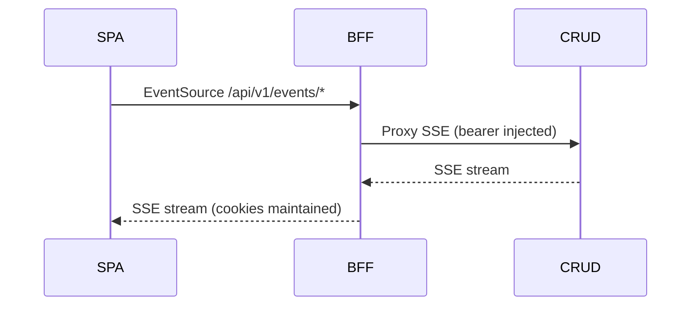

Purpose: stream Server‑Sent Events from CRUD service through the BFF.

- Code: `ms_bff_spike/ms_bff/src/api/v1/endpoints/streaming.py`
- Upstream: `CRUD_SERVICE_URL` env (default `http://crud-service:8000`)

Auth: session cookie required; use BFF domain (cookies flow).

Endpoints
- GET `/api/v1/events/workflow`
- GET `/api/v1/events/config`
- GET `/api/v1/configs/stream`
- GET `/api/v1/stream/health`

Browser example
```ts
const es = new EventSource('/api/v1/events/workflow');
es.onmessage = (e) => console.log('workflow event', e.data);
es.addEventListener('workflow', (e) => console.log('typed', e.data));
es.onerror = () => { es.close(); setTimeout(() => location.reload(), 3000); };
```

Tuning
- `WORKFLOW_EVENTS_TIMEOUT`, `CONFIG_EVENTS_TIMEOUT`, `CONFIGS_STREAM_TIMEOUT`

Mermaid


Notes
- Ensure Traefik routes on SPA hosts forward `/events/*` to BFF (labels in compose).
- Increase upstream/proxy idle timeouts if disconnects are frequent.


