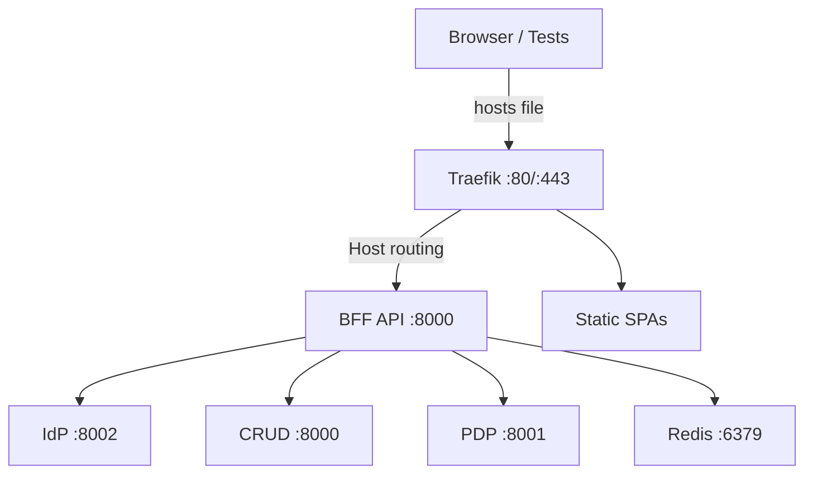

This guide summarizes the verified steps to stand up the authzen4 compose stack and execute critical BFF tests.

## Prereqs
- Docker & Compose installed
- Hosts file maps local domains to 127.0.0.1:
  - `authn|authz|automate|api|idp|traefik.ocg.labs.empowernow.ai`
- Test credentials available (dedicated test account)

## Bring up stack
```bash
cd CRUDService
docker-compose -f docker-compose-authzen4.yml up -d
```

Verify core health:
```bash
docker-compose -f docker-compose-authzen4.yml ps
curl -f http://localhost:8000/health || echo FAIL
curl -f http://localhost:8080/ping || echo FAIL
```

## URL model (verified)


## Critical tests (from BFF repo)
Run in `ms_bff_spike/ms_bff`:
```bash
python verify_tests_created.py
python -m pytest tests/integration/test_traefik_forwardauth.py::test_integration_traefik_forwardauth_full_flow -v -s
python -m pytest tests/integration/test_traefik_middleware_config.py::test_integration_traefik_middleware_chain -v -s
python -m pytest tests/e2e/test_real_user_workflows.py::test_real_user_workflow_integration -v -s
```

Run complete suite:
```bash
python -m pytest \
  tests/integration/test_traefik_forwardauth.py \
  tests/integration/test_traefik_middleware_config.py \
  tests/e2e/test_real_user_workflows.py -v -s
```

## Troubleshooting quick refs
- Inspect logs:
```bash
docker-compose -f ../CRUDService/docker-compose-authzen4.yml logs -f bff_app
```
- Validate ForwardAuth endpoint (unauthenticated):
```bash
curl http://localhost:8000/auth/forward  # expect 401/403
```
- Common issues: missing hosts entries, credentials not set, Traefik dynamic config not pointing to `/auth/forward`.
