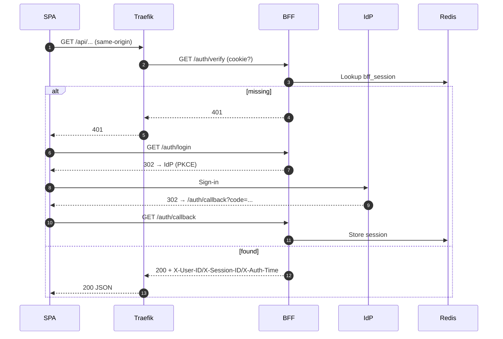

This guide is based on verified BFF code and configs. It shows the minimum steps to get login → callback → session check working.

## Prerequisites
- Set IdP issuer: `OIDC_ISSUER` (required)
- Choose callback mode:
  - Dynamic: `BFF_DYNAMIC_CALLBACK=true` + `BFF_DEFAULT_HOST` + optional `BFF_DEFAULT_SCHEME`
  - Static: `BFF_DYNAMIC_CALLBACK=false` + `BFF_CALLBACK_URL`
- Configure cookie domain: `BFF_COOKIE_DOMAIN` (e.g., `.ocg.labs.empowernow.ai`)
- Allowed absolute return_to hosts: `BFF_ALLOWED_REDIRECT_HOSTS`
- OAuth scopes: `OIDC_SCOPES`

## Verified endpoints
- `/auth/login`, `/auth/callback`
- `/auth/verify` (Traefik) and alias `/auth/forward`
- `/api/auth/session` (SPA session check)
- `/auth/logout`
- `/health`

## Golden-path (concise)

## Minimal configuration (examples)
- `OIDC_ISSUER=https://idp.ocg.labs.empowernow.ai/api/oidc`
- `BFF_DYNAMIC_CALLBACK=true`
- `BFF_DEFAULT_HOST=authn.ocg.labs.empowernow.ai`
- `BFF_DEFAULT_SCHEME=https`
- `BFF_COOKIE_DOMAIN=.ocg.labs.empowernow.ai`
- `BFF_ALLOWED_REDIRECT_HOSTS=authn.ocg.labs.empowernow.ai,authz.ocg.labs.empowernow.ai,automate.ocg.labs.empowernow.ai`
- `OIDC_SCOPES=openid profile email offline_access admin.api application.all`

## Validate
1) Health: `GET /health` → 200 JSON
2) CSRF cookie appears after a safe GET (middleware sets `_csrf_token`)
3) Login round-trip completes and sets `bff_session` (HttpOnly, Secure, SameSite=Lax, Domain configured)
4) `/api/auth/session` returns `{ authenticated: true, ... }` when logged in
