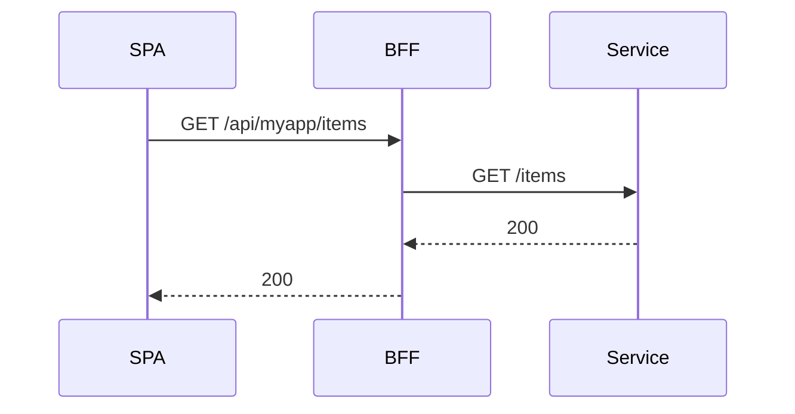

Goal: launch a React SPA that authenticates via the BFF and calls `/api/...` routes.

Prereqs

- BFF running with `routes.yaml` loaded
- An IdP configured and reachable by the BFF

Steps

1) Configure env
   - `VITE_BFF_BASE_URL=https://bff.example.com/api` (or `/api` when same origin)

2) Wire the app
   - Wrap your app with `AuthProvider` and call `setBaseUrl`.

```tsx
import { AuthProvider, setBaseUrl } from '@empowernow/bff-auth-react'
setBaseUrl(import.meta.env.VITE_BFF_BASE_URL || '/api')
```

3) Protect routes
   - Use an `AuthGuard` to redirect anonymous users to `/login`.

4) Call your APIs
   - Use `apiClient`/`fetchWithAuth` to call canonical `/api/<app>/...` paths.

5) Define routes in the BFF
   - Add entries under `routes:` referencing your backend service.

```yaml
services:
  my_service:
    base_url: "http://my-service:8080"
    timeout: 30
routes:
  - id: "my-app-items"
    path: "/api/myapp/items/*"
    target_service: "my_service"
    upstream_path: "/items/{path}"
    methods: ["GET", "POST", "PUT", "DELETE", "OPTIONS"]
    auth: "session"
```

6) Test the flow



Checklist

- [ ] `AuthProvider` wraps `<App />`
- [ ] `VITE_BFF_BASE_URL` set
- [ ] Calls go to `/api/...` (no direct service URLs)
- [ ] Route exists in `routes.yaml`
- [ ] PDP allows your action (403 otherwise)


