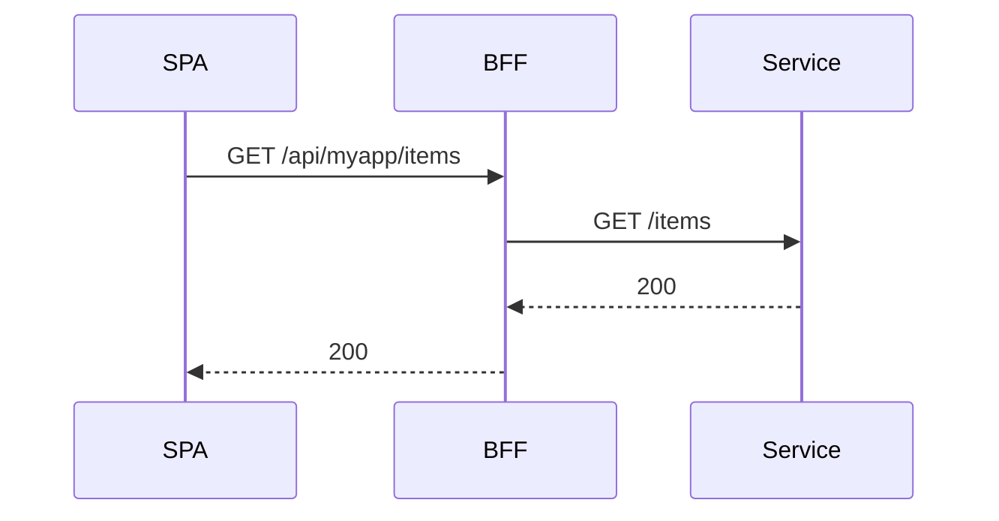

What is the golden path?

The golden path is the recommended, production‑grade way for SPAs to reach backend APIs through the BFF. It
 a) keeps tokens out of the browser, b) uses same‑origin `/api/**` for a simple DX, and c) lets Traefik/BFF authorize
 every request. Follow this path unless you have a strong reason not to.

Prereqs

- BFF running with `routes.yaml` loaded
- IdP reachable by the BFF
- Dev: CORS allowlist includes your Vite origin; Prod: same‑origin routing via Traefik
- Hosts entries for local TLS domains if you use the compose stack (see QA guide)

Steps

1) Configure env
   - `VITE_BFF_BASE_URL=https://bff.example.com/api` (or `/api` when same origin)

2) Wire the app
   - Wrap your app with `AuthProvider` and call `setBaseUrl`. Place this in `src/main.tsx`.

```tsx
import { AuthProvider, setBaseUrl } from '@empowernow/bff-auth-react'
setBaseUrl(import.meta.env.VITE_BFF_BASE_URL || '/api')
```

3) Protect routes
   - Use an `AuthGuard` to redirect anonymous users to `/login` and preserve `returnUrl`.

4) Call your APIs
   - Use `apiClient`/`fetchWithAuth` to call canonical `/api/<app>/...` paths. Do not attach Authorization headers; the cookie is sent automatically.

5) Define routes in the BFF
   - Add entries under `routes:` referencing your backend service. Use the canonical `/api/<app>/*` shape and set `auth: session`.

```yaml
services:
  my_service:
    base_url: "http://my-service:8080"
    timeout: 30
routes:
  - id: "my-app-items"
    path: "/api/myapp/items/*"
    target_service: "my_service"
    upstream_path: "/items/{path}"
    methods: ["GET", "POST", "PUT", "DELETE", "OPTIONS"]
    auth: "session"
```

6) Test the flow



### Mental model: `/api` is the BFF

- Calls that look “local” like `/api/<app>/...` always go to the BFF first.
- The BFF uses `routes.yaml` to translate them into real backend requests and enforces session/CSRF/PDP.

Concrete example

```text
GET /api/myapp/items/123  →  BFF  →  GET http://my-service:8080/items/123
```

Dev vs Prod base URL

- Dev (separate origins): set `VITE_BFF_BASE_URL` to the BFF origin (for example `http://localhost:8000/api`) and ensure CORS allows your UI origin.
- Prod (same origin): serve the SPA via Traefik with the BFF and set `VITE_BFF_BASE_URL` to `/api`.

Common pitfalls

- Double `/api` prefix (client path should start with `/api/...`, wrapper strips leading `/api` once)
- Missing dev origin in CORS allowlist → opaque 401
- Wrong `VITE_BFF_BASE_URL` in dev → calls go to the wrong origin

Checklist

- [ ] `AuthProvider` wraps `<App />`
- [ ] `VITE_BFF_BASE_URL` set
- [ ] Calls go to `/api/...` (no direct service URLs)
- [ ] Route exists in `routes.yaml`
- [ ] PDP mapping exists in `pdp.yaml` for your route; action allowed (403 otherwise)
- [ ] Unauthenticated call returns JSON + CORS headers in dev (verifies error‑path CORS)

### Automation Studio (Visual Designer) checklist

- [ ] SPA calls same-origin endpoints only
  - [ ] CRUD + SSE: `/api/crud/...`
  - [ ] PDP (AuthZEN): `/access/v1/evaluation` and `/access/v1/evaluations` (preserved path)
- [ ] `ServiceConfigs/BFF/config/routes.yaml` entries exist
  - [ ] CRUD entries target `crud_service`
  - [ ] PDP entries target `pdp_service` with `preserve_path: true`
- [ ] Credentials included from the browser
  - [ ] fetch: `credentials: 'include'`
  - [ ] axios: `{ withCredentials: true }`
  - [ ] SSE: same-origin works by default; cross-origin dev uses `{ withCredentials: true }`
- [ ] Dev vs Prod base URL
  - [ ] Dev: `VITE_BFF_BASE_URL` = BFF origin (CORS allows UI origin)
  - [ ] Prod: `VITE_BFF_BASE_URL` = `/api`


