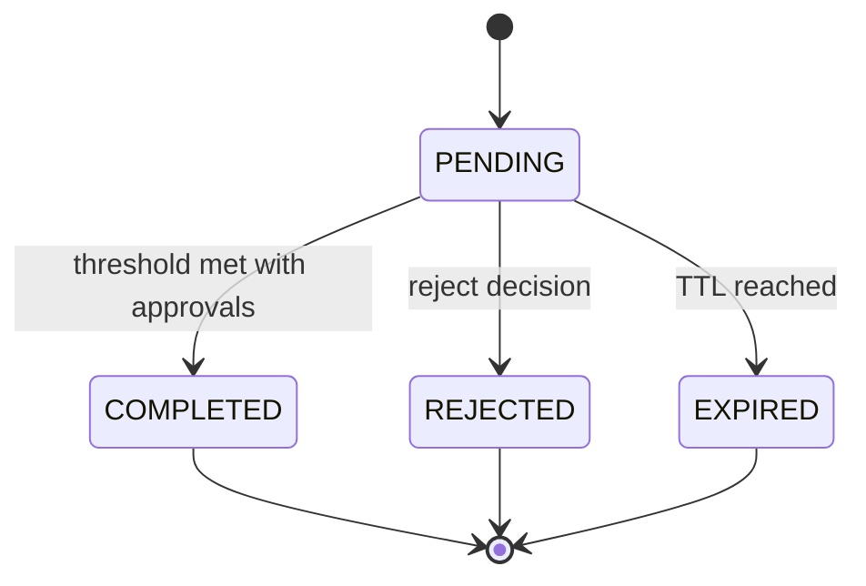

## Orchestration Service Approvals — Overview

This page explains approvals in the Orchestration Service: concepts, lifecycle, and where policy plugs in.

### Why approvals here?

- The workflow engine creates durable approval tasks and pauses execution (WAITING) until decisions arrive.
- Resolver plugins let policy decide “who may approve,” without hardcoding org logic in workflows.

### Lifecycle (high-level)

```mermaid
sequenceDiagram
  autonumber
  participant WF as Workflow Engine
  participant PL as Plugin Loader
  participant AR as Approver Resolver
  participant PDP as PDP (AuthZEN)
  participant DB as Task Store (Postgres)
  participant UI as Approvals UI/API Client

  WF->>PL: Load resolver from approval_config
  PL-->>WF: Resolver instance
  WF->>AR: resolve_approvers(approval_config, context)
  AR->>PDP: POST /access/v1/search/subject
  PDP-->>AR: {results: [user ids]}
  AR-->>WF: {allowed_approvers: [...]} 
  WF->>DB: Create APPROVAL task (approval_data)
  WF->>WF: Set WAITING; expose task_id
  UI->>DB: GET /tasks (pending approvals)
  UI->>DB: POST /tasks/{id}/complete (decision)
  WF->>PL: Load resolver (validate)
  WF->>AR: validate_approver(user, approval_data)
  AR->>PDP: POST /access/v1/evaluation (optional)
  PDP-->>AR: {decision: true|false}
  AR-->>WF: True/False
  WF->>WF: Record vote; check thresholds
  WF-->>WF: COMPLETE or remain WAITING
```

### States and thresholds



### Where policy lives

- Approver selection: resolver plugins (e.g., role-based, external PDP checks).
- Decision keywords: `approval_synonyms.yaml` defines allowed approve/reject terms.
- Thresholds: `required_count` in node `approval_config` controls N-of-M approvals.

See also

- How‑to: Adding a custom approver resolver
- Reference: Approval tasks & APIs
- How‑to: Synonyms & refresh jobs
- IdP: Obligation processing and consent (pre‑issuance) — `services/idp/backend/pep-pdp-request.md`
- PDP: Obligations and delegation (policy) — `services/pdp/backend/obligations-and-delegation.md`

