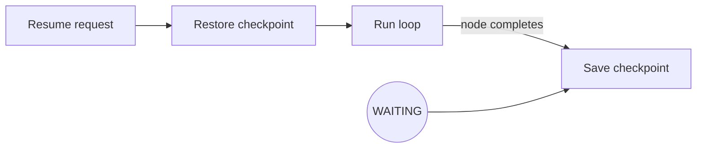

### Checkpointing and recovery

- **Save**: periodic or event-driven snapshots of graph node states, context (inputs, variables, outputs, step_results), in-progress tasks, and current WAITING node.
- **Restore**: given a checkpoint id, rebuild graph state and context, then continue execution (e.g., after resume).

#### Flow

- Storage abstraction: pluggable save/load interface.
- Used for resiliency, long-lived interactions, and operator-driven recovery.
