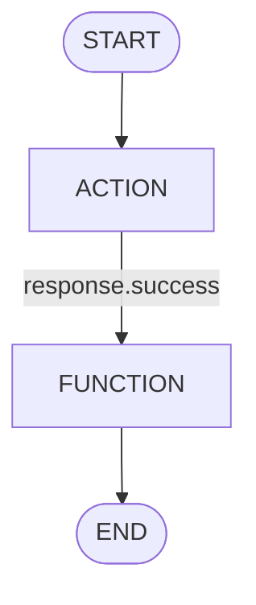

### Data model: nodes, edges, workflow

- **Node types**
  - ACTION, FUNCTION, USER_INTERACTION, LOG, SET_VARIABLE, FOREACH, START, END, CANCEL, AGENT
- **Node status lifecycle**
  - PENDING → ACTIVE → COMPLETED | FAILED | SKIPPED | WAITING (for user input)
- **Edges**
  - `from` → `to` with optional `condition`
  - Multiple outbound edges can be true and activate in the same pass
- **Workflow**
  - Holds `nodes`, `edges`, and computed `dependencies` (reverse edges) used to determine readiness

#### Minimal YAML example
```yaml
nodes:
  start:
    type: START
  fetch:
    type: ACTION
    depends_on: [start]
    config:
      system: my_system
      action: get_thing
  transform:
    type: FUNCTION
    depends_on: [fetch]
    config:
      function: my_transform
  end:
    type: END
    depends_on: [transform]
edges:
  - from: fetch
    to: transform
    condition: "{{ response.success }}"
  - from: start
    to: fetch
```

#### Visual

