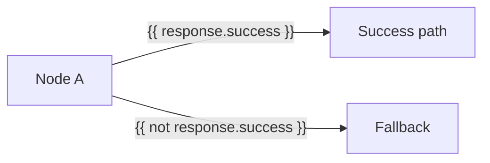

### Edge conditions and templating

- **Templating context** available in expressions:
  - `in` (workflow inputs), `var` (variables), `out` (outputs), `step_results`, `node` (metadata), `response` (action/user data)
- **Edge conditions**: string expressions rendered via Jinja, then evaluated as Python boolean. If truthy, the edge activates its target.
- **Multiple edges**: all truthy edges activate; no short-circuit or priority.

#### Examples
- Activate when a previous response was successful:
  - Condition: `{{ response.success }}`
- Branch on variable value:
  - Condition: `{{ var.total > 100 }}`

#### Visual

