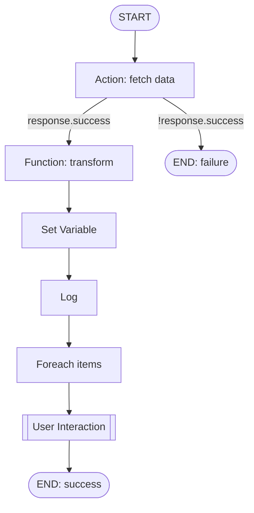

### CRUD Service workflow engine overview

The CRUD Service includes a node-based workflow engine that executes directed graphs of steps with conditional edges, concurrency, user-interaction pauses, and checkpoint-based recovery.

- **Key capabilities**
  - Dynamic branching via edge conditions
  - Parallel execution of independent nodes
  - Rich templating for parameters, variables, and conditions
  - Typed handlers: ACTION, FUNCTION, SET_VARIABLE, FOREACH, LOG, AGENT, START, END
  - User interaction: pause at forms/approvals/LLM prompts and resume later
  - Checkpointing and restoration for reliability and resumability

- **Concepts**
  - **Nodes**: typed steps with configuration and status
  - **Edges**: directed links with optional boolean condition expressions
  - **Workflow**: a DAG of nodes+edges with computed dependencies

#### Example DAG

See the following pages for details:
- [Data model (nodes, edges, statuses)](./data-model.md)
- [Execution loop (readiness, concurrency)](./execution-loop.md)
- [Edge conditions and templating](./edge-conditions-templating.md)
- [Node handlers](./node-handlers.md)
- [User interaction and resume](./user-interaction-resume.md)
- [Checkpointing and recovery](./checkpointing.md)
- [Security considerations](./security.md)
