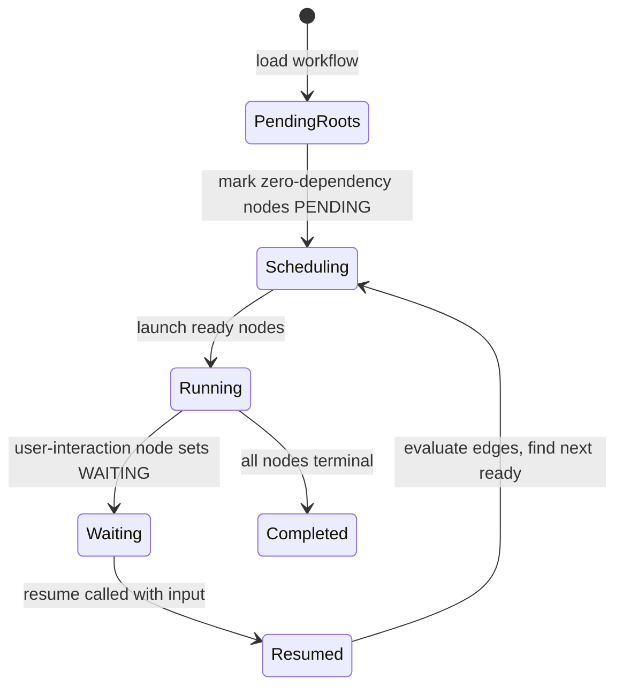

### Execution loop and readiness

- **Initialization**: mark zero-dependency nodes as PENDING.
- **Readiness**: a node is ready when it is PENDING and all its dependencies are COMPLETED.
- **Concurrency**: all ready nodes may run in parallel; the loop continues until completion or a user-interaction node is WAITING.
- **Completion**: upon node completion, outbound edges are evaluated to activate successors.

#### State flow

#### Ready node rules
- Not in terminal or WAITING state.
- Status is PENDING (or treated as such).
- All dependencies COMPLETED.
