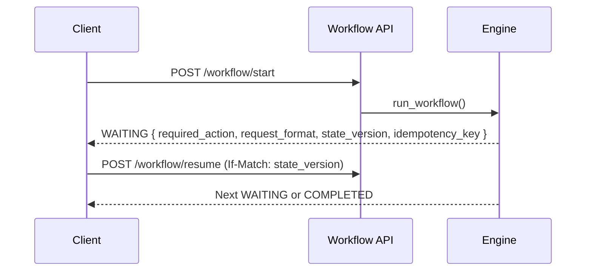

At every USER_INTERACTION gate, the engine returns a self‑describing WAITING response telling any client exactly what to do next and how to do it safely. Side‑effects run only in ACTION nodes under concurrency/idempotency/audit.

See also
- Contract reference: `services/crud-service/reference/waiting-contract.md`
- Adoption guide: `services/crud-service/how-to/agent-adoption.md`
- Cheat sheet: `explainability_cheat_sheet.md`

