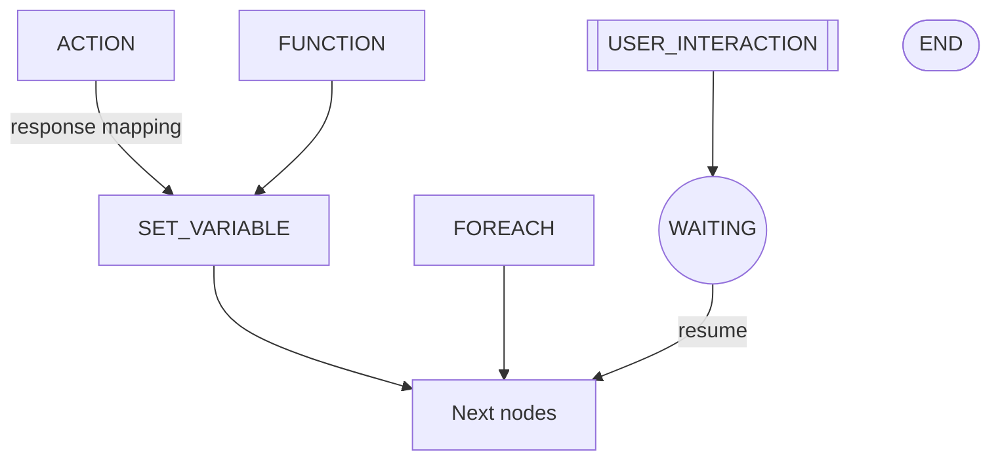

### Node handlers

- **ACTION**: render parameters from context, execute external command/action with circuit breaker and timeout, map response back to variables.
- **FUNCTION**: call a registered Python function with rendered inputs, capture result, map outputs to variables.
- **SET_VARIABLE**: render an expression and set `var.<name>`.
- **FOREACH**: iterate over rendered `items`; per-iteration context exposes `item`, `loop_variable`, `_index`, `_batch`; supports batching and concurrency configuration.
- **LOG**: emit structured log from template.
- **AGENT**: invoke an LLM/tool-calling agent with constraints and instructions.
- **START/END**: graph sentinels; END marks workflow completed.
- **USER_INTERACTION**: create a task (form/approval/LLM/bulk), set node to WAITING, and return a resume payload.

