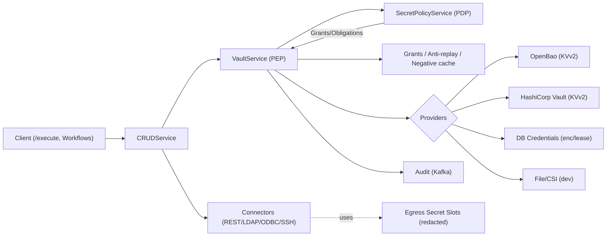
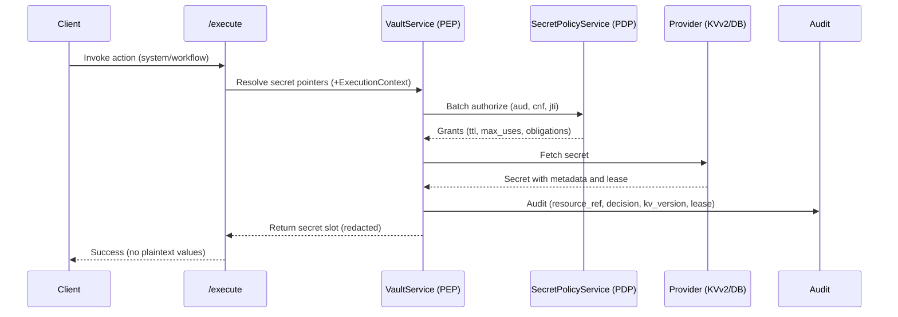

### Review outcome
- Most feedback is excellent and fits our “use, not read” and thin‑waist goals. We’re incorporating it with clarifications to keep the model simple now and extensible later.

### Executive overview (for CISO & Product)
- **Purpose**: Central policy enforcement for secrets (“use, not read”), with provable controls, clean operations, and minimal developer burden.
- **What’s enforced**:
  - Canonical Secret URIs with tenant guards and strict validation
  - PDP‑backed authorization issuing short‑lived, sender‑bound grants (DPoP/mTLS + anti‑replay)
  - Provider parity (KVv2 versioning, delete/destroy types; dynamic DB leases)
  - Egress “secret slots” that prevent leaks across logs/metrics/responses
  - Audits with non‑leaky identifiers (`resource_ref`), decision correlation, and sampling
- **Outcomes**:
  - Fail‑closed defaults with break‑glass out of band
  - Low latency on grant hits; clear runbooks; phased rollout with safe switches

### Architecture (high level)

### Request flow (simplified)

### What we’re adopting (tightened and actionable)
- **Canonical URIs** with strict normalization, tenant guards, and explicit error codes.
- **v1 ARN** mapping plus a short HMAC‑based `resource_ref` for audit/cache.
- **PEP + Grants** with sender‑binding (DPoP/mTLS), `jti` anti‑replay, atomic use‑count semantics, negative caching, and fail‑closed on PDP outage (except break‑glass).
- **Batch PDP** semantics for `/execute` and workflows; revalidation rules.
- **Provider edge cases** (KVv2 pinned version, delete/destroy types; DB engine leases/renew/revoke).
- **Egress guard** via secret “slots” that block leakage and enforce redaction.
- **Audit enrichment** (non‑leaky), safer defaults, and security‑focused tests.

### Where to go next
- Canonical URI grammar and error codes: ./../how-to/secrets-canonical-uris.md
- Audits and metrics schema: ./../how-to/audits-and-metrics.md
- YAML Vault Provider for local dev: ./../how-to/yaml-vault-provider.md

