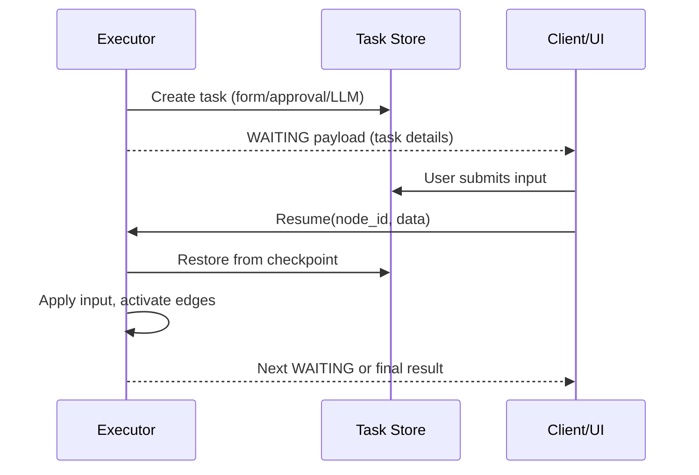

### User interaction and resume

- **WAITING**: `USER_INTERACTION` nodes create a task and set status to WAITING; the workflow returns a payload instructing the client how to proceed.
- **Resume**: submit data to the resume endpoint, the engine restores state (via checkpoint), processes the input, clears WAITING, and continues execution.

#### Sequence

- Task types: FORM, APPROVAL, LLM, BULK.
- Transition manager keeps DB task state and node status in sync.
