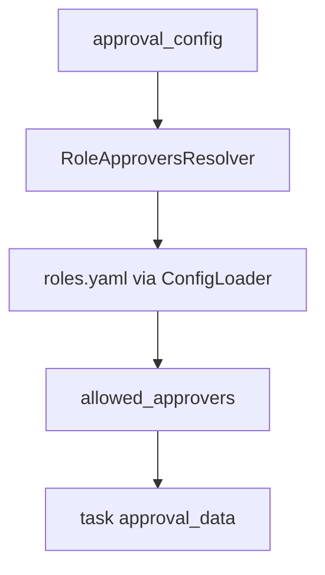
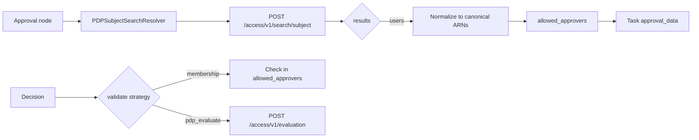

## How‑to: Approver resolver plugins

Goal: Add or configure approver resolvers for approval tasks.

### Quick start (PDPSubjectSearchResolver)

Minimal workflow node using the PDP-backed subject search:

```yaml
nodes:
  manager_approval:
    type: USER_INTERACTION
    config:
      interaction_type: approval
      approval_config:
        approver_resolver: "pdp_subject_search.PDPSubjectSearchResolver"
        pdp:
          base_url: "https://pdp.example.com"
          auth:
            type: "bearer"
            bearer_token: "${PDP_TOKEN}"
        action:
          name: "approve_payment"
        resource:
          type: "invoice"
          id: "{{ workflow_context.invoice_id }}"
```

See the full sample approval_config and options below in “Use the PDPSubjectSearchResolver (AuthZEN Draft 4)”.

### Prerequisites

- Orchestration Service running with plugin discovery enabled
- Access to `plugins/approver_resolvers/`

### 1) Configure an approval node

```yaml
nodes:
  await_manager_approval:
    type: USER_INTERACTION
    config:
      interaction_type: approval
      approval_config:
        approver_resolver: "role_approvers.RoleApproversResolver"
        role_required: "Manager"
        required_count: 1
```

### 2) Use the built‑in role resolver

- Reads role membership (via ConfigLoader) and returns allowed approvers.
- Supports username→ARN normalization with optional provider derivation.



### 3) Implement a custom resolver

```python
class FooResolver(ApproverResolver):
    def __init__(self, config_loader):
        self.config_loader = config_loader

    async def initialize(self, config: dict) -> None:
        ...

    async def resolve_approvers(self, approval_config: dict, context: dict | None = None) -> dict:
        return {"allowed_approvers": ["auth:account:provider:alice"], "policy_decision": "OK", "expiration": None}

    async def validate_approver(self, user_id: str, current_approval_data: dict, context: dict | None = None) -> bool:
        return user_id in set(current_approval_data.get("allowed_approvers", []))

    async def shutdown(self) -> None:
        ...
```

### 4) Use the PDPSubjectSearchResolver (AuthZEN Draft 4)

This resolver queries the PDP subject-search endpoint to determine who can perform an action on a resource.

```yaml
approval_config:
  approver_resolver: "pdp_subject_search.PDPSubjectSearchResolver"
  pdp:
    base_url: "https://pdp.example.com"
    auth:
      type: "client_credentials"
      token_url: "https://idp.example.com/oauth/token"
      client_id: "crud-service"
      client_secret: "${PDP_CLIENT_SECRET}"
      scope: "application.all"
  action:
    name: "approve_payment"   # or ["view","approve"] with mode: any|all
  resource:
    type: "invoice"
    id: "{{ workflow_context.invoice_id }}"  # or filter: { cost_center_id: ... }
  normalize:
    provider: "empowernow"
  validate:
    strategy: "pdp_evaluate"
    evaluation_action: "approve_payment"
  limits:
    page_size: 500
    max_results: 5000
```

Mermaid (flow)



### 4) Reference your resolver in workflows

Set `approval_config.approver_resolver: "foo.FooResolver"` and redeploy.

### 5) Validate decisions

- On decision, the engine loads the resolver, verifies the actor, and applies thresholds.
- Approve/reject terms are normalized via `approval_synonyms.yaml`.

Troubleshooting

- Resolver not found: check plugin path/class name and plugin loader configuration.
- Not authorized: confirm normalization to ARNs and role membership inputs.

See also

- IdP: PEP to PDP request and obligation handling — `services/idp/backend/pep-pdp-request.md`
- PDP: Obligations & delegation (who may approve) — `services/pdp/backend/obligations-and-delegation.md`

