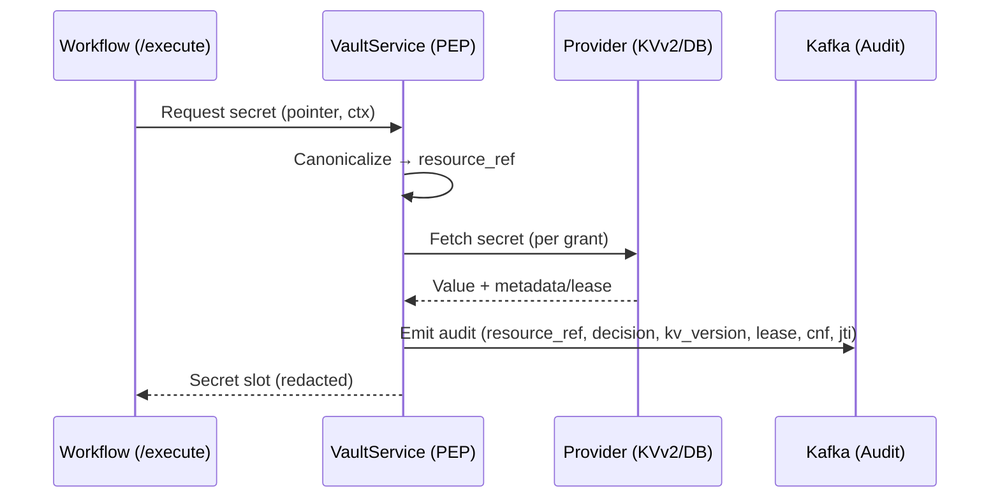

### Audit schema
Required fields: `timestamp, tenant_id, system_id, workflow_run_id, node_id, subject{sub, act?}, action="use", resource_ref, decision_id, policy_version, classification, purpose_of_use, kv_version?, lease_id?, lease_ttl?, cnf_jkt|mtls_thumbprint, token_jti`.

### Visual: audit emission sequence


Example payload:
```json
{
  "ts":"2025-01-01T00:00:00Z",
  "tenant_id":"t-123",
  "system_id":"jira",
  "workflow_run_id":"wr-1",
  "node_id":"n-2",
  "subject":{"sub":"auth:account:github:octocat","act":null},
  "action":"use",
  "resource_ref":"hmac-abc",
  "resource_arn":"auth:v1:resource:secret:openbao-X:abc",
  "decision_id":"d-789",
  "policy_version":"p-42",
  "classification":"confidential",
  "purpose_of_use":"execute",
  "kv_version":12,
  "lease_id":null,
  "lease_ttl":null,
  "cnf_jkt":"thumb",
  "token_jti":"1a2b3c",
  "event":"SECRET_PERMIT",
  "sampled":true
}
```

### Sampling rules
- Sample cache‑hit audits (1:N). Always emit DENY/ERROR/ROTATE.

### Metrics
- **PEP latency**: `pep_latency_ms{hit="grant|first"}`
- **Grant hit ratio**: `grant_hit_total`, `grant_miss_total`
- **Negative cache**: `grant_negative_cache_hit_total`
- **PDP**: `pdp_latency_ms`, `pdp_error_total`
- **Provider circuits**: `provider_circuit_open_total`
- **Denies/sec by policy**: `secret_denies_total{policy=...}`
- **Anti‑replay**: `anti_replay_total`


