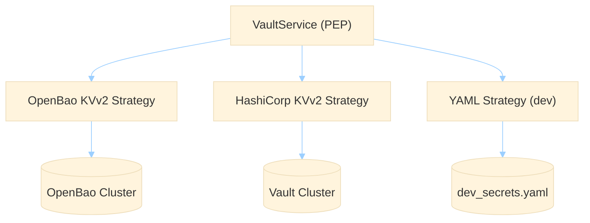
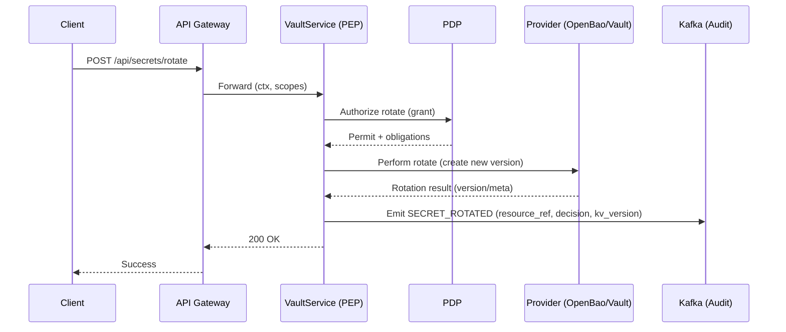

## Overview
- **PEP at `VaultService`** enforces policy before any provider access and handles grants, sender-binding, and anti-replay.
- **YAML provider** is dev-only for rapid iteration; writes are blocked outside dev/test.
- **OpenBao / HashiCorp** providers support KVv2 reads/writes, delete/destroy, version pins, and wrap/unwrap.
- **Secrets API** supports CRUD operations; PDP checks and optional OAuth scopes guard access.

## Endpoints and authorization model
### Visual: end-to-end authorization flow
```mermaid
%%{init: {'theme':'base','themeVariables':{'lineColor':'#9ccfff','textColor':'#e6f1ff'}}}%%
flowchart LR
  A["Client"] --> B["API Gateway"]
  B --> C{"Require auth?"}
  C --|no| D["Proceed (dev)"]
  C --|yes| E["Authenticate (session/bearer)"]
  E --> F{"Scopes enabled?"}
  F --|yes| G{"Check endpoint scope"}
  F --|no| H["Skip scopes"]
  G --|fail| X["403 Forbidden"]
  G --|pass| I["VaultService (PEP)"]
  H --> I
  D --> I
  I --> J["PDP (grants, binding, anti-replay)"]
  J --> K{"Permit?"}
  K --|deny| X
  K --|permit| L{"Provider"}
  L --|yaml (dev)| M[("YAML file")]
  L --|openbao+kv2| N[("OpenBao KVv2")]
  L --|hashicorp+kv2| O[("HashiCorp KVv2")]
  L --> P["Audit (Kafka)"]
  L --> Q["Response (slots/metadata)"]
```
- **POST `/api/secrets`**: create/update
  - PDP purpose: `write`
  - Scope (optional, when enabled): `secrets.write`
  - Providers: `yaml` (dev only), `openbao+kv2`, `hashicorp+kv2`
- **GET `/api/secrets?uri=...`**: read value (yaml dev only; use `VaultService` for others)
  - PDP: implicit via PEP when using `VaultService`
  - Scope (optional): `secrets.read`
  - Provider: `yaml` only
- **DELETE `/api/secrets?uri=...&destroy=true|false`**: soft delete or hard destroy
  - PDP purpose: `delete`
  - Scopes (optional): `secrets.delete` or `secrets.destroy`
  - Providers: `yaml` (dev only), `openbao+kv2`, `hashicorp+kv2`
- **GET `/api/secrets/metadata?mount=...&prefix=...`**: metadata-only listing
  - PDP purpose: `read_metadata`
  - Scope (optional): `secrets.read_metadata`
  - Provider: `yaml` (dev)
- **GET `/api/secrets/keys?uri=...`**: enumerate keys under a path (metadata-only)
  - PDP purpose: `read_metadata`
  - Scope (optional): `secrets.read_metadata`
  - Provider: `yaml` (dev)
- **POST `/api/secrets/rotate`**: rotate secret
  - PDP purpose: `rotate`
  - Scope (optional): `secrets.rotate`
  - Providers: `yaml` (dev semantics), `openbao+kv2`, `hashicorp+kv2`

Notes
- For non-YAML providers, perform reads through `VaultService.get_credentials(...)` using Canonical URIs.
- YAML writes/deletes are denied in non-dev environments.

## Canonical Secret URIs
- Format: `<provider>[+engine]://<mount>/<path>#<fragment>?<sorted-params>`
- Examples:
  - `yaml://secret/crud#DB_PASS`
  - `openbao+kv2://secret/app/api#token?version=12`
  - `hashicorp+kv2://secret/payments/stripe#api_key`

See also: Canonical URI rules and error codes in `../how-to/secrets-canonical-uris.md`.

## Security controls (PEP)
- **Grants** (issued by PDP facade for now): ttl, max-uses, decision IDs; cached with negative cache on deny.
- **Sender-binding**: binds grant to DPoP `jkt` or mTLS thumbprint when available; binding drift rejects use.
- **Anti-replay**: tracks `jti` to prevent reuse during a short TTL.
- **Audience check**: if `aud` is present in the execution context, it must include expected audience.
- **Audits**: Kafka events with non-leaky `resource_ref`; includes decision IDs, kv version, lease fields when available.

## Environment settings
### API/gateway
- `SECRETS_API_REQUIRE_AUTH` (default: `false`): when true, `/api/secrets/*` requires session or bearer via `AuthenticationService`.
- `SECRETS_ENFORCE_SCOPES` (default: `false`): when true, enforce OAuth scopes per endpoint:
  - `secrets.read`, `secrets.write`, `secrets.delete`, `secrets.destroy`, `secrets.rotate`, `secrets.read_metadata`.
- `ENVIRONMENT` (default: `dev`): non-dev disables YAML writes/deletes.

### PEP/grants
- `SECRETS_AUDIENCE` (default: `crud.secrets`): expected audience for PEP audience check (applies when `aud` present).
- `ENABLE_AUTHORIZATION` (pdp.yaml also supported): enables PDP checks in `SecretPolicyService`.
- `GRANT_TTL_DEFAULT` (default: `300`), `GRANT_MAX_USES_DEFAULT` (default: `1`).
- `ANTI_REPLAY_TTL_S`, `NEGATIVE_CACHE_TTL_S` (optional): replay and negative-cache TTLs.
- `TENANT_ID` (default: `dev`), `TENANT_ALLOWED_MOUNTS` (CSV): tenant guard for mounts.
- `TENANT_SALT` or `SECRET_TENANT_SALT`: HMAC salt to compute `resource_ref` for audits.

### YAML provider (dev-only)
- `YAML_VAULT_PATH`: path to the YAML file (e.g., `/app/config/data/dev_secrets.yaml`).
- See `yaml-vault-provider.md` for structure and bootstrap instructions.

### OpenBao/HashiCorp providers (KVv2)
#### Visual: provider strategy placement

- Read via `VaultService` using canonical URIs (`openbao+kv2://...` or `hashicorp+kv2://...`).
- Config falls back to generic `VAULT_` keys:
  - `OPENBAO_URL` or `VAULT_URL`
  - `OPENBAO_TOKEN` or `VAULT_TOKEN` (or AppRole below)
  - `OPENBAO_ROLE_ID`, `OPENBAO_SECRET_ID` (or `HASHICORP_ROLE_ID`, `HASHICORP_SECRET_ID`) when token is omitted
  - Optional: `VAULT_TIMEOUT`, `VAULT_VERIFY_SSL`, `VAULT_POOL_SIZE`, `VAULT_TOKEN_RENEWAL_THRESHOLD`, `VAULT_MAX_CONCURRENT_OPERATIONS`

## Typical production toggles
- Set `SECRETS_API_REQUIRE_AUTH=true` and `SECRETS_ENFORCE_SCOPES=true`.
- Ensure tokens sent to CRUDService include:
  - Audience: `crud.secrets` (or your configured `SECRETS_AUDIENCE`)
  - Scopes: for example `secrets.write` to create/update, `secrets.delete`/`secrets.destroy` to delete/destroy
  - Sender-binding (DPoP) where possible; mTLS thumbprint when using mutual TLS.
- Disable YAML writes (automatic when `ENVIRONMENT` is not dev/test). Use OpenBao/HashiCorp URIs in all flows.

## Examples
- Create/update (OpenBao KVv2) with scope and audience (PowerShell):
```powershell
curl -X POST "http://localhost:9100/api/secrets" -H "Authorization: Bearer $env:TOKEN" -H "Content-Type: application/json" -d '{
  "uri": "openbao+kv2://secret/app/api#token",
  "value": {"token":"s3cr3t"}
}'
```

- Delete (hard destroy) (HashiCorp KVv2):
```powershell
curl -X DELETE "http://localhost:9100/api/secrets?uri=hashicorp+kv2://secret/app/api#token&destroy=true" -H "Authorization: Bearer $env:TOKEN"
```

- Metadata listing (YAML dev):
```powershell
curl "http://localhost:9100/api/secrets/metadata?mount=secret&prefix=env" -H "Authorization: Bearer $env:TOKEN"
```

## Development flow (YAML)
- Bootstrap YAML from multiple `.env` files using the manifest:
```powershell
python scripts/yaml_dev_bootstrap.py --manifest scripts/bootstrap_manifest.yaml --out ..\ServiceConfigs\CRUDService\config\data\dev_secrets.yaml --mount secret --clear
```
- Read a value in code:
```python
creds = await vault_service.get_credentials("yaml://secret/crud#DB_PASS", execution_context=ctx)
```

## Auditing
## Rotation flow
### Visual: rotate sequence

- All operations emit Kafka secret events where configured. Sensitive URIs are replaced by a non-leaky `resource_ref` computed using tenant salt.
- Cache hits may be sampled (`AUDIT_SAMPLE_CACHE_HIT_N`). DENY/ERROR/ROTATE are emitted at full fidelity.


