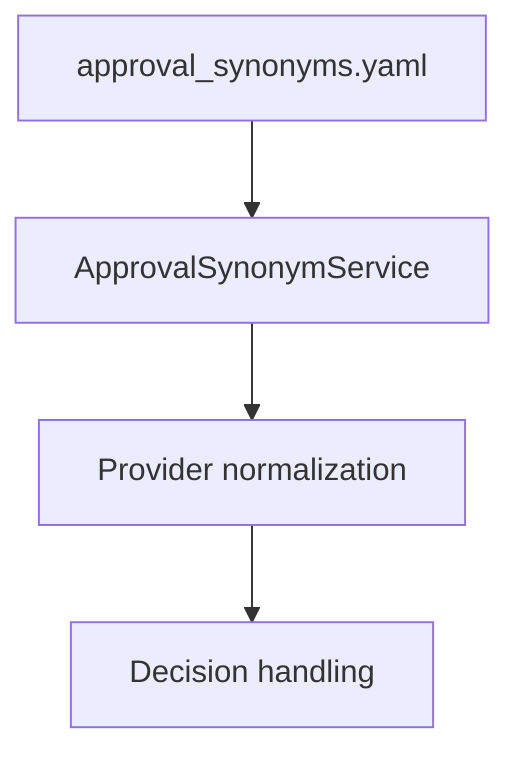

## How‑to: Decision synonyms and approval refresh

Goal: Manage approve/reject terms and keep approver lists current for pending tasks.

### Manage synonyms

- File: `CRUDService/config/approval_synonyms.yaml`
- Service helper: `src/services/approval_synonym_service.py`



Steps

1) Add or remove terms using `ApprovalSynonymService` (preferred) or edit the YAML.
2) Deploy and verify by completing an approval with the new term.

### Schedule approval refresh

- Function: `src/tasks/approval_refresh.py: refresh_approval_tasks`
- Purpose: Re‑resolve approvers for PENDING tasks and update `approval_data` if changed.

Notes

- Tasks with `override_approvers` are skipped to preserve manual assignments.
- Choose cadence based on how volatile org/roles are.

Example (pseudocode)

```python
stats = await refresh_approval_tasks(db_session, approver_resolver, batch_size=100)
print(stats)  # { total_tasks: X, tasks_updated: Y, tasks_skipped: Z, errors: [] }
```

Troubleshooting

- No changes detected: confirm the resolver returns a different `allowed_approvers` set.
- Errors on refresh: check plugin loader config and resolver dependencies.

See also

- IdP: Consent/approval as obligations — `services/idp/backend/pep-pdp-request.md`
- PDP: Defining obligations and approver policy — `services/pdp/backend/obligations-and-delegation.md`

