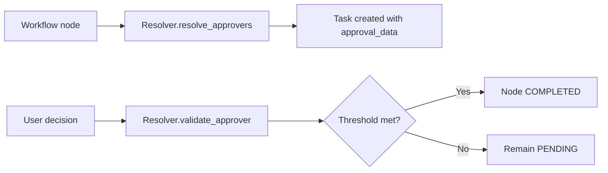

## Reference: Approval tasks and APIs

Scope: task shapes, resolver contract, routes, and key config.

### Task shapes

- interaction_type: `APPROVAL`
- config includes:
  - `approval_config`: resolver name and inputs
  - `approval_data`: list of allowed approvers
  - optional `override_approvers`: freeze approvers for this task

### Resolver contract (runtime)

```python
class ApproverResolver:
    async def resolve_approvers(self, approval_config: dict, context: dict | None = None) -> dict: ...
    async def validate_approver(self, user_id: str, current_approval_data: dict, context: dict | None = None) -> bool: ...
```

Return shape of `resolve_approvers` includes `allowed_approvers`.

### PDPSubjectSearchResolver (config schema)

```yaml
pdp:
  base_url: string
  auth:
    type: "client_credentials" | "bearer" | "none"
    token_url?: string
    client_id?: string
    client_secret?: string
    scope?: string
    bearer_token?: string
  timeouts_sec?: number
  retries?: number
action:
  name: string | string[]
  mode?: "any" | "all"
resource:
  type: string
  id?: string
  filter?: object
  from_context?: string
subject_filter?: object
normalize:
  provider?: string
  enforce_canonical_arns?: boolean
limits:
  page_size?: number
  max_results?: number
validate:
  strategy?: "membership" | "pdp_evaluate" | "none"
  evaluation_action?: string
```

Endpoints used

- `POST /access/v1/search/subject` → list of user ids allowed for action/resource
- `POST /access/v1/evaluation` → per-user decision for validation (optional)

### Decision synonyms

File: `config/approval_synonyms.yaml`

```yaml
approval_decisions: [approve, approved, yes, accept, ...]
rejection_decisions: [reject, rejected, no, deny, ...]
```

### HTTP endpoints

- `GET /tasks`
  - Filters: `status`, `type`, `workflow_id`, `created_by`, `completed_by`, `search`, `after`, `before`
  - Returns paginated list; supports ETag/Last‑Modified

- `GET /tasks/{task_id}`
  - Returns task with config, status, timestamps, response, metadata

- `POST /tasks/{task_id}/complete`
  - Body includes `decision` and optional `data`/`metadata`
  - Applies resolver validation and transitions status

- `GET /tasks/approvals/pending`
  - Returns pending approvals for the current user (short TTL cache)

### Refresh job

- `refresh_approval_tasks()` re‑resolves approvers for PENDING tasks and updates `approval_data` when changed; skips tasks with `override_approvers`.

### Mermaid: request → decision path



Versioning

- Resolver plugins are internal interfaces; keep breaking changes behind new classes.
- Decision synonyms are backward‑compatible—additive changes preferred.

See also

- IdP: PEP ↔ PDP evaluation and obligation enforcement — `services/idp/backend/pep-pdp-request.md`
- PDP: Obligations & delegation reference — `services/pdp/backend/obligations-and-delegation.md`

