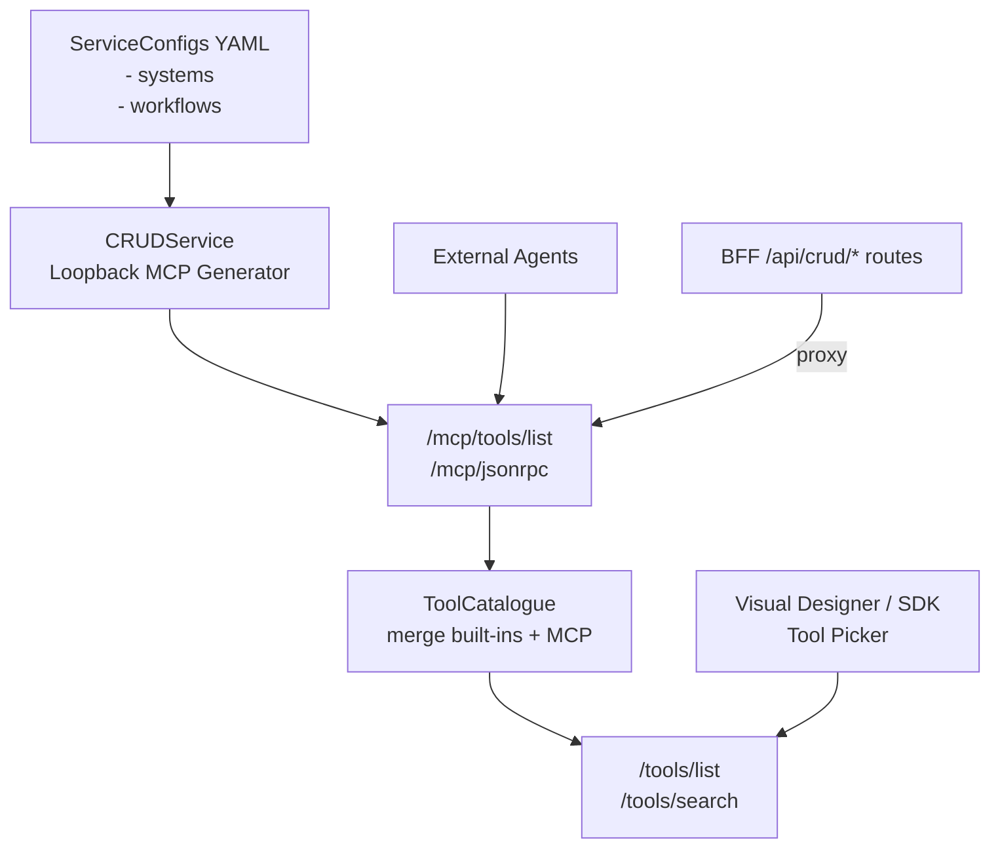

## Loopback MCP and Tool Catalogue – Persona Guide

This guide explains how CRUDService exposes system commands and workflows as MCP tools in‑process ("loopback MCP"), how they are discovered/merged by the ToolCatalogue, and how clients (UIs and agents) consume them. It provides role‑specific instructions and references.

### Architecture overview



---

## Backend developers (CRUDService)

- Source of truth
  - System commands: `config/systems/<system>.yaml` (objects.actions/commands)
  - Workflows: `config/workflows/*.yaml`

- Tool generation
  - Class: `src/mcp/loopback/generator.py`
  - Naming (deterministic):
    - Default: namespaced `provider.instance.base` (e.g., `entra.cont.account.get_by_id`, `ldap.av.account.get_by_dn`).
    - Workflow → `workflow.<name>`.
    - 50‑char cap with stable hash; fail‑fast on pre‑cap and final collisions.
    - Optional Router surface (short names with `oneOf`) disabled by default.
  - Input schema derivation:
    - Commands: prefer `input_schema`; else derive from `required_params` and optional `input_params` hints; fallback `{ type: object, additionalProperties: true }`.
    - Workflows: prefer top‑level `parameters` JSON Schema; else fallback permissive object.

- Loopback MCP endpoints (FastAPI)
  - `GET /mcp/tools/list` – returns `[ { name, description, inputSchema, source, metadata, title, annotations } ]`
  - `POST /mcp/jsonrpc` – JSON‑RPC 2.0
    - `tools/list` → `{ result: { tools: [...] } }`
    - `tools/invoke`:
      - System tool → executes `CommandExecutor.execute_command_action`
      - Workflow tool → validates arguments; by default returns `{ accepted: true }` stub
      - Optional direct start behind flag `MCP_LOOPBACK_WORKFLOW_DIRECT_INVOKE=true` (internal ASGI call to `/workflow/start`)

- Security and scopes
  - Discovery requires scope: `mcp.tools.discovery`
  - Invoke requires scope: `mcp.tools.invoke`
  - Both enforced in `src/api/mcp_loopback_routes.py`

- ToolCatalogue merge
  - Class: `src/services/tool_catalogue.py`
  - Always loads built‑ins from `config/tools.yaml`
  - Includes loopback MCP tools when `config_loader` is provided
  - External MCP endpoints (optional) from `config/mcp_endpoints.yaml`
  - Name constraints: `ToolInfo.name` ≤ 64 chars; long names will be skipped and logged

- Observability
  - Structured logs for `mcp_tools_list_*` and `mcp_jsonrpc_*` events with correlation IDs and durations
  - OTEL can be disabled locally: `OTEL_DISABLED=true`

- Feature flags / env
  - `MCP_LOOPBACK_WORKFLOW_DIRECT_INVOKE=true` → actually invoke `/workflow/start` inside tools/invoke
  - `OTEL_DISABLED=true` (tests/local)

---

## Frontend developers (Visual Designer and SDK)

- Catalogue APIs
  - `GET /api/crud/tools/list?type=builtin|mcp` → list tools (BFF proxies CRUDService `/tools/list`)
  - `GET /api/crud/tools/search?q=<query>&limit=<n>` → search tools (merged list)

- Hooks and service (Visual Designer)
  - `src/services/toolService.ts` – `listTools`, `searchTools` returning `{ name, type, description, func?, metadata }`
  - `src/hooks/useTools.ts` – `useToolList(type?)`, `useToolSearch(q, limit, includeEmpty?)`

- Tool Picker modal (large catalog ready)
  - Component: `visual_designer/frontend/src/components/ToolPicker/index.tsx`
  - Features: debounced search, segmented filter (All/Built‑in/MCP), endpoint column for MCP, paging (20/50/100), scroll; disables already selected.
  - Usage: In your editor page, keep a Set of selected tool names, pass `alreadySelected`, and handle `onSelect(ToolInfo)`

```tsx
<ToolPicker
  open={isOpen}
  onClose={() => setOpen(false)}
  onSelect={(t) => addTool(t)}
  alreadySelected={new Set(selected.map(s => s.name))}
/>
```

---

## SRE / DevOps

- BFF routing (proxy to CRUDService MCP)
  - File: `ServiceConfigs/BFF/config/routes.yaml`
  - Added:
    - `GET /api/crud/mcp/tools/list` → CRUD `/mcp/tools/list`
    - `POST /api/crud/mcp/jsonrpc` → CRUD `/mcp/jsonrpc`
    - `GET|POST /api/crud/mcp/*` → CRUD `/mcp/{path}`

- Security middlewares
  - CRUDService exempts `/mcp/*` from CSRF/origin validation for server‑side clients; keep BFF session auth on `/api/crud/*`.

- Env and resilience
  - Disable OTEL locally/tests: `OTEL_DISABLED=true`
  - Tests may bypass FIPS: `ALLOW_NONFIPS_FOR_TESTS=true`
  - Naming/identity:
    - `MCP_NAMING_STRATEGY=global_namespace` (default). Fallback suffix when identity missing.
    - `MCP_DUPLICATE_POLICY=fail` enforces uniqueness (pre‑cap and final).
    - `MCP_MAX_TOOLS` caps publication; list is deterministic and paginated.

---

## Security / Authorization

- Scopes
  - `mcp.tools.discovery` – required for listing tools
  - `mcp.tools.invoke` – required for invoking tools
  - Accepts scopes in `user.scope` or `normalized_permissions`

- PDP integration
  - Standard `/api/crud/*` routes continue to go through BFF with PDP guards by configuration.
  - Loopback MCP runs in CRUDService; use session → service token flow or rely on BFF proxy with session to enforce policy at the edge.

---

## QA / Testing

- Unit tests
  - MCP list: `tests/unit/api/test_mcp_loopback_list.py`
  - MCP invoke: `tests/unit/api/test_mcp_loopback_invoke.py`
  - ToolCatalogue merge: `tests/unit/services/test_tool_catalogue_mcp_merge.py`

- Integration tests
  - Tools routes: `tests/test_tool_routes.py`
  - MCP endpoints: `tests/integration/test_mcp_endpoints.py`

- Useful env for tests
  - `OTEL_DISABLED=true`
  - `ALLOW_NONFIPS_FOR_TESTS=true`

---

## External agent integrators

- Discovery (choose one)
  - Direct to CRUDService: `GET /mcp/tools/list`
  - Via BFF proxy: `GET /api/crud/mcp/tools/list` (session‑protected)

- Invocation (JSON‑RPC 2.0)
  - Direct: `POST /mcp/jsonrpc`
  - Via BFF: `POST /api/crud/mcp/jsonrpc`

Example – list tools:

```bash
curl -s -H "Authorization: Bearer <token>" \
  http://crud-service:8000/mcp/tools/list
```

Example – invoke a system tool:

```bash
curl -s -H "Authorization: Bearer <token>" \
  -H "Content-Type: application/json" \
  -d '{
    "jsonrpc": "2.0",
    "id": "1",
    "method": "tools/invoke",
    "params": { "name": "svc_thing_do", "arguments": { "id": "123" } }
  }' \
  http://crud-service:8000/mcp/jsonrpc
```

Workflow invocation behavior:
  - Validates arguments against the tool’s JSON Schema
  - Default returns `{ accepted: true, workflow: "<name>", params: {...} }`
  - To start immediately (test/dev), set `MCP_LOOPBACK_WORKFLOW_DIRECT_INVOKE=true` in CRUDService and reuse the same JSON‑RPC call

---

## Migration notes and limits

- Tool name length ≤ 64 (Pydantic validation in `ToolInfo`); ultra‑long names are skipped with a warning.
- Workflows missing full structure still emit tools (schema falls back); starting them may require proper definitions.
- Loopback MCP is always present; external MCP endpoints remain optional and are merged when configured.


---

## See also

- Quickstart: `../../how-to/mcp-quickstart.md`
- API Reference: `./mcp_api_reference.md`
- Security & Governance: `./mcp_security_governance.md`
- Tool Catalogue & Naming: `../../explanation/mcp_tool_catalogue_naming.md`
- BFF MCP proxy routing: `../../../bff/devops/mcp_proxy_routing.md`
- Cursor integration: `../../how-to/mcp-cursor-integration.md`
- Visual Designer Tool Picker: `../../../visual-designer/frontend/tool-picker.md`
- Tutorials: `../tutorials/mcp-scenario-user-context.md`