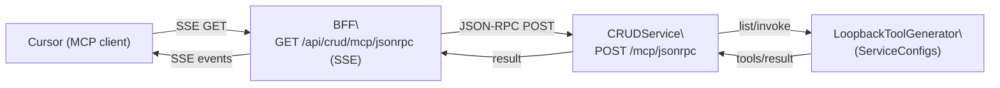

## Loopback MCP tools in CRUDService – Admin How‑To

### What you get
- **In‑process MCP server** under `/mcp` that exposes tools generated from ServiceConfigs (systems + workflows).
- **Single source of truth**: tools derive from your YAML configs (no separate MCP processes required).
- **ToolCatalogue auto‑merge**: built‑ins from `config/tools.yaml` + loopback MCP + any external MCP endpoints in `config/mcp_endpoints.yaml`.

### Endpoints
- **GET `/mcp/tools/list`**
  - Returns `{ "tools": [ { name, description, inputSchema, source, metadata } ] }`
  - Requires scope: `mcp.tools.discovery`

- **POST `/mcp/jsonrpc`** (JSON‑RPC 2.0)
  - Supported methods:
    - `tools/list` → returns same structure as REST list
    - `tools/invoke` → executes named tool; body: `{ id, method: "tools/invoke", params: { name, arguments } }`
    - `tools/call` → alias for `tools/invoke` (compatibility)
  - Requires scope: `mcp.tools.invoke`

### Auth and scopes
- Reuses CRUDService authn/z. Provide `Authorization: Bearer <token>`.
- Scopes enforced:
  - `mcp.tools.discovery` for listing
  - `mcp.tools.invoke` for invoking
- PDP `enable_authorization` flag is read from `config/pdp.yaml`.

### Tool sources and naming
- **Default namespaced**: `provider.instance.base` for system tools (e.g., `entra.cont.account.get_by_id`, `ldap.av.account.get_by_dn`). Workflows use `workflow.<name>`.
- **Router (optional)**: short names with `oneOf` input schema; enable via `MCP_ENABLE_ROUTER=true` (invocation routing remains namespaced).
- JSON Schema for inputs is auto‑derived; falls back to a permissive object when unspecified.

### Catalogue behavior
- On startup, CRUDService builds a ToolCatalogue with:
  - Built‑ins from `config/tools.yaml`
  - Loopback MCP tools (when `ToolCatalogue` is constructed with a `config_loader` – default in `src/main.py`)
  - External MCP endpoints in `config/mcp_endpoints.yaml` (merged)
- After mutations, catalogue refreshes automatically:
  - Systems: create/update/delete (`/config/systems/*`)
  - Workflows: create/update/delete (`/workflows/*`)
  - Tools config replace: `PUT /config/tools`

### Observability
- Structured logs with `correlation_id` and durations:
  - `mcp_tools_list_start` / `mcp_tools_list_complete`
  - `mcp_jsonrpc_call` / `mcp_jsonrpc_complete`
  - Errors/denied: `mcp_jsonrpc_error`, `mcp_jsonrpc_forbidden`

### Examples

#### Architecture (transport) overview


#### List tools (REST)
```bash
curl -H "Authorization: Bearer $TOKEN" \
  https://crud.service.local/mcp/tools/list
```

Response (truncated):
```json
{ "tools": [
  { "name": "entra.cont.account.get_by_id", "source": "system", "inputSchema": {"type":"object",...} },
  { "name": "workflow.onboard_user", "source": "workflow", "inputSchema": {"type":"object",...} }
]}
```

#### List tools (JSON‑RPC)
#### Health (JSON‑RPC)
```bash
curl -H "Authorization: Bearer $TOKEN" -H "Content-Type: application/json" \
  -d '{
    "jsonrpc":"2.0","id":"1","method":"tools/call",
    "params":{"name":"system.health","arguments":{"verbose":true}}
  }' \
  https://crud.service.local/mcp/jsonrpc
```

Also supported: `"name":"system_health"`.
```bash
curl -H "Authorization: Bearer $TOKEN" -H "Content-Type: application/json" \
  -d '{"jsonrpc":"2.0","id":"1","method":"tools/list"}' \
  https://crud.service.local/mcp/jsonrpc
```

#### Invoke a workflow tool
```bash
WF=workflow_onboard_user
curl -H "Authorization: Bearer $TOKEN" -H "Content-Type: application/json" \
  -d '{
    "jsonrpc":"2.0","id":"2","method":"tools/invoke",
    "params": {"name":"'"$WF"'","arguments":{"username":"jdoe","email":"jdoe@example.com"}}
  }' \
  https://crud.service.local/mcp/jsonrpc
```

Response (loopback MVP):
```json
{ "jsonrpc": "2.0", "id": "2", "result": {
  "content": [{ "type": "text", "text": "{\"accepted\": true, \"workflow\": \"onboard_user\", \"params\": {\"username\":\"jdoe\",\"email\":\"jdoe@example.com\"}}" }]
}}
```

#### Invoke a system command tool
```bash
TOOL=ldap_account_create
curl -H "Authorization: Bearer $TOKEN" -H "Content-Type: application/json" \
  -d '{
    "jsonrpc":"2.0","id":"3","method":"tools/invoke",
    "params": {"name":"'"$TOOL"'","arguments":{"uid":"jdoe","cn":"John Doe"}}
  }' \
  https://crud.service.local/mcp/jsonrpc
```

Response (truncated):
```json
{ "jsonrpc": "2.0", "id": "3", "result": { "content": [ { "type": "text", "text": "{...}" } ] } }
```

### Rollout tips
- Start in non‑prod; monitor the structured log events above.
- Ensure tokens used by agent UIs carry the minimal scopes required.
- External MCP endpoints remain optional; add them via `config/mcp_endpoints.yaml`.

### Troubleshooting
- 403 or JSON‑RPC error `-32001`: missing scope (`mcp.tools.discovery` or `mcp.tools.invoke`).
- Empty list: confirm ServiceConfigs are mounted and readable; check logs for loader validation errors.
- Stale list: trigger a change or call an admin mutation to refresh; or restart service.
 - `-32601 Method not found`: use `tools/call` (alias) or check method casing.
 - Health tool missing: set `MCP_LOOPBACK_ONLY_HEALTH=false` (or unset) and redeploy.

### Quick start
1. Set `MCP_MAX_TOOLS=80` on CRUDService.
2. Add minimal `mcp` blocks to one Azure/Auth0 GET command and one workflow.
3. Call tools/list; verify tools plus `system.health`/`system_health`.
4. Invoke health via `tools/call` with `{ verbose: true }`.
5. Invoke an enabled Azure/Auth0 tool with required params.

### Cursor setup (copy/paste)
Create or edit `~/.cursor/mcp.json` (Windows: `%USERPROFILE%\.cursor\mcp.json`).

```json
{
  "mcpServers": {
    "crud-mcp": {
      "type": "streamable-http",
      "url": "https://api.ocg.labs.empowernow.ai/api/crud/mcp/jsonrpc",
      "headers": {
        "Authorization": "Bearer <ACCESS_TOKEN_WITH_scopes_mcp.tools.discovery_mcp.tools.invoke>",
        "Content-Type": "application/json"
      }
    }
  }
}
```

Then in Cursor:
- Open the MCP tools panel → enable `crud-mcp` if disabled
- Ask: “List tools from crud-mcp” (Cursor sends `tools/list`)
- Ask: “Run the CRUD MCP health check with verbose true” (Cursor sends `tools/call` to `system.health`)

Tips
- If you see 403/CSRF, ensure the URL points to the BFF proxy and you’re sending a Bearer token.
- If Cursor uses `tools/call`, the server handles it; `tools/invoke` also works.


---

## See also

- Quickstart: `../how-to/mcp-quickstart.md`
- Cursor integration: `../how-to/mcp-cursor-integration.md`
- API Reference: `./mcp_api_reference.md`
- BFF MCP proxy routing: `../../bff/devops/mcp_proxy_routing.md`
- Opt‑in authors guide: `../how-to/mcp-opt-in-authors-guide.md`