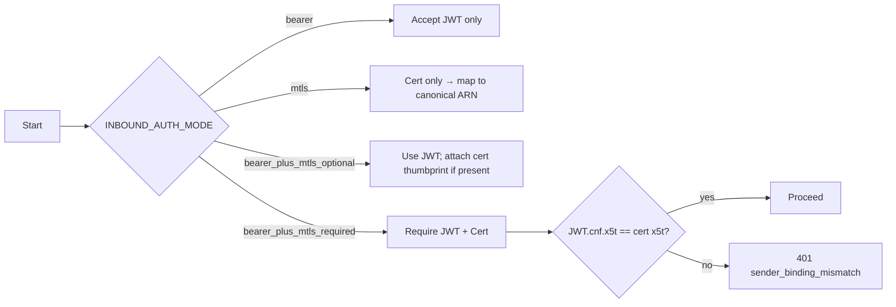
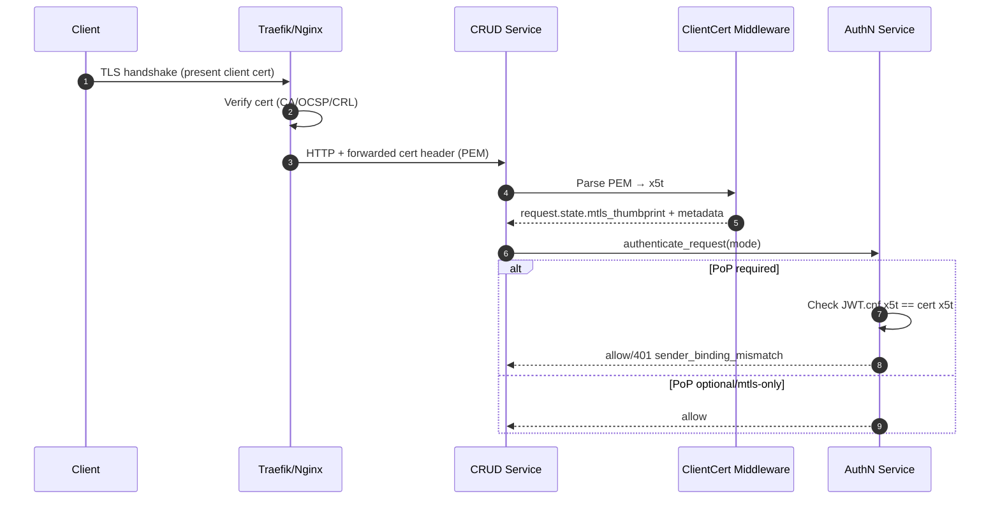
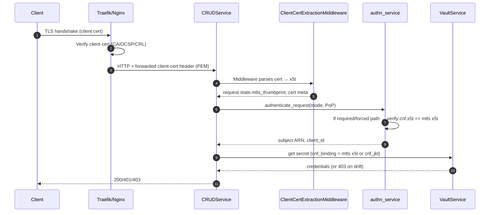
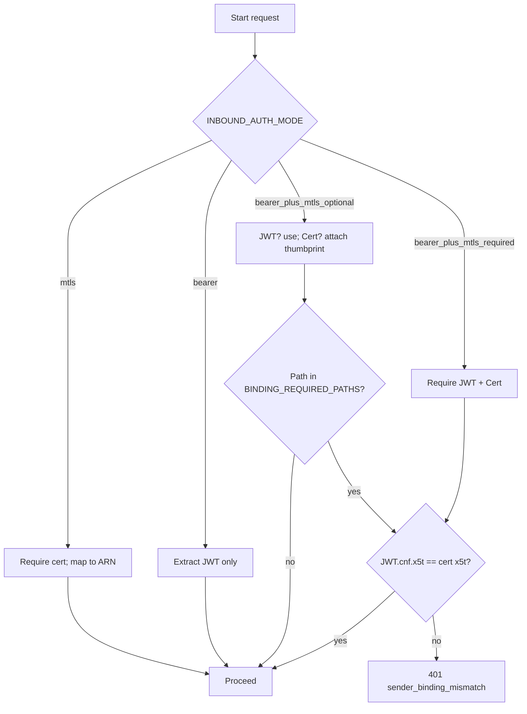

## Quick links

- How‑to: Enable mTLS → [Enable mTLS for CRUD Service APIs](../how-to/enable-mtls.md)
- Jump to: [Flow: mode and PoP enforcement](#flow-mode-and-pop-enforcement)

### Mode selection (quick visual)



## At a glance



---

## mTLS Implementation Guide

This guide explains what we built, how it works end-to-end, how to configure it (Docker/Kubernetes), and how to use and verify it.

### What we built
- Inbound mutual TLS (mTLS) at the edge (Traefik/Nginx) with the verified client certificate forwarded to the app via a trusted header.
- FastAPI middleware parses the forwarded certificate, computes x5t#S256, and attaches identity details to `request.state`.
- Authentication service supports modes: `bearer`, `mtls`, `bearer_plus_mtls_optional`, `bearer_plus_mtls_required` with PoP (sender-binding) enforcement using `cnf.x5t#S256`.
- Identity mapping produces canonical ARNs like `auth:account:x509:sha256:{thumb}` or email SAN-based ARNs under policy.
- Vault secrets path enforces sender-binding and drift detection.

### How it works (at a glance)
- Edge terminator verifies client cert (CA/OCSP/CRL) and forwards the PEM to the app.
- Middleware trusts only configured proxy CIDRs, parses PEM, computes thumbprint, and sets `request.state.mtls_thumbprint` and other metadata.
- AuthN enforces mode and PoP: compares `JWT.cnf.x5t#S256` to `mtls_thumbprint` when required.
- VaultService binds secrets to the thumbprint (or `cnf_jkt`) and detects drift across requests.

Key diagrams are further below in this document (sequence and flow). 

---
Here’s a production-grade design to add inbound mTLS and certificate-based authentication, integrated cleanly with your existing auth flow and policies.

### Current state (deep assessment)
- `authenticate_user` in `src/services/authn_service.py` accepts only Bearer tokens; no client cert parsing or sender-binding checks.
- `workflow_routes.py` and `execute_routes.py` rely on `Depends(authorize_user)` → still Bearer-only.
- `main.py` can run HTTPS but does not support client auth (no CA, no verify_mode).
- No middleware parses `X-Forwarded-Client-Cert`/XFCC or attaches cert-derived identity. Only `PrincipalHeadersMiddleware` exists.
- `VaultService` already anticipates `request.state.mtls_thumbprint`/`cnf_jkt` for secret policy binding, but nothing sets these today.

### Goals
- Robust inbound mTLS for service-to-service/API-clients.
- Cert-based identity and optional PoP binding to JWT (`cnf.x5t#S256`).
- Zero-trust header handling (only trust proxy-provided cert headers).
- FIPS-appropriate TLS policy and revocation handling.
- Clear modes: bearer-only, mtls-only, or strict “bearer + mtls binding required”.

### Trust boundaries and deployment options
- Edge-terminated mTLS at Traefik/Nginx and forward a trusted client-cert header to the app.
- Optional direct mTLS at the app (Uvicorn with client cert verification), but prefer proxy termination for standardization and revocation checks.

### Target architecture

- Reverse proxy (Traefik) enforces mTLS:
  - Require client certificate (RequireAndVerify).
  - Validate against trusted CA bundle (config-managed).
  - Enable `passTLSClientCert` to forward the peer cert via `X-Forwarded-Tls-Client-Cert` (PEM) and optionally a SHA-256 thumbprint header.
  - Enforce TLS1.2+ (prefer TLS1.3 when available) and FIPS-approved ciphers.

- App (CRUDService) adds:
  - `ClientCertExtractionMiddleware`:
    - Trusts cert headers only from known internal proxies.
    - Parses forwarded PEM cert, computes SHA-256 thumbprint (DER), extracts subject DN, SANs, issuer, validity, policy OIDs.
    - Stores on `request.state`:
      - `mtls_thumbprint` (base64url x5t#S256),
      - `client_cert_subject_dn`, `client_cert_sans`, `client_cert_issuer_dn`,
      - `client_cert_not_before`, `client_cert_not_after`,
      - `client_cert_policy_oids`.
  - `authn_service.authenticate_request`:
    - New `INBOUND_AUTH_MODE` options: `bearer`, `mtls`, `bearer_plus_mtls_optional`, `bearer_plus_mtls_required`.
    - If `mtls` or `bearer_plus_mtls_*`, build a canonical identity from cert (see “Identity mapping”).
    - If `bearer_plus_mtls_required`, enforce `token.cnf.x5t#S256 == mtls_thumbprint`.
    - Set `request.state.mtls_thumbprint`, `request.state.client_id`, and `request.state.subject` so `VaultService` and downstream components can apply sender-binding.
  - `authorize_user` continues to work; it will see a `unique_id` derived from cert when JWT is absent or both identities are present (config determines which wins).

### Identity mapping (canonical and policy-driven)
- Canonical ARNs: use standard `auth:account:{provider}:{subject}`.
- Certificate identities:
  - Default provider: `x509`.
  - Subject resolution strategies (configurable):
    - Thumbprint-based: `auth:account:x509:sha256:{x5t#S256}` (strongest/unique).
    - SAN e-mail: `auth:account:x509:email:{addr}` when email SAN present and allowed.
    - SAN URI / DNS / UPN mapping rules.
- Mapping policy file (config-managed, mounted at `/app/config/cert_identity_mappings.yaml`):
  - Static allowlist: specific thumbprints → principal ARNs.
  - CA constraints: which CAs are allowed per endpoint group.
  - Policy OIDs required (e.g., for device or hardware-token client certs).
  - SAN/domain constraints (e.g., `email SAN must end with @corp.tld`).
  - Endpoint-level mode: which endpoints accept `mtls`, require `bearer+mtls`, or are `bearer` only.

### Sender-binding and PoP enforcement
- If mTLS and JWT present:
  - Verify `JWT.cnf.x5t#S256 == request.state.mtls_thumbprint`; otherwise 401 with explicit error.
- If DPoP is used instead of mTLS in some flows, keep your existing DPoP path. Prefer one PoP mechanism per client profile to reduce complexity.

### Revocation checks and cert validation
- Primary: enforce mTLS at Traefik with CRL/OCSP.
  - Configure OCSP stapling and revocation at the proxy (preferred for performance and consistency).
- Secondary (defense-in-depth): app validates certificate fields from header against mappings (expiry, policy OIDs, SAN restrictions).
- Optionally implement light OCSP/CRL verification in app for high-risk endpoints (cache responses, short TTLs) if the proxy cannot enforce revocation.

### Configuration (centralized, docker-compose-driven)
- New security section (single source of truth in mounted config):
  - Trusted proxies/CIDRs.
  - Expected forwarded cert header names.
  - Mode per endpoint group: `bearer`, `mtls`, `bearer_plus_mtls_optional`, `bearer_plus_mtls_required`.
  - Allowed CAs (hashes or filenames), policy OIDs required, SAN constraints.
  - Enable/disable PoP binding enforcement.
- Traefik dynamic config:
  - TLS client auth (CA bundle path).
  - `passTLSClientCert` with `pem: true` and `info.notAfter/notBefore/subject/issuer/sans` enabled as needed.
  - Strict TLS versions and FIPS-compliant ciphers.

### App changes (concrete)
- Add `src/middleware/client_cert.py`:
  - Verify caller is a trusted proxy (`remote_addr` in CIDRs or a shared internal mTLS), otherwise ignore/strip client-cert headers.
  - Read `X-Forwarded-Tls-Client-Cert` (PEM), parse via `cryptography`, compute x5t#S256 (base64url of SHA-256 DER), extract SANs/DNs, set `request.state.*`.
- Wire it in `main.py` before `PrincipalHeadersMiddleware`.
- Extend `src/services/authn_service.py`:
  - Load auth mode and mapping policies from config loader.
  - Build identity from cert when configured; verify PoP binding when required.
  - If cert-only mode: bypass JWT introspection; set `unique_identity` from cert mapping.
  - If bearer+mtls: keep JWT introspection, then enforce binding.
- Extend error responses with clear troubleshooting (e.g., missing cert, untrusted CA, expired cert, PoP mismatch).
- Kafka audit:
  - On cert-auth success/failure publish security event with minimal non-sensitive details: `cert_thumbprint`, `issuer_hash`, `policy_oids`, endpoint, correlation_id.
- Metrics:
  - Counters for `mtls_auth_success`, `mtls_auth_failure_{reason}`, `mtls_pop_mismatch`.

### Security hardening
- Strip any client-cert header from untrusted sources (defense-in-depth).
- Enforce strict header names; reject multi-value tricks.
- Rate-limit cert-auth failures.
- Rotate CA bundles via mounted config; reload on SIGHUP or periodic watch.
- TLS policy: TLSv1.2+ (prefer TLSv1.3); FIPS-approved ciphers only.
- No silent fallback between modes. If `bearer_plus_mtls_required`, return 401 when cert missing or binding fails.

### Rollout plan
- Phase 1 (observe): Deploy proxy mTLS termination and pass cert headers; add middleware in passive mode to parse/attach, but keep `bearer` mode. Monitor.
- Phase 2 (optional binding): Switch to `bearer_plus_mtls_optional` and log binding success/failure; alert on mismatches.
- Phase 3 (enforce): Flip endpoints to `bearer_plus_mtls_required` or `mtls` as needed.
- Add runbooks for CA rotation and incident response (revocation, blocklists).

### Optional: direct app mTLS (only if needed)
- Build `ssl.SSLContext` with `ssl.Purpose.CLIENT_AUTH`, `verify_mode=CERT_REQUIRED`, `load_verify_locations(ca)`, `minimum_version=TLSv1_2` (or TLSv1_3), FIPS ciphers.
- Pass `ssl=ctx` to uvicorn programmatically (instead of env-only run).
- Still keep proxy as preferred termination for simplicity and revocation.

If you want, I can implement:
- `ClientCertExtractionMiddleware`.
- Config schema changes (security section, mapping file).
- `authenticate_request` updates with modes and PoP binding checks.
- Traefik dynamic config snippet to enable mTLS and pass client cert safely.

- Implementing this will also populate `request.state.mtls_thumbprint`, unlocking the sender-binding already recognized by `VaultService`.

- This design aligns with your canonical ARN format, avoids unsafe fallbacks, and keeps configuration centralized via the mounted config directory.

- Summary
- Inbound mTLS terminated at Traefik with strict TLS and revocation; cert forwarded via trusted header.
- New FastAPI middleware parses cert, computes x5t#S256, and attaches identity details.
- `authenticate_request` gains configurable modes (bearer, mtls, bearer+mtls with PoP binding).
- Identity mapping from cert to canonical ARNs via policy file; strict enforcement, no silent fallback.
- Full auditing and metrics; FIPS-appropriate TLS posture.

Yes. The design fits your current split: Docker + Traefik in dev, Kubernetes + ingress (Traefik or Nginx) in prod. Here’s exactly how it maps to your `docker-compose-authzen4.yml` and what to do in K8s.

### Dev (Docker + Traefik) – concrete changes
- Traefik already fronts all services in `docker-compose-authzen4.yml`. Add mTLS and forward the client cert to the app.
- Use Traefik dynamic config (`CRUDService/traefik/dynamic.yml`) and the existing certs mount (`../IdP/certs → /certs`).

Minimal dynamic config additions:
```yaml
# traefik/dynamic.yml
tls:
  options:
    mtls:
      minVersion: VersionTLS12
      cipherSuites:
        - TLS_ECDHE_ECDSA_WITH_AES_256_GCM_SHA384
        - TLS_ECDHE_RSA_WITH_AES_256_GCM_SHA384
      clientAuth:
        clientAuthType: RequireAndVerifyClientCert
        caFiles:
          - /certs/ca.crt

http:
  middlewares:
    mtls-passcert:
      passTLSClientCert:
        pem: true
        info:
          subject: true
          issuer: true
          notBefore: true
          notAfter: true
          sans: true
```

Attach to your CRUD router (labels) so the cert is required and forwarded:
```yaml
# in crud-service.labels (add/keep existing)
- "traefik.http.routers.crud.tls=true"
- "traefik.http.routers.crud.tls.options=mtls@file"
- "traefik.http.routers.crud.middlewares=mtls-passcert@file,security-headers@file,rate-limit@file"
```

App-side settings (env or config file under `/app/config`):
- `INBOUND_AUTH_MODE=bearer_plus_mtls_required` (or `mtls`/`bearer_plus_mtls_optional` per endpoint policy)
- `FORWARDED_CLIENT_CERT_HEADER=X-Forwarded-Tls-Client-Cert`
- `TRUSTED_PROXY_CIDRS=172.16.0.0/12,10.0.0.0/8` (Docker bridge)
- `CERT_IDENTITY_MAPPINGS=/app/config/cert_identity_mappings.yaml`

The new `ClientCertExtractionMiddleware` will:
- Trust only Traefik (by `TRUSTED_PROXY_CIDRS`).
- Parse `X-Forwarded-Tls-Client-Cert` (PEM), compute x5t#S256, set `request.state.mtls_thumbprint`, SANs, DNs, validity.
- `authenticate_request` will enforce PoP binding if configured and populate canonical identity. This automatically unlocks sender-binding in `VaultService` (it already reads `mtls_thumbprint`).

### Prod (Kubernetes)
You can run either Traefik or Nginx. The app’s middleware stays identical; only ingress config differs.

Option A: Traefik (CRDs)
- In your `IngressRoute`:
  - reference a `tls.options: mtls@file` with `clientAuth` (mounted CA secret)
  - apply the same `passTLSClientCert` middleware

Example fragment:
```yaml
apiVersion: traefik.containo.us/v1alpha1
kind: IngressRoute
spec:
  entryPoints: [ websecure ]
  routes:
    - match: Host(`crud.prod.example.com`)
      kind: Rule
      services:
        - name: crud-service
          port: 8000
      middlewares:
        - name: mtls-passcert
  tls:
    options:
      name: mtls
      namespace: traefik
```

Option B: Nginx Ingress
- Enable mTLS and forward the cert to upstream:
```yaml
metadata:
  annotations:
    nginx.ingress.kubernetes.io/auth-tls-verify-client: "on"
    nginx.ingress.kubernetes.io/auth-tls-secret: "default/mtls-ca"   # CA bundle
    nginx.ingress.kubernetes.io/auth-tls-pass-certificate-to-upstream: "true"
    nginx.ingress.kubernetes.io/proxy-ssl-name: "crud.prod.example.com"
```
- Configure the app to accept the Nginx header (e.g., `ssl-client-cert`); set `FORWARDED_CLIENT_CERT_HEADER=ssl-client-cert`.

### Config, policy, and CA management
- Keep all app settings in `ServiceConfigs/CRUDService/config` (mounted at `/app/config`) per your standard.
- Store CA bundles/secrets in:
  - dev: `../IdP/certs` (already mounted to Traefik as `/certs`)
  - prod: K8s `Secret` referenced by Ingress (Traefik/Nginx)
- Identity mapping file: `ServiceConfigs/CRUDService/config/cert_identity_mappings.yaml` to constrain SAN/issuers/policy OIDs and map certs to canonical ARNs.

### What this gives you
- Dev and prod use the same application behavior; only the edge differs.
- Traefik/Nginx terminate mTLS and forward the client cert. The app enforces PoP binding and builds cert-based identity. `VaultService` sender-binding starts working immediately via `request.state.mtls_thumbprint`.

- I can proceed to:
  - add `ClientCertExtractionMiddleware`,
  - extend `authenticate_request` with the modes and PoP-binding,
  - introduce new config keys and a sample `cert_identity_mappings.yaml`,
  - and leave Traefik dynamic config snippets ready in `CRUDService/traefik/dynamic.yml`.

- The docker-compose and K8s specifics above ensure the design is fully aligned with your current architecture.

### Implementation To-Do (detailed)

- Prerequisites and decisions
  - Define trusted proxy CIDRs for dev/prod (Docker bridge, cluster CIDRs) and the exact forwarded cert header name per ingress:
    - Dev (Traefik): `X-Forwarded-Tls-Client-Cert` (PEM)
    - Nginx Ingress: `ssl-client-cert` (PEM)
  - Prepare CA bundle(s) for client auth:
    - Dev: place CA at `../IdP/certs/ca.crt` (already mounted to Traefik as `/certs`)
    - Prod: create K8s Secret (e.g., `default/mtls-ca`) with CA chain
  - Decide inbound auth mode per endpoint group: `bearer`, `mtls`, `bearer_plus_mtls_optional`, `bearer_plus_mtls_required`
  - Author identity mapping rules and constraints (SAN, issuer, policy OIDs) in `ServiceConfigs/CRUDService/config/cert_identity_mappings.yaml`

- Reverse proxy (Dev – Traefik)
  - Update `CRUDService/traefik/dynamic.yml`:
    - Add `tls.options.mtls` with `clientAuth.RequireAndVerifyClientCert` and `caFiles: [/certs/ca.crt]`
    - Add middleware `mtls-passcert` with `passTLSClientCert` (`pem: true`, include subject/issuer/notBefore/notAfter/sans)
  - Update `crud-service` labels in `docker-compose-authzen4.yml`:
    - Attach `traefik.http.routers.crud.tls.options=mtls@file`
    - Append `mtls-passcert@file` to the router `middlewares`
  - Reload Traefik (compose restart) and verify dashboard shows TLS client auth enabled for `crud` router

- Reverse proxy (Prod – Ingress)
  - If Traefik: create `IngressRoute` referencing `tls.options mtls` and apply `passTLSClientCert` middleware; mount CA secret in Traefik
  - If Nginx Ingress: set annotations
    - `nginx.ingress.kubernetes.io/auth-tls-verify-client: "on"`
    - `nginx.ingress.kubernetes.io/auth-tls-secret: "<ns>/mtls-ca"`
    - `nginx.ingress.kubernetes.io/auth-tls-pass-certificate-to-upstream: "true"`
  - Document header name for app (`FORWARDED_CLIENT_CERT_HEADER`) and ensure it matches ingress behavior

### Per-path binding enforcement

- Set global mode to `bearer_plus_mtls_optional` and list paths that require PoP binding via `BINDING_REQUIRED_PATHS`:

```env
INBOUND_AUTH_MODE=bearer_plus_mtls_optional
BINDING_REQUIRED_PATHS=/workflow/start,/workflow/resume,/execute
```

- Behavior:
  - Requests to listed paths must include a client cert (forwarded) and the JWT must contain `cnf.x5t#S256` matching the cert thumbprint. Otherwise 401.
  - Non-listed paths in optional mode accept bearer-only and will not enforce PoP.

### Kubernetes ingress snippets and CA rotation

- Traefik (CRDs) – mTLS options and passTLSClientCert middleware. Rotate CA by updating the Secret referenced in Traefik and reloading.
- Nginx Ingress – `auth-tls-verify-client: on` and `auth-tls-secret: <ns>/mtls-ca`. Rotate CA by updating the Secret; upstream header is `ssl-client-cert`.

Runbook (rotation):
- Prepare new CA bundle Secret (ensure old + new overlap if needed).
- Update Traefik/Nginx to reference new Secret; apply rollout.
- Verify with a canary client cert; then remove old CA from bundle.

### Curl examples

- Dev (Traefik mTLS):

```bash
curl -sS https://crud.local/workflow/start \
  --cert client.pem --key client.key \
  -H "Authorization: Bearer $JWT" -d '{"workflow_name":"demo","data":{}}'
```

- PoP mismatch troubleshooting: check that `cnf.x5t#S256` in the JWT equals the SHA-256 DER thumbprint of the client cert; otherwise server returns 401.

### Config validation

- On startup we warn (non-blocking) when:
  - `INBOUND_AUTH_MODE` is unknown
  - `BINDING_REQUIRED_PATHS` contains malformed entries
  - `CERT_IDENTITY_MAPPINGS` points to a non-existent file


- App config (centralized under `/app/config` with env overrides)
  - Extend `pdp.yaml` `security` section or add `security.mtls` with:
    - `inbound_auth_mode` (default for endpoints), `binding_required_paths` (optional per-path overrides)
    - `forwarded_client_cert_header`, `trusted_proxy_cidrs`, `identity_mappings_path`
  - Provide environment overrides in `docker-compose-authzen4.yml` for dev:
    - `INBOUND_AUTH_MODE=bearer_plus_mtls_optional` (Phase 2), later `bearer_plus_mtls_required`
    - `FORWARDED_CLIENT_CERT_HEADER=X-Forwarded-Tls-Client-Cert`
    - `TRUSTED_PROXY_CIDRS=172.16.0.0/12,10.0.0.0/8`
    - `CERT_IDENTITY_MAPPINGS=/app/config/cert_identity_mappings.yaml`

- Middleware: `src/middleware/client_cert.py`
  - Implement `ClientCertExtractionMiddleware`:
    - If `remote_addr` not in `TRUSTED_PROXY_CIDRS`, ignore/strip any client-cert headers
    - Read PEM from `FORWARDED_CLIENT_CERT_HEADER`, parse via `cryptography`
    - Compute x5t#S256 (SHA-256 of DER, base64url, no padding)
    - Extract: subject DN, issuer DN, SANs (DNS, URI, RFC822), notBefore/notAfter, policy OIDs
    - Set on `scope['state']` and `request.state`: `mtls_thumbprint`, `client_cert_*`
  - Defensive parsing: handle multi-line headers, large PEMs, malformed input; cap size

- Wire middleware in `src/main.py`
  - Add before `PrincipalHeadersMiddleware` to ensure state is available to authn/authz:
    - `app.add_middleware(ClientCertExtractionMiddleware, ...)`
  - Ensure order: iterator adapter outermost, then security headers/origin/cert extraction, then principal headers

- Identity mapping module: `src/utils/cert_identity_mapper.py`
  - Load `cert_identity_mappings.yaml` (fail-closed if `mtls`/`binding_required` mode and no mapping allows)
  - Produce canonical ARN: default `auth:account:x509:sha256:{x5t}`; allow SAN/issuer policy-based mappings
  - Validate constraints: allowed issuers/roots, SAN domain allowlist, policy OIDs, validity window

- AuthN changes: `src/services/authn_service.py`
  - Read `inbound_auth_mode` and per-path overrides from config
  - If mode is `mtls` and cert present:
    - Build `UniqueIdentity` from cert mapping; skip JWT introspection
  - If mode is `bearer_plus_mtls_optional` and both present:
    - Prefer JWT identity but set `request.state.mtls_thumbprint` for sender-binding
    - If `binding_required_paths` match, enforce PoP (`token.cnf.x5t#S256 == mtls_thumbprint`)
  - If mode is `bearer_plus_mtls_required`:
    - Require both JWT and cert; enforce PoP, else `401 invalid_token` with troubleshooting
  - Populate: `request.state.subject`, `request.state.client_id`, `request.state.unique_identity` consistently for downstream

- AuthZ: `src/services/authz_service.py` (validate context only)
  - No core changes; ensure normalized identity is used (cert ARN or JWT unique_id)
  - Log principal ARN, mtls thumbprint presence, and enforcement outcome for audit

- Secrets sender-binding: `src/services/vault_service.py`
  - Confirm `cnf_binding = mtls_thumbprint or cnf_jkt` path works
  - Add tests to ensure `grant.cnf_binding` drift is detected when `mtls_thumbprint` changes within TTL

- Observability and audit
  - Metrics: add counters/histograms
    - `mtls_auth_success_total`, `mtls_auth_failure_total{reason}`, `mtls_pop_mismatch_total`
    - Latency histograms for middleware parse and auth pipeline
  - Kafka: publish security events on success/failure (mask sensitive fields, include thumbprint only)
  - Structured logs: include `correlation_id`, `mtls_thumbprint_present`, `binding_enforced`

- Tests
  - Unit
    - Middleware: parse valid PEM, invalid PEM, no header, untrusted proxy, large header
    - Identity mapper: mapping precedence, constraint failures (issuer/SAN/policy/expiry)
    - AuthN modes: each mode with and without cert/JWT; PoP pass/fail
  - Integration (dev via Traefik)
    - Compose with mtls enabled; hit CRUD endpoints using client cert; verify 200 vs 401 on PoP mismatch
  - E2E
    - Critical flows on `/workflow/*` and `/execute` with mode permutations

- Runbook and rollout
  - Phase toggles via env/config; start with `bearer` → `bearer_plus_mtls_optional` (observe) → `bearer_plus_mtls_required`
  - CA rotation procedure (Traefik/Nginx + app policy reload)
  - Incident steps for revocation, thumbprint blocklisting (temporary deny-list in mappings)

- Security hardening
  - Strip client-cert headers from untrusted sources (always)
  - Enforce TLSv1.2+ (prefer TLSv1.3) and FIPS ciphers at proxy
  - Rate-limit cert-auth failures; alert on spikes
  - Validate that cert clock-skew handling is sane; apply small leeway only if required

- Documentation updates
  - Add `ServiceConfigs/CRUDService/config/cert_identity_mappings.yaml` example with comments
  - Update `traefik/dynamic.yml` example and K8s ingress examples
  - Provide `curl` examples for mTLS (dev) and PoP-mismatch troubleshooting

---

### Role-based quick guides and FAQs

#### For Product Managers (non-technical)
- What is being added? Inbound mutual TLS (mTLS) so API clients present a client certificate. We can optionally require their JWT to be bound to that certificate for stronger proof-of-possession (PoP).
- Why it matters: Prevents token replay and enforces that only devices with approved certificates can access sensitive endpoints.
- Modes and impact:
  - bearer: current behavior, no change to clients.
  - mtls: cert-only clients; no JWT needed. Good for service accounts.
  - bearer_plus_mtls_optional: JWT still works; certain paths can require PoP.
  - bearer_plus_mtls_required: strongest; clients must send both JWT and cert and they must match.
- Rollout safety: adopt optional mode first, monitor, then enforce on high-risk endpoints only.
- SLA impact: negligible under normal load; cert parsing and PoP check are microseconds compared to network I/O.

Common PM questions
- How do we identify clients? Certificate → canonical ARN (e.g., `auth:account:x509:sha256:{thumbprint}` or email SAN when allowed).
- Can we block a compromised cert quickly? Yes: remove it from mappings or rotate CA at the proxy; app also enforces SAN/issuer/policy constraints.
- What changes for UIs? None directly. This feature targets API/service clients.

#### For DevOps (enable/operate)
- Dev (Docker + Traefik):
  - Enable mTLS in `traefik/dynamic.yml` with `tls.options.mtls` and `passTLSClientCert` middleware.
  - Ensure CRUD router labels include `...tls.options=mtls@file` and `...middlewares=mtls-passcert@file,...`.
  - App env: set `FORWARDED_CLIENT_CERT_HEADER=X-Forwarded-Tls-Client-Cert`, trusted CIDRs for the bridge, and `INBOUND_AUTH_MODE`.
  - Optional: set `FORWARDED_CLIENT_CERT_HMAC_SECRET` and `FORWARDED_CLIENT_CERT_SIGNATURE_HEADER` to require a signed forwarded cert header.
  - Safer default for teams: mTLS is disabled by default in dev; opt in when ready
    - Default compose now routes without mTLS to avoid blocking teammates without a CA.
    - To enable mTLS locally, run with the override:
      ```bash
      docker compose -f docker-compose-authzen4.yml -f docker-compose.dev-mtls.yml up -d --build
      ```
    - To revert to non-mTLS quickly, stop and start without the override file.

  - Traefik: strip and re-add client-cert headers (order matters)

    In `traefik/dynamic.yml` add a headers middleware to remove any client-cert-like headers from inbound requests, then apply `passTLSClientCert` to attach the verified cert after TLS client auth:

    ```yaml
    http:
      middlewares:
        strip-external-client-cert:
          headers:
            removeRequestHeaders:
              - X-Forwarded-Tls-Client-Cert
              - X-Forwarded-Client-Cert
              - X-Forwarded-Client-Cert-Chain
              - X-Forwarded-Tls-Client-Cert-Signature
              - XFCC

        mtls-passcert:
          passTLSClientCert:
            pem: true
            info:
              subject: true
              issuer: true
              notBefore: true
              notAfter: true
              sans: true

    tls:
      options:
        mtls:
          minVersion: VersionTLS12
          clientAuth:
            clientAuthType: RequireAndVerifyClientCert
            caFiles:
              - /certs/ca.crt
    ```

    Update the CRUD router to ensure middleware order is: strip → passcert → security/rate-limit:

    ```yaml
    - "traefik.http.routers.crud.tls.options=mtls@file"
    - "traefik.http.routers.crud.middlewares=strip-external-client-cert@file,mtls-passcert@file,security-headers@file,rate-limit@file"
    ```

  - CA setup (dev): ensure `/certs/ca.crt` exists in Traefik

    Traefik mounts `../IdP/certs` as `/certs`. Create a dev CA and client cert, and place the CA at `../IdP/certs/ca.crt`:

    ```bash
    # 1) Dev CA
    openssl req -x509 -newkey rsa:2048 -keyout ca.key -out ca.crt -days 3650 -nodes -subj "/CN=EmpowerNow Dev CA"

    # 2) Client key & CSR
    openssl req -newkey rsa:2048 -keyout client.key -out client.csr -nodes -subj "/CN=dev-client"

    # 3) Sign client cert with CA
    openssl x509 -req -in client.csr -CA ca.crt -CAkey ca.key -CAcreateserial -out client.pem -days 365 -sha256

    # 4) Place CA where Traefik reads it
    mkdir -p ../IdP/certs
    cp ca.crt ../IdP/certs/ca.crt

    # 5) Test a request (requires client cert)
    curl -k --resolve crud.ocg.labs.empowernow.ai:443:127.0.0.1 \
      --cert client.pem --key client.key \
      https://crud.ocg.labs.empowernow.ai/health
    ```

    Team-friendly option: commit a public dev CA certificate (no private key) at `IdP/certs/ca.crt`, and provide a small script to generate per‑developer client certs.
- Prod (K8s):
  - Traefik: reference `tls.options mtls` and apply passTLSClientCert middleware; CA via Secret.
  - Nginx: use `auth-tls-verify-client: "on"` and `auth-tls-pass-certificate-to-upstream: "true"`; set app header to `ssl-client-cert`.
  - CA setup (prod): create a Secret with your CA bundle and reference it from the ingress controller

    ```bash
    # Create a secret with your CA chain (no private keys)
    kubectl create secret generic mtls-ca \
      --from-file=ca.crt=./prod-ca.crt \
      -n traefik
    ```

    - Traefik (CRD) snippet:
    ```yaml
    apiVersion: traefik.containo.us/v1alpha1
    kind: TLSOption
    metadata:
      name: mtls
      namespace: traefik
    spec:
      minVersion: VersionTLS12
      clientAuth:
        secretNames:
          - mtls-ca
        clientAuthType: RequireAndVerifyClientCert
    ```

    - Nginx Ingress annotations:
    ```yaml
    metadata:
      annotations:
        nginx.ingress.kubernetes.io/auth-tls-verify-client: "on"
        nginx.ingress.kubernetes.io/auth-tls-secret: "<ns>/mtls-ca"
        nginx.ingress.kubernetes.io/auth-tls-pass-certificate-to-upstream: "true"
    ```

    CA rotation: replace the Secret, roll the ingress controller, canary test, then remove old CA from the bundle.
- CA rotation runbook: update Secret, reload ingress, canary test, then remove old CA.
- Observability:
  - Metrics counters: mTLS auth successes/failures, PoP mismatches (see MetricsCollector usage).
  - Kafka audit (best-effort): success/failure events with minimal data (thumbprint, reason).
- FIPS posture: enforce TLS1.2+/1.3 and AES-GCM at the edge; ensure OpenSSL FIPS mode on ingress layer as required.

DevOps FAQ
- How to verify header forwarding? Inspect Traefik dashboard router/middleware, and in app logs look for `mtls_thumbprint_present=true` on requests. 401 with `sender_binding_mismatch` indicates PoP mismatch is working.
- How to simulate client cert in dev? Use curl with `--cert/--key` or a test client behind the proxy.
- What breaks clients? Only when switching to `bearer_plus_mtls_required` or `mtls` for their endpoints without provisioning certs and JWT PoP.

#### For QA (verify/accept)
- Acceptance criteria
  - Optional mode: listed paths in `BINDING_REQUIRED_PATHS` enforce PoP; non-listed paths accept bearer-only.
  - Required mode: missing cert → 401; PoP mismatch → 401; matching PoP → 200.
  - mtls mode: no JWT required; identity derived from cert mapping.
  - Sender-binding drift (secrets): second request with different thumbprint for same subject/resource is rejected.
- Test matrix (examples)

| Mode | Path listed | JWT | Cert | PoP match | Expected |
|------|-------------|-----|------|-----------|----------|
| optional | yes | yes | yes | yes | 200 |
| optional | yes | yes | yes | no  | 401 |
| optional | no  | yes | no  | n/a | 200 |
| required | n/a | yes | no  | n/a | 401 |
| required | n/a | yes | yes | no  | 401 |
| required | n/a | yes | yes | yes | 200 |
| mtls     | n/a | no  | yes | n/a | 200 |

QA tips
- Use curl examples below to simulate; validate `WWW-Authenticate` error details on failures.
- Confirm sender-binding drift by requesting a secret twice with two different certs for the same subject.

### Sequence: request flow



### Flow: mode and PoP enforcement



### FAQs and troubleshooting
- How do I generate a test client certificate?
```bash
openssl req -x509 -newkey rsa:2048 -keyout client.key -out client.pem -days 365 -nodes -subj "/CN=test-client"
```
- Curl examples
  - mTLS + bearer:
```bash
curl -sS https://crud.local/workflow/start \
  --cert client.pem --key client.key \
  -H "Authorization: Bearer $JWT" -d '{"workflow_name":"demo","data":{}}'
```
  - PoP mismatch (expect 401): issue a JWT with different `cnf.x5t#S256` than the client cert x5t.
- Common errors
  - 401 invalid_token, reason=certificate_missing: proxy not forwarding cert or untrusted proxy.
  - 401 sender_binding_mismatch: JWT `cnf.x5t#S256` doesn’t match cert thumbprint.
  - 403 binding_drift (secrets): thumbprint changed for same subject/resource.
  - 400 on PEM parse: header malformed or exceeds `MAX_CLIENT_CERT_SIZE` (default 32KB). Duplicate header → 400. Missing/bad signature → 400 when HMAC is enabled.
- Verifying the forwarded header exists
  - Check proxy config and app logs; ensure `FORWARDED_CLIENT_CERT_HEADER` matches ingress header name.
- Kafka audit not visible?
  - Ensure broker reachable (inside Docker use `kafka:9092`, from host use `localhost:9093`). Audits are best-effort and won’t block requests.

### Trust boundary hardening (recommended)
- At the proxy:
  - Strip any inbound client-cert/XFCC headers from external requests before mTLS verification.
  - After successful client cert verification, re-add only the canonical forwarded header with the verified PEM.
  - Optionally sign the forwarded header (HMAC) using a shared secret; validate signature in the app.
  - Prefer TLS 1.3; for TLS 1.2 restrict to AES-GCM suites and strong curves (P-256/P-384). Disable renegotiation.
- Between proxy → app:
  - Prefer mTLS on the internal hop, or use signed forwarded headers to prevent tampering.
- In the app middleware:
  - Enforce single-value header (reject duplicates). Cap size (default 32KB). Normalize percent-encoding and `\n`.
  - Fail closed with clear 4xx when header is duplicated, oversized, or malformed; log reason-coded metrics.
- Identity mapping:
  - Precedence: thumbprint → SAN:email → SAN:URI/DNS/UPN. Log which rule matched; validate chain depth and issuer allow-list, not only root CA.
- Incident response:
  - Support a hot-reloadable thumbprint blocklist and short OCSP/CRL cache TTLs for high-risk endpoints.

### Certificate identity mapping (cert_identity_mappings.yaml)

- Location and wiring
  - File lives in your mounted config: `ServiceConfigs/CRUDService/config/cert_identity_mappings.yaml` → container path `/app/config/cert_identity_mappings.yaml`.
  - Environment variable `CERT_IDENTITY_MAPPINGS=/app/config/cert_identity_mappings.yaml` enables it (already set in compose).
  - Used by the authentication service when building a canonical ARN for mTLS identities.

- Purpose
  - Control how a certificate becomes a principal ARN and constrain which certs are accepted (issuers, SAN domains, policy OIDs).
  - Precedence is explicit and deterministic: `thumbprint_map` override → SAN email mapping (when allowed) → default thumbprint ARN.

- Fields
  - `thumbprint_map` (map): overrides specific x5t#S256 thumbprints to a concrete ARN.
  - `constraints.allowed_issuers` (list of substrings): issuer DN must contain at least one.
  - `constraints.allowed_email_domains` (list): RFC822 SAN must end with one of these domains to allow email-based mapping.
  - `constraints.allowed_policy_oids` (list, optional): require at least one policy OID (e.g., hardware token profile). If absent, policy OIDs aren’t enforced.

- ARN formats (canonical)
  - Default thumbprint mapping: `auth:account:x509:sha256:{thumbprint}`
  - Email SAN mapping: `auth:account:x509:email:{address}`
  - You can map to any canonical ARN your PDP understands, e.g., `auth:account:x509:device:build-agent` for a CI runner.

- Real-world examples

  Minimal (default to thumbprint ARNs):
  ```yaml
  thumbprint_map: {}
  constraints:
    allowed_issuers: []          # any issuer
    allowed_email_domains: ["corp.tld"]
  ```

  Pin a CI agent and restrict issuers and SAN domain:
  ```yaml
  thumbprint_map:
    mQz0sE5e1E-6XfOUkqH8yYl2o9g0mY0y2X2qKX7fUOQ: auth:account:x509:device:ci-prod-build-agent
  constraints:
    allowed_issuers:
      - "CN=EmpowerNow Dev CA"
      - "CN=Corp Root CA"
    allowed_email_domains:
      - "corp.tld"
    allowed_policy_oids:
      - "2.23.140.1.3"   # example hardware-token policy OID
  ```

  Route specific users by email SAN while leaving others as thumbprint ARNs:
  ```yaml
  thumbprint_map: {}
  constraints:
    allowed_issuers: ["CN=EmpowerNow Dev CA"]
    allowed_email_domains: ["partner.example"]
  ```

- Computing x5t#S256 (thumbprint)
  ```bash
  # DER → SHA-256 → base64url (no padding)
  openssl x509 -in client.pem -outform der \
    | openssl dgst -sha256 -binary \
    | openssl base64 -A \
    | tr '+/' '-_' | tr -d '='
  ```

- Testing changes in dev
  1) Edit `ServiceConfigs/CRUDService/config/cert_identity_mappings.yaml`.
  2) Restart `crud-service` (the file is read on startup).
  3) Call an endpoint that triggers identity mapping, e.g., `/execute` in `mtls` mode or any endpoint with mTLS present.
  4) Verify logs include the mapped ARN and that constraints are enforced (e.g., issuer mismatch → 401 with reason).

- Blocking a compromised cert quickly
  - Prefer the dedicated blocklist: set `CERT_THUMBPRINT_BLOCKLIST=/app/config/blocked_thumbs.txt` and list x5t#S256 values (one per line). The middleware returns `401 certificate_blocklisted` for matches.
  - You can also remove entries from `thumbprint_map` or tighten `allowed_issuers`/`allowed_email_domains`.
