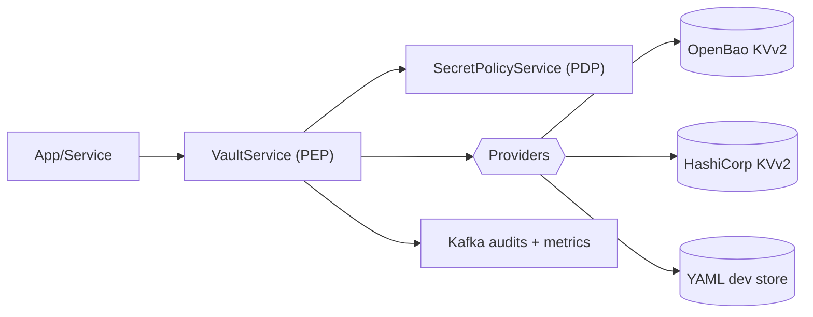

The Secrets Platform centralizes how services access credentials, API keys, and configuration secrets. It enforces policy before use, standardizes URIs, and provides consistent auditing.

Why it matters:

- **Security**: tokens/keys are never spread across apps; short‑lived grants and sender binding reduce blast radius.
- **Consistency**: one way to reference secrets across providers (OpenBao, HashiCorp Vault) and environments.
- **Compliance**: non‑leaky audits, masking, and versioned recovery.

At a glance:



Outcomes and how we measure

- Rotation speed: time from approved request to provider change applied
- Coverage: proportion of secrets accessed via Canonical URIs with PDP enforcement
- Audit completeness: events consistently include subject, purpose, decision, resource_ref
- Governance: policy changes use an approval flow and appear in the audit trail

Risk scenarios

- Stolen provider token: short TTL grants + sender binding prevent reuse
- Misrouted pointer: tenant/mount guard blocks cross‑tenant access
- Accidental delete: soft delete → undelete; destroy is gated

What’s in vs out

- In: use/rotate/delete via platform; centralized audits and policy
- Out: plaintext secrets in code/env; unmanaged direct provider calls

Dependencies

- PDP reachable; Kafka for audits; KVv2 provider configured; OTel collector for traces (optional)

Roll‑out checklist

- Enable PDP, set TENANT_* guards, configure providers, update env pointers to Canonical URIs, enable scopes in prod, verify dashboards.


What is secrets management (primer)

Secrets management is the discipline of storing, distributing, and rotating sensitive values (credentials, tokens, keys) safely. Good practice removes secrets from code and config files, minimizes who can read them, and proves how/when they were used.

Key challenges it addresses

- Sprawl: secrets spread across repos and environments; hard to inventory or revoke
- Leakage: plaintext in logs/env/commits; long‑lived tokens reused broadly
- Drift: inconsistent rotation cadences; unclear ownership and auditability
- Integration friction: each provider behaves differently; migration is risky

Types of secrets we support

- API tokens and OAuth client secrets
- Database/user credentials
- Encryption keys and certificates (material handled via providers; references stored)
- Application and integration keys (e.g., third‑party SaaS)
- Configuration values that must be protected but frequently read

Vault providers we support

- OpenBao KVv2 (first‑class)
- HashiCorp Vault KVv2 (first‑class)
- YAML file store for local development only (feature‑parity URIs, guarded in prod)

Big design concepts we achieved

- Canonical Secret URIs: one, normalized way to reference secrets across providers and tenants
- PEP/PDP pattern: VaultService enforces policy; SecretPolicyService decides with explicit purposes
- Grants and obligations: short‑lived, purpose‑bound usage with TTL/max‑uses
- Sender binding: DPoP/mTLS/audience checks to prevent replay and token theft misuse
- Tenant/mount guards: prevent cross‑tenant access by construction
- Versioned lifecycle: soft delete/undelete/destroy with auditable decisions
- Non‑leaky audits: HMAC(`resource_ref`) enables correlation without exposing paths/keys

Common use cases we enable

- Bootstrapping app credentials safely via pointers, not plaintext
- Rolling rotations without downtime; rollback to a prior version if needed
- Per‑tenant secret isolation and least‑privilege mounts
- Environment promotion using the same Canonical URI across dev/stage/prod
- Break‑glass flows with approvals and complete audit trails
- Bulk operations (set/delete/rotate/undelete/destroy) for maintenance windows

How this strengthens security

- Eliminates plaintext in code and reduces long‑lived credentials
- Enforces least‑privilege and purpose‑limited access at every use
- Makes misuse detectable and attributable via structured audits and traces
- Standardizes safe patterns so all teams benefit without bespoke solutions

Lifecycle at a glance

```mermaid
flowchart LR
  C[Create/Rotate] --> U[Use with grant]
  U --> A[Audit + Metrics]
  U --> V[Versioned retention]
  V --> UD[Undelete]
  V --> D[Destroy versions (approved)]
```


