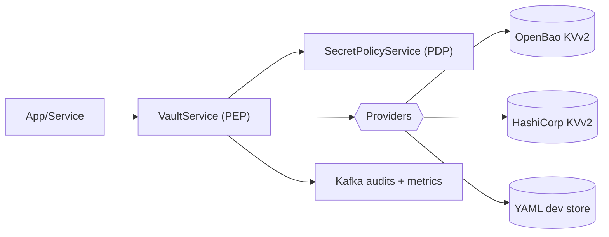

The Secrets Platform centralizes how services access credentials, API keys, and configuration secrets. It enforces policy before use, standardizes URIs, and provides consistent auditing.

Why it matters:

- **Security**: tokens/keys are never spread across apps; short‑lived grants and sender binding reduce blast radius.
- **Consistency**: one way to reference secrets across providers (OpenBao, HashiCorp Vault) and environments.
- **Compliance**: non‑leaky audits, masking, and versioned recovery.

At a glance:

