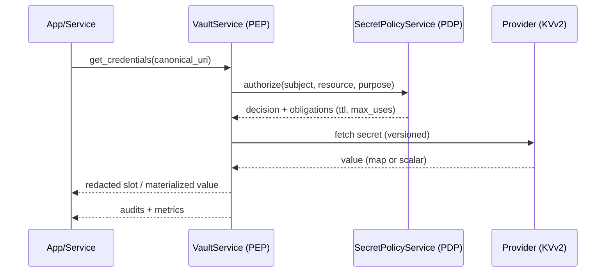
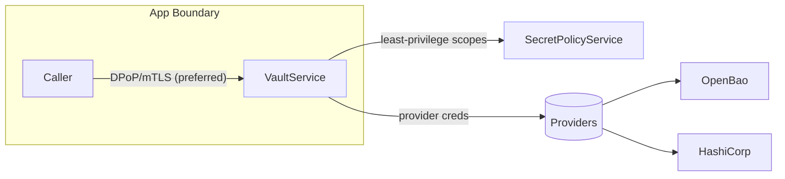

Components

- VaultService (PEP): parses Canonical URIs, authorizes with PDP, fetches from providers, emits audits
- SecretPolicyService (PDP client): batch authorization with purposes (read, write, delete, rotate, read_metadata)
- Providers: OpenBao/HashiCorp KVv2, YAML (dev)
- CRUDService Secrets API: management endpoints for admins and automation

Flow

Trust boundaries

Data in transit/at rest

- TLS between components; provider credentials stored securely
- Audits emitted to Kafka; logs redacted; resource_ref HMAC masks URIs

Failure modes

- Policy deny → fail closed with 403
- Provider down → 502 with retries/backoff; no cache of plaintext
- Binding failure (DPoP/mTLS) → 401/403

Scale and HA

- VaultService stateless (horizontal scale); PDP caches decisions with TTL
- Backpressure: queue limits on provider calls; circuit breaking recommended

Configuration surface

- Timeouts, retries, max concurrency documented in Admin how‑to; default sane limits

