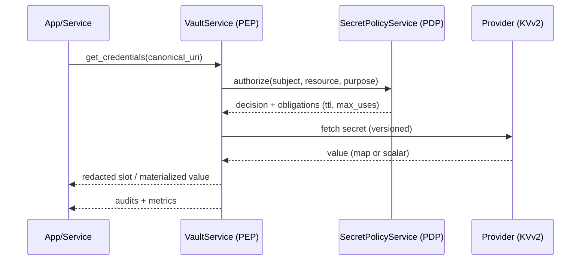
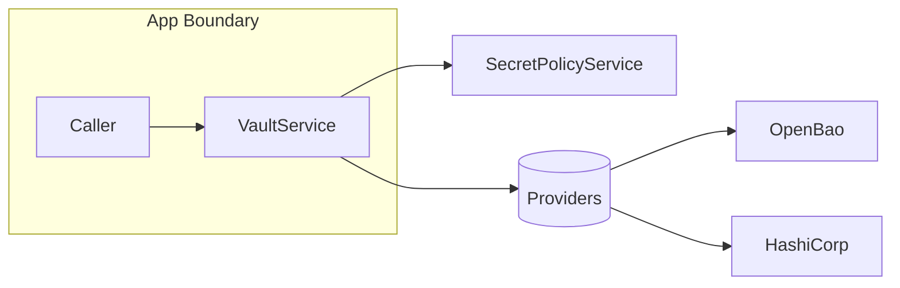

Components

- VaultService (PEP): parses Canonical URIs, authorizes with PDP, fetches from providers, emits audits
- SecretPolicyService (PDP client): batch authorization with purposes (read, write, delete, rotate, read_metadata)
- Providers: OpenBao/HashiCorp KVv2, YAML (dev)
- CRUDService Secrets API: management endpoints for admins and automation

Flow

Trust boundaries

