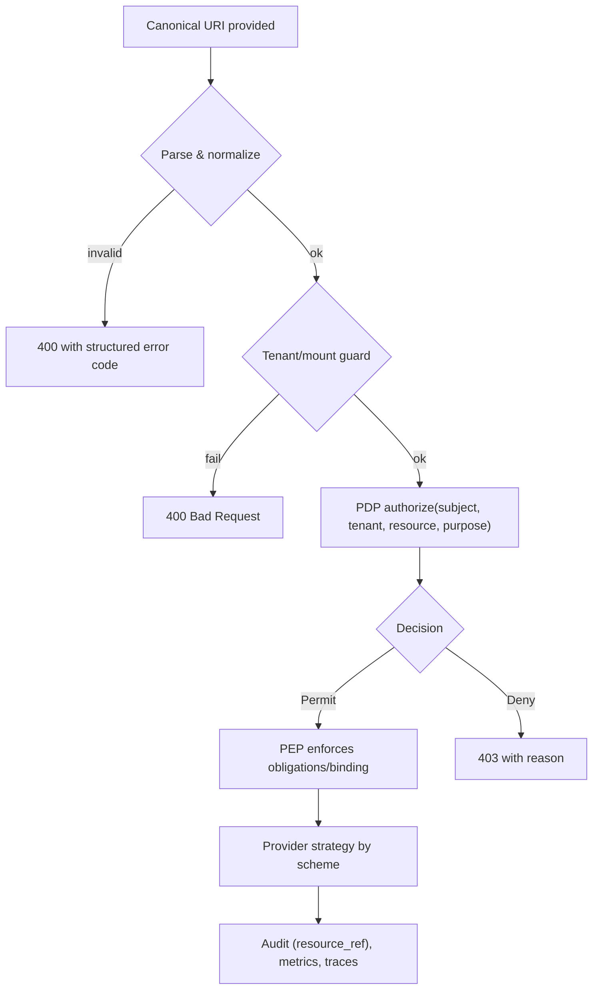

## Why Canonical URIs

Canonical Secret URIs give us a single, unambiguous way to identify secrets across providers and environments. They let the PEP parse intent, apply tenant/mount guards, ask the PDP for a purpose‑based decision, and then route to the right provider strategy. Because the URI itself carries provider, engine, mount, path, and an optional fragment, the same application code works against OpenBao, HashiCorp Vault, or dev YAML.

## Canonical Secret URIs

- YAML: `yaml://secret/<path>#<key>`
- OpenBao KVv2: `openbao+kv2://<mount>/<path>#<key>[?version=N]`
- HashiCorp KVv2: `hashicorp+kv2://<mount>/<path>#<key>[?version=N]`

### Components

- `provider[+engine]` — which backing store and engine to use (e.g., `openbao+kv2`, `hashicorp+kv2`, `yaml`)
- `mount` — top‑level namespace in the provider (e.g., `secret`)
- `path` — nested path segments under the mount (e.g., `app/api`)
- `fragment` — a specific key within a KV map (e.g., `#token`)
- `version` — optional version pin for KVv2 reads (e.g., `?version=3`)

Examples

- Fragment value: `openbao+kv2://secret/app/api#token`
- Whole map at a path: `openbao+kv2://secret/app/api`
- Version‑pinned read: `openbao+kv2://secret/app/api#token?version=3`

## Guards

- Tenant guard: `TENANT_ID`, `TENANT_ALLOWED_MOUNTS`
- Normalization strips ambiguous forms; invalid URIs yield structured errors

## Policy model

- Purposes: `read`, `write`, `delete`, `undelete`, `destroy_versions`, `rotate`, `read_metadata`
- Batch authorization with mixed required/optional sets
- Obligations: TTL, max uses, binding hints

### How purposes map to operations

- SDK read via PEP: purpose `execute` (PDP enforced inside `VaultService`)
- API endpoints map to admin/CRUD purposes (see `09-api-reference.md`)

## Resource references

- `resource_ref = HMAC(tenant_salt, canonical_uri)` used in audits (non‑leaky)

Why this matters

- Audits are useful without revealing sensitive paths; the UI/Analytics can still correlate by `resource_ref`.

## Default‑deny posture and lifecycle

- Policies default to deny unless explicitly allowed for purpose
- Owners: Security approves policy changes; periodic reviews (quarterly)

## Examples and migration

- With fragment: `openbao+kv2://secret/app/api#token`
- Without fragment (path object): `openbao+kv2://secret/app/api`
- Version pin: `...?version=3`
- Migration: ENV var `MY_KEY` → pointer `MY_KEY_POINTER=openbao+kv2://secret/app#MY_KEY`

Migration tips

- Keep the same logical names; swap the value for a pointer and use the SDK/API to resolve.
- Start with YAML in dev, then replace `yaml://` with `openbao+kv2://` for higher environments.

## Common mistakes

- Missing fragment when provider expects KV map → 400
- Wrong mount (not in TENANT_ALLOWED_MOUNTS) → 400
- Using YAML in prod → blocked by environment guard

## Normalization rules (what the parser fixes)

- Collapses duplicate slashes, trims whitespace
- Lowercases provider/engine scheme
- Ensures fragment and version query are in the correct positions
- Produces a canonical string that’s stable for HMAC and audits

## Decision flow with Canonical URIs

## Test matrix (QA)

- Valid/invalid URI forms; fuzz path/fragment; ensure normalization is idempotent
- Purposes map to expected provider actions and responses

---

See also

- Authorization model and purposes: `./11-authorization-model-authzen.md`
- PDP enrichment (exact context fields): `./SECRETS_PDP_ENRICHMENT.md`
- Providers and capabilities: `./04-providers.md`
- Security model (binding/anti‑replay): `./05-security-model.md`

