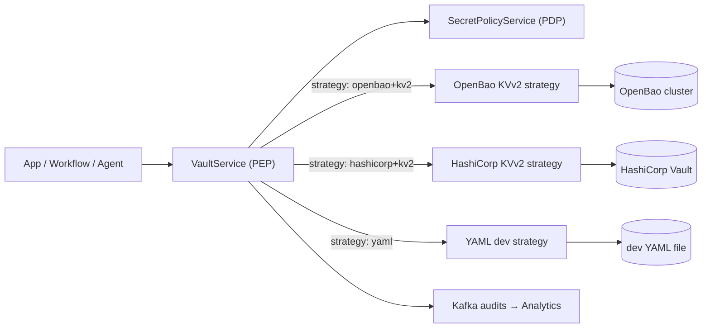

## What a provider is

Providers are backing secret stores that actually persist and return values. The Secrets Platform treats providers behind a stable abstraction so policy (PDP), auditing, and Canonical URIs are consistent regardless of where secrets live.

- VaultService (PEP) is provider‑agnostic. It parses the Canonical Secret URI, authorizes via PDP, then delegates to a provider strategy.
- Provider strategies implement a common interface (read, write, delete, metadata, versions, list/search when available) and emit audits.
- Canonical URIs select the provider and engine: `provider[+engine]://<mount>/<path>#<fragment>[?version=N]`.



## Multi‑provider model

- Canonical URIs encode provider and engine (e.g., `openbao+kv2://secret/app/api#token`).
- Tenant/mount guards are enforced before any provider call (`TENANT_ALLOWED_MOUNTS`).
- PDP decision and obligations are uniform across providers; the PEP enforces them, then calls a provider strategy.
- Strategies are registered in `VaultService` so adding a new provider does not change callers or policy.

## Capabilities

| Capability | OpenBao/HashiCorp KVv2 | YAML (dev only) |
| --- | --- | --- |
| Read map/fragment | ✅ | ✅ |
| Versioned reads (`?version=N`) | ✅ | ❌ |
| Soft delete | ✅ | ❌ |
| Undelete versions | ✅ | ❌ |
| Destroy versions | ✅ | ❌ |
| List keys / shallow traversal | ✅ (provider API) | ✅ (in‑file) |
| Custom metadata (owner/created_by/created_at) | ✅ | ❌ |
| Owner update API support | ✅ | ❌ |
| Audit events | ✅ (Kafka) | ✅ (Kafka) |

Notes

- KVv2 providers surface `custom_metadata` used as resource attributes in PDP context (owner, created_by, created_at). First write/rotate stamps these.
- YAML provider is file‑backed for local development and is blocked for writes/deletes outside dev/test.

## How Canonical URIs map to providers

- Scheme: `openbao+kv2`, `hashicorp+kv2`, or `yaml`
- Mount: first path segment after `://` (e.g., `secret`)
- Path: remaining path segments (`app/api`)
- Fragment: key within the KV map (`#token`)

Examples

- `openbao+kv2://secret/app/api#token?version=3`
- `yaml://secret/dev#CREDENTIAL_ENCRYPTION_KEY`

## Configuration (ops)

- KVv2
  - `VAULT_URL`, `VAULT_TOKEN` (or AppRole)
  - Timeouts, retries, pool size: `VAULT_TIMEOUT`, `VAULT_POOL_SIZE`, etc.
  - HA/Load balancing: see `SECRETS_HA_OPENBAO.md`
- YAML (dev)
  - `YAML_VAULT_PATH`
- Platform guards
  - `TENANT_ID`, `TENANT_ALLOWED_MOUNTS`
  - `ENABLE_AUTHORIZATION=true` (PEP→PDP)
  - Optional API hardening: `SECRETS_API_REQUIRE_AUTH`, `SECRETS_ENFORCE_SCOPES`, `SECRETS_AUDIENCE`

## Provider trust and credentials (CISO)

- Least‑privilege provider policies per mount; rotate provider credentials regularly
- Provider tokens/AppRole are stored via secure secret pointers; never committed to code
- Audits do not leak sensitive URIs (HMAC(`resource_ref`) when `TENANT_SALT` is set)

## Error mapping and reliability

- Provider 404 vs policy 403 are distinguished at the PEP (guard first, then provider error)
- Retries/backoff and rate limiting recommended; 429/503 surfaced upstream with context
- OpenTelemetry spans include provider calls; Kafka events capture success/failure

## Adding a new provider (extensibility)

1) Implement a strategy with the common methods:
   - `get_credentials(path, ...)`, `create_or_update_secret(path, payload)`, `delete_secret(path, destroy=...)`
   - `read_secret_metadata(path)`, `list_keys(prefix)`, optional search
2) Register strategy under a new scheme (e.g., `myprov+engine`) in `VaultService.strategies`
3) Ensure Canonical URI parsing supports the scheme (provider and optional engine)
4) Emit Kafka audits on success/failure; include provider name and canonical URI
5) Add tests for reads/writes/metadata and edge cases (soft‑delete, not found, permissions)

## Enablement steps (Admin)

1) Configure provider URL/credentials
2) Define mounts and least‑privilege policies
3) Set tenant/mount guards
4) Enable PDP authorization and optional API scopes
5) Validate with sample reads/writes and confirm audits/metrics

## CLI examples (KVv2)

```bash
# KVv2 write (OpenBao/HashiCorp)
vault kv put secret/app/api token=abc

# Read a specific version
vault kv get -version=2 secret/app/api
```

## QA notes

- Use a fake provider or record/replay to avoid touching live vaults in CI
- Exercise edge cases: missing metadata, soft‑deleted keys, 404 vs 403 mapping, version pin reads

---

See also

- Authorization model: `./11-authorization-model-authzen.md`
- PDP enrichment (context fields): `./SECRETS_PDP_ENRICHMENT.md`
- Security model (binding, anti‑replay): `./05-security-model.md`
- API reference: `./09-api-reference.md`
- OpenBao HA: `./SECRETS_HA_OPENBAO.md`