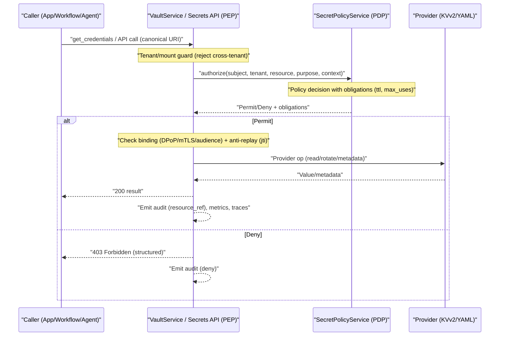
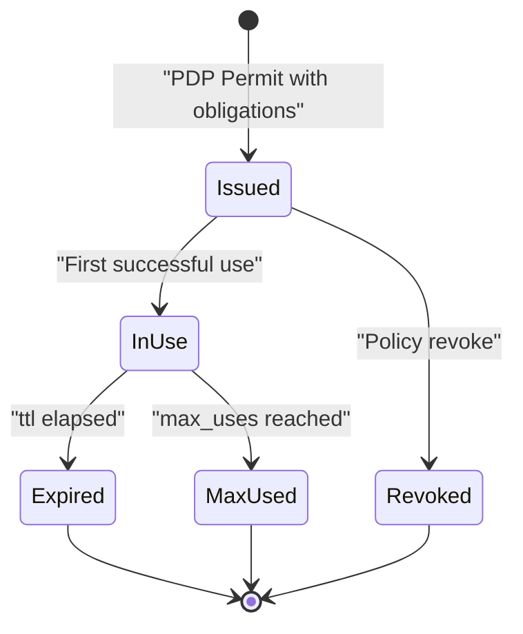
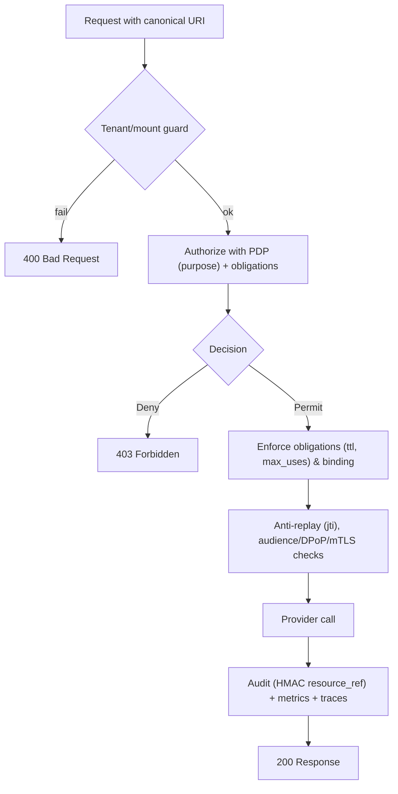

## What this model provides (at a glance)

- Purpose‑bound, short‑lived usage grants enforced at the point of use (PEP in `VaultService` / Secrets API)
- Strong caller binding (DPoP/mTLS when available; audience checks otherwise)
- Anti‑replay and tenancy/mount safety by construction
- Uniform auditing that avoids leaking sensitive paths/keys
- Optional OAuth scopes to layer least‑privilege on the API surface

See also:

- Authorization model: `./11-authorization-model-authzen.md`
- PDP enrichment (exact fields sent to PDP): `./SECRETS_PDP_ENRICHMENT.md`
- API reference (purposes and scopes): `./09-api-reference.md`

## Threat model and goals

- Goals
  - Prevent secret exfiltration (values leaving the intended boundary)
  - Prevent misuse (wrong subject, wrong purpose, wrong tenant/mount)
  - Enable forensics (who/what/purpose/when) without leaking resource paths
- Key mitigations
  - Default‑deny policy; explicit permit for a concrete purpose per use
  - Short‑lived grants with obligations (TTL, max_uses)
  - Sender binding (DPoP/mTLS preferred; audience checks when needed)
  - Anti‑replay (JTI enforcement) and correlation with traces
  - Non‑leaky audits (HMAC of canonical URI as `resource_ref`)

## End‑to‑end request flow (security checks)

## Grants and obligations

- The PDP issues a decision with obligations the PEP must enforce before contacting providers.
- Typical obligations
  - `ttl_seconds`: maximum time the decision is valid
  - `max_uses`: maximum successful invocations before re‑authorization
- The PEP caches and decrements usage; expired or exhausted grants force a fresh PDP check.

Grant lifecycle

## Sender binding (who is really calling?)

- Preferred
  - DPoP (proof‑of‑possession) via `cnf.jkt` (public key thumbprint)
  - mTLS client cert thumbprint
- Fallback
  - Audience checks enforced at the PEP (ensure token `aud` includes `SECRETS_AUDIENCE`)
- Behavior
  - Binding is attached to the grant; if the binding changes during `ttl`, further uses are denied
  - Binding + obligations constrain token theft/replay utility even if a bearer leaks

## Anti‑replay (JTI)

- When a token JTI is present, the PEP tracks JTI usage within the grant window
- Replays with the same JTI are denied
- Correlate denials with traces using `correlation_id` and `trace_id`

## Tenant/mount safety

- Canonical Secret URIs encode `provider[+engine]://<mount>/<path>#<fragment>`
- A tenant guard ensures `mount` ∈ `TENANT_ALLOWED_MOUNTS` before PDP authorization
- Prevents cross‑tenant access by construction

## Least privilege on the API surface

- The Secrets API supports optional OAuth scopes (enable with `SECRETS_ENFORCE_SCOPES=true`):
  - `secrets.read`, `secrets.write`, `secrets.delete`, `secrets.destroy`, `secrets.rotate`, `secrets.read_metadata`, `secrets.set_owner`
- Combine with PDP purposes for defense in depth:
  - Example: POST `/api/secrets/metadata/owner` requires scope `secrets.set_owner` and PDP purpose `owner_update`

## Provider specifics and metadata

- KVv2 (OpenBao/HashiCorp)
  - Versioned lifecycle (read pin by version; delete/undelete/destroy versions)
  - Custom metadata used as resource attributes in PDP context: `owner` (mutable), `created_by`, `created_at`
  - First write/rotate stamps metadata best‑effort; owner can be updated via dedicated endpoint
- YAML (dev only)
  - File‑backed for local development; writes/deletes blocked in non‑dev

## Enforcement flow (permit branch)

## Configuration summary (ops)

- Authorization and guards
  - `ENABLE_AUTHORIZATION=true`
  - `TENANT_ID` and `TENANT_ALLOWED_MOUNTS`
- API hardening (optional but recommended outside dev)
  - `SECRETS_API_REQUIRE_AUTH=true`
  - `SECRETS_ENFORCE_SCOPES=true`
  - `SECRETS_AUDIENCE=crud.secrets`
- Auditing
  - Set `TENANT_SALT` to enable non‑leaky `resource_ref` (HMAC)

## Auditing and redaction

- Kafka events include: `subject`, `purpose`, `effect`, `resource_ref`, `decision_id`, correlation and trace identifiers
- Secret values are never logged; request/response logs are masked centrally
- Analytics service ingests audit topics for UI and reporting
