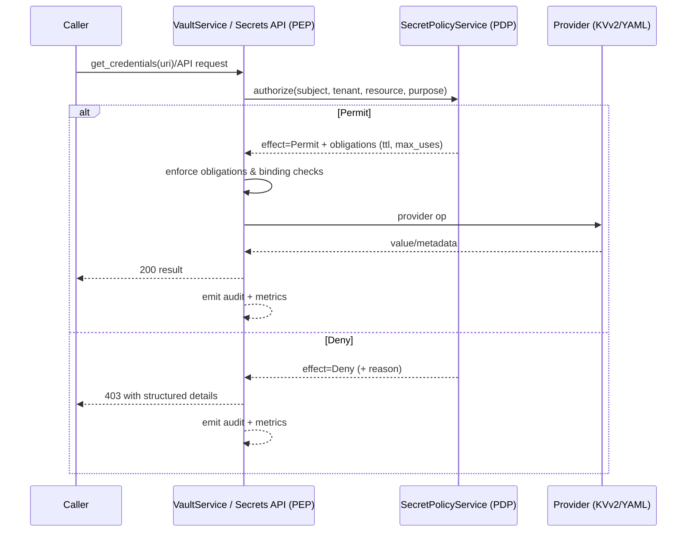
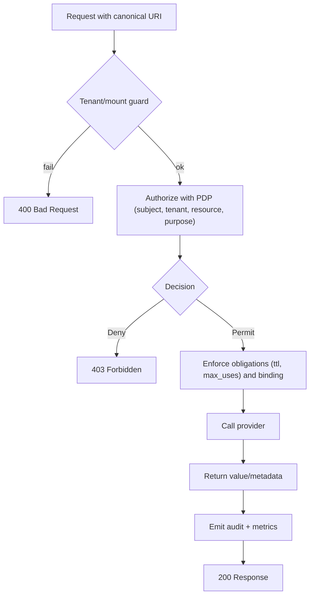
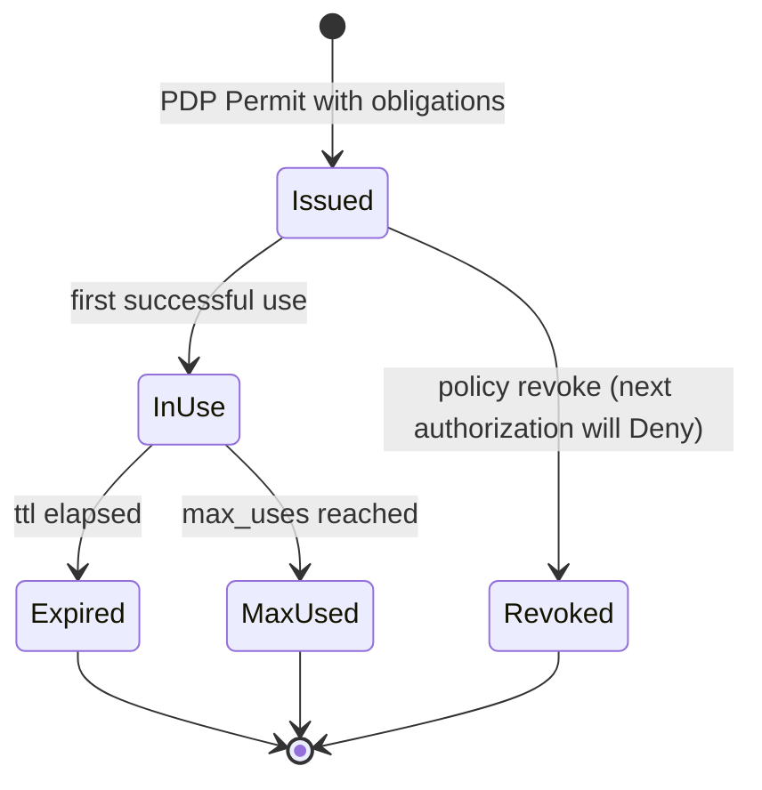

## Why a PDP for secrets

Challenges addressed:

- Provider tokens alone don’t express business policy (“who may use what, for what purpose, when”).
- Each provider behaves differently; policy must be consistent across providers.
- Minimizing blast radius requires short‑lived, purpose‑bound usage and binding to the caller.

Our approach:

- Canonical Secret URIs identify resources uniformly across providers and tenants.
- A Policy Enforcement Point (PEP) in `VaultService` and the Secrets API calls a Policy Decision Point (PDP) client (`SecretPolicyService`).
- Decisions include obligations (e.g., TTL, max uses) that the PEP enforces before any provider access.

## What “AuthZ‑style PDP” means here

- The PEP sends subject, tenant, resource (canonical URI), and a purpose (e.g., `read`, `write`, `delete`, `undelete`, `destroy_versions`, `rotate`, `read_metadata`).
- The PDP returns allow/deny and optional obligations (like TTL/max‑uses). The PEP enforces the decision at the point of use.

## What is protected (purposes)

- Read via SDK (`VaultService.get_credentials`) is protected by the PEP (enforces PDP decision internally).
- Management endpoints purpose‑map:
  - POST `/api/secrets` → `write`
  - DELETE `/api/secrets` → `delete` (or `destroy_versions` when `destroy=true`)
  - POST `/api/secrets/rotate` → `rotate`
  - GET `/api/secrets/metadata`, `/keys` → `read_metadata`
  - GET `/api/secrets/metadata/detail`, `/versions` → `read_metadata`
  - POST `/api/secrets/undelete` → `undelete`
  - POST `/api/secrets/destroy-versions` → `destroy_versions`
  - POST `/api/secrets/bulk` → per‑operation mapping as above

Tenant and mount guards:

- `TENANT_ID` and `TENANT_ALLOWED_MOUNTS` constrain canonical URIs to allowed mounts per tenant prior to PDP.

Optional scope/audience enforcement:

- `SECRETS_ENFORCE_SCOPES=true` enforces endpoint scopes (e.g., `secrets.read`, `secrets.write`, `secrets.delete`, `secrets.destroy`, `secrets.rotate`, `secrets.read_metadata`).
- `SECRETS_API_REQUIRE_AUTH=true` requires auth for `/api/secrets/*` endpoints.
- `SECRETS_AUDIENCE` can be used for audience checks where applicable.

## How it’s configured

- Enable authorization: `ENABLE_AUTHORIZATION=true` so PEP calls PDP.
- Guard URIs: `TENANT_ID`, `TENANT_ALLOWED_MOUNTS`.
- Toggle scopes: `SECRETS_ENFORCE_SCOPES` (optional) and endpoint auth: `SECRETS_API_REQUIRE_AUTH`.
- Providers:
  - KVv2: `VAULT_URL`, `VAULT_TOKEN` (or AppRole), mount policies.
  - YAML (dev only): `YAML_VAULT_PATH`.

Passing subject/tenant/context:

- The PEP includes subject and tenant (from request state) when calling the PDP client (`SecretPolicyService.authorize_batch(...)`).
- From FastAPI/Starlette, `ExecutionContext(request)` propagates request context; correlation IDs and traces flow with it.

## Binding and obligations

- Obligations (e.g., TTL, max_uses) are returned from the PDP and enforced by the PEP.
- Binding checks are performed by the PEP when applicable (e.g., audience checks). Where DPoP/mTLS are available, they’re preferred; otherwise standard audience/scope checks apply.

## Auditing and logging

- Kafka events are emitted for read/update/delete and related actions. When `TENANT_SALT` is set, a non‑leaky `resource_ref = HMAC(tenant_salt, canonical_uri)` is included.
- Events include correlation identifiers for traceability; OpenTelemetry spans link PEP → PDP → provider calls when tracing is enabled.
- Logs redact secret values. YAML dev adds SSE `/events` and `/audit` in‑memory buffers for local diagnostics.

## Failure modes (examples)

- PDP denial → the PEP returns 403 with structured details for API calls; SDK calls fail prior to provider access.
- Guard failure (tenant/mount) → 400 with a structured error code/message.
- Unsupported provider operation → 501.
- Provider error → 502 from API; SDK raises accordingly.

## Where to look next

- Canonical URIs and policy model: `./03-canonical-uris-and-policy.md`
- Security model details: `./05-security-model.md`
- API reference and scopes/purposes: `../reference/secrets-api.md`
- PDP enrichment details (exact fields sent to PDP): `./SECRETS_PDP_ENRICHMENT.md`

---

## PEP enforcement flow (at a glance)

## Grant lifecycle (conceptual)

