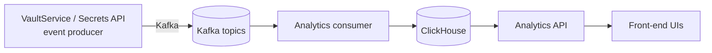

## What we audit

Actions recorded as structured events for secrets operations:

- Reads via PEP (VaultService) and Secrets API
- Create/update (set), delete (soft), rotate
- Undelete, destroy versions (KVv2)
- Metadata listing and key enumeration (metadata access)
- Bulk operations (per‑op events)
- Copy/move (source read + destination write)

Event content (high level):

- Correlation identifiers (correlation_id, optional trace_id/span_id)
- Subject and optional user context (when available)
- Non‑leaky `resource_ref` (HMAC of canonical URI when `TENANT_SALT` is set)
- Event type, effect (success/failure), timestamp, and provider type

## How events are produced

- The PEP and Secrets API publish events via the Kafka producer.
- Topics include functional and audit streams (for example: `crud.secrets`, `crud.secrets.audit`).
- Topic names are prefixed by `KAFKA_TOPIC_PREFIX` (default: `crud`).
- Values such as secret payloads are redacted before emission.

See also: `../reference/secrets-api.md` and the broader Kafka events overview in `../../crud-service/reference/kafka-events.md`.

## Pipeline to Analytics and ClickHouse

At a high level, Analytics consumes the Kafka streams and persists events to ClickHouse. Analytics exposes API endpoints used by our front‑end interfaces to render dashboards and reports.

Notes:

- Kafka is the transport; retention and ACLs are configured at the platform level.
- ClickHouse holds the analytical store queried by Analytics APIs.
- Front‑end UIs call Analytics APIs to render tables, charts, and timelines.

## Logging

- Logs are structured and redact sensitive values.
- Correlation IDs connect logs, traces, and audit events for investigations.

