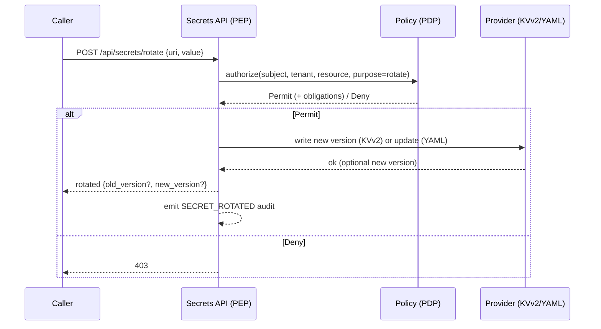

## Why rotation matters

Secrets (API keys, credentials, tokens) age and leak. Rotation reduces blast radius by replacing values on a cadence or event, ensuring consumers pick up new versions, and leaving a recoverable trail (versions, audits). Without rotation, compromise windows are long, detection is harder, and revocation is risky.

## Big picture

- Programmatic rotation is an API‑first operation that writes a new value/version and emits auditable evidence.
- YAML (dev) treats rotation as an update; KVv2 providers (OpenBao/HashiCorp) create a new version.
- Authorization occurs at the PEP/PDP boundary; auditing flows to Kafka → Analytics → ClickHouse → UI.



## How rotation works end‑to‑end

### 1) Invocation: `secrets` system config maps “rotate” to API

The system mapping exposes a rotate operation that POSTs to `/api/secrets/rotate` with a bearer token intended for internal callers.

```yaml
rotate:
  method: "POST"
  endpoint: "/api/secrets/rotate"
  required_params: ["uri", "value"]
  headers:
    Authorization: "Bearer {{ 'INTERNAL_EXECUTION_TOKEN' | ENV or 'internal' }}"
  body:
    uri: "{{ params.uri }}"
    value: "{{ params.value }}"
  skip_schema_transform: true
```

Key points

- Requires `uri` and `value`.
- Uses `INTERNAL_EXECUTION_TOKEN` and bypasses schema transforms.
- Integrates with the CRUDService function plugin system to reach rotation logic.

### 2) API entrypoint: plugin `rotate(...)` applies provider‑specific behavior

- Parses Canonical Secret URIs and routes by provider/engine.
- YAML behaves like an update; KVv2 (OpenBao/HashiCorp) delegates to `RotationController`.

Highlights

- YAML → `create_or_update` (no version metadata)
- KVv2 → enforce engine `kv2`, build per‑fragment or object payload, then `RotationController.rotate_kvv2(...)`
- Guardrails → tenant scoping and allowed mounts (e.g., `secret`); fragment updates only the keyed value

### 3) Controller: versioned write + audit for KVv2

`RotationController` implements rotation for KVv2 providers:

- Best‑effort read of old version (if provider exposes `get_latest_version`)
- Write new value via provider strategy
- Best‑effort read of new version
- Emit Kafka audit event `SECRET_ROTATED` including salted `resource_ref` and `kv_version` (when available)

Behavioral guarantees

- Rotation succeeds if provider `create_or_update_secret` succeeds; version lookups are best‑effort
- `resource_ref` is an HMAC of the canonical URI when configured (non‑leaky reference)

### 4) Provider strategies via `VaultService`

Rotation depends on strategy capabilities:

- `create_or_update_secret(path, value)`
- `get_latest_version(path)` (optional)

`VaultService` discovers strategies (e.g., OpenBao/HashiCorp) and wires configuration from environment variables.

### 5) Security and scoping

- Rotate is intentionally gated by the internal bearer (`INTERNAL_EXECUTION_TOKEN` header in the mapping)
- PDP checks occur at the PEP for API calls; writes are scoped by canonical URI parsing (tenant/mount guards)
- Audits are emitted (`SECRET_ROTATED`) with salted `resource_ref` to avoid URI leakage

### 6) Separate concern: BFF cookie “rotation” (expiration refresh)

- Unrelated to secrets. It refreshes cookie expirations after inactivity; values remain identical.

## Examples

Rotate KVv2 fragment

```bash
POST /api/secrets/rotate
{ "uri": "openbao+kv2://secret/app/api#token", "value": "new-value" }
```

Rotate KVv2 path object

```bash
POST /api/secrets/rotate
{ "uri": "openbao+kv2://secret/app/api", "value": { "token": "new" } }
```

YAML (dev) treated as update

```bash
POST /api/secrets/rotate
{ "uri": "yaml://secret/env#MY_KEY", "value": "new" }
```

## Troubleshooting

- 400: malformed URI or object required when no fragment
- 403: policy denied; verify PDP and mapping
- 501: provider not supported for rotation
- 502: provider write failure

## See also

- Authorization model (PDP): ./11-authorization-model-authzen.md
- Auditing & logging: ./12-auditing-logging.md
- API reference: ../reference/secrets-api.md

