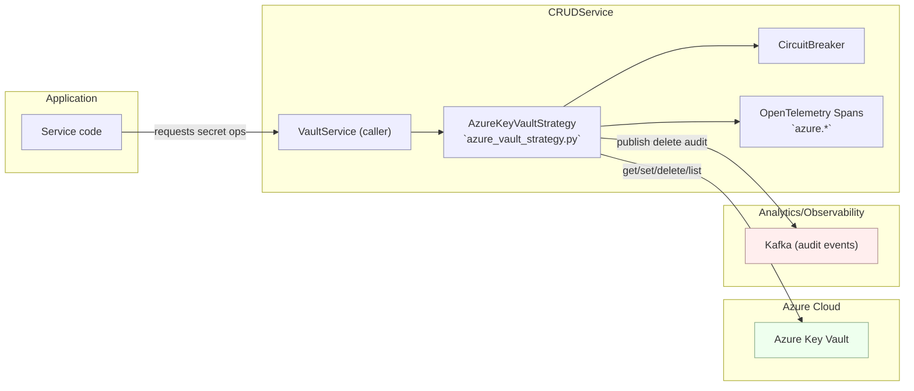
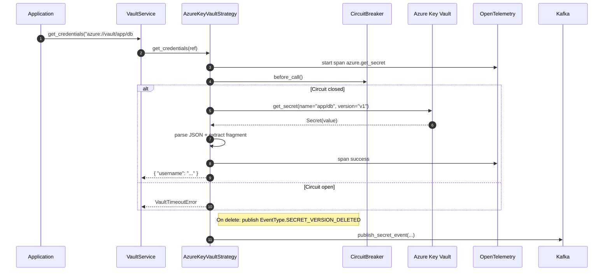

## Summary

Use Azure Key Vault as a provider behind the Secrets Platform (VaultService). Callers use canonical URIs; the platform enforces policy via PDP, adds tracing/metrics, and publishes audit events. This page is production‑ready guidance for admins and developers.

- Provider: `azure`
- Purpose: Retrieve and manage app secrets stored in Azure Key Vault (KV)
- Highlights:
  - Canonical URI parsing (fragments, versions)
  - Retries, circuit‑breaker, and timeouts
  - OpenTelemetry traces and Prometheus metrics
  - Kafka audit events on delete
  - Metadata helpers (tags) and version discovery

## Architecture



## Canonical URI

- Scheme: `azure://`
- Mount: `vault`
- Path: free‑form name (supports slashes for logical grouping)
- Fragment: optional key selector for JSON payloads
- Query: optional version string (Azure version ID)

Examples:

- Full secret dict: `azure://vault/app/db`
- Single field: `azure://vault/app/db#username`
- Versioned read: `azure://vault/app/db#username?version=v1`

Behavior:

- JSON values return a parsed dict; with a fragment, returns `{fragment: value}`
- Scalar values return `{value: "<scalar>"}`; with a fragment, returns `{fragment: None}`
- Versions are strings and map to Azure version IDs

## API surface (normalized)

- `get_credentials(ref: str) -> dict`
  - Accepts canonical URIs or raw names; applies retries, circuit‑breaker, and timeouts
- `create_credentials(name: str, data: dict) -> dict`
  - Stores JSON‑serialized value; creates a new version
- `update_credentials(name: str, data: dict) -> dict`
  - Requires existence; creates a new version
- `delete_credentials(name: str) -> bool`
  - Soft‑deletes (per KV settings) and emits Kafka audit event
- `list_credentials() -> list[str]`
  - All secret names
- `list_keys(path: str) -> list[str]`
  - Prefix filter using slash‑separated names
- `read_secret_metadata(name: str) -> dict`
  - Returns current version, versions (timestamps/enabled), and `custom_metadata` (tags)
- `update_custom_metadata(name: str, custom: dict, merge=True) -> None`
  - Maps to KV tags (merge or replace)
- `get_latest_version(name: str) -> Optional[str>`

## Sequence: get_credentials



## Security & authorization

- Enforce PDP checks in front of the provider (`ENABLE_AUTHORIZATION=true`)
- Require auth on `/api/secrets/*` (`SECRETS_API_REQUIRE_AUTH=true`)
- Scope enforcement recommended (`SECRETS_ENFORCE_SCOPES=true`)
- Tenant guard: `TENANT_ID`, `TENANT_ALLOWED_MOUNTS` restrict accessible mounts/paths
- Sender binding: prefer DPoP or mTLS for grant usage

## Observability & audit

- Tracing: spans per operation (e.g., `azure.get_secret`, `azure.create_secret`, `azure.update_secret`, `azure.delete_secret`, `azure.list_secrets`, `azure.read_secret_metadata`, `azure.update_custom_metadata`) with attributes `secret.name`, `secret.version` (or `latest`)
- Metrics: emitted via OTEL exporters → Prometheus
- Auditing: on delete, emits `EventType.SECRET_VERSION_DELETED` via `CrudKafkaProducer`
  - `credential_id`: `azure://vault/<name>`
  - `resource_ref`: HMAC‑masked when `TENANT_SALT` or `SECRET_TENANT_SALT` is set

## Configuration

Required:

- `vault_url`: `https://<vault-name>.vault.azure.net/`

Optional:

- `managed_identity_client_id`: prefer Managed Identity when present
- `timeout_s` (default 30), `max_retries` (default 3)
- `cb_failure_threshold` (default 5), `cb_reset_timeout_s` (default 30)

Configuration should be supplied via service env/compose; avoid per‑app `.env` files.

## Error semantics (normalized)

- `VaultSecretNotFoundError`: secret or version not found
- `VaultAuthenticationError`: permission/auth failures (future mapping)
- `VaultTimeoutError`: circuit breaker open or timeout
- `VaultOperationError`: generic provider errors

## Quick usage

Fetch a JSON field:

```python
creds = await strategy.get_credentials("azure://vault/app/db#username")
```

Update tags/metadata:

```python
await strategy.update_custom_metadata("app/db", {"owner": "payments"}, merge=True)
```

Delete and emit audit:

```python
await strategy.delete_credentials("app/db")
```

## Notes & limitations

- Azure Key Vault does not support response wrapping; helpers in this provider are dev‑only stubs for parity with other providers
- Hierarchical listing is emulated via prefix matching on slash‑separated names

## Related

- Platform overview: `../index.md`
- Authorization model (PDP): `../11-authorization-model-authzen.md`
- Observability: `../06-observability.md`
- Admin how‑to: `../07-admin-howto.md`
- API reference: `../reference/secrets-api.md`
I'll embed two Mermaid diagrams: an architecture overview and a get_credentials sequence. Then I'll provide the detailed documentation text.
Ran tool
Ran tool
### Azure Key Vault Strategy

This document describes how to use the Azure Key Vault strategy in VaultService, including canonical URI syntax, supported operations, error semantics, observability, and audit behavior.

### Overview

- Provider: azure
- Purpose: Retrieve and manage application secrets stored in Azure Key Vault
- Key features:
  - Canonical URI parsing with fragments and version selection
  - Retries, circuit breaker, and request timeouts
  - OpenTelemetry tracing
  - Kafka audit events on delete
  - Metadata helpers (tags) and version discovery

### Architecture

[Mermaid] Architecture overview:


### Canonical URI

- Scheme: azure://
- Mount: vault
- Path: free-form name (supports slashes for logical grouping)
- Fragment: optional key selector for JSON payloads
- Query: optional version string

Examples:
- Full secret dict: `azure://vault/app/db`
- Single field: `azure://vault/app/db#username`
- Versioned read: `azure://vault/app/db#username?version=v1`

Behavior:
- If secret value is JSON, returns parsed dict. With a fragment, returns `{fragment: value}`.
- If secret value is a scalar and a fragment is requested, returns `{fragment: None}`.
- Versions are treated as strings (Azure version IDs).

### API Surface

- get_credentials(ref: str) -> dict
  - Accepts canonical URIs or raw secret names
  - Uses retries, circuit breaker, timeouts
- create_credentials(name: str, data: dict) -> dict
  - Stores JSON-serialized value; creates a new version
- update_credentials(name: str, data: dict) -> dict
  - Validates existence; creates a new version
- delete_credentials(name: str) -> bool
  - Soft-deletes the secret (per Key Vault settings) and emits a Kafka audit event
- list_credentials() -> list[str]
  - Returns all secret names
- list_keys(path: str) -> list[str]
  - Prefix filter using slash-separated names
- read_secret_metadata(name: str) -> dict
  - Returns current version, versions list (with timestamps and enablement), and custom_metadata (tags)
- update_custom_metadata(name: str, custom: dict, merge=True) -> None
  - Maps to Key Vault tags (merge or replace)
- get_latest_version(name: str) -> Optional[str]
- get_credentials_wrapped(ref: str, wrap_ttl: str) -> dict
  - Dev-friendly stub returning a wrap token
- unwrap_token(wrap_token: str) -> dict
  - Dev-friendly stub with a success payload

### Error Semantics

- VaultSecretNotFoundError: secret or version not found
- VaultAuthenticationError: permission/auth failures (future mapping)
- VaultTimeoutError: circuit breaker open or timeout
- VaultOperationError: generic provider errors

All errors are normalized for consistent handling across providers.

### Observability

- Tracing: Spans per operation with attributes:
  - azure.get_secret, azure.create_secret, azure.update_secret, azure.delete_secret, azure.list_secrets, azure.read_secret_metadata, azure.update_custom_metadata
  - Attributes: secret.name, secret.version (or “latest”)
- Metrics: leverage OpenTelemetry exporters configured globally

### Auditing

- On delete: emits EventType.SECRET_VERSION_DELETED to Kafka via `CrudKafkaProducer`
  - credential_id: `azure://vault/<name>`
  - resource_ref: hashed reference when TENANT_SALT or SECRET_TENANT_SALT is set

### Sequence for get_credentials

[Mermaid] Sequence diagram:


### Configuration

- Required:
  - vault_url: `https://<vault-name>.vault.azure.net/`
- Optional:
  - managed_identity_client_id: use Managed Identity when present
  - timeout_s (default 30), max_retries (default 3)
  - cb_failure_threshold (default 5), cb_reset_timeout_s (default 30)

Configuration is provided via service environment/compose. Avoid per-app .env files.

### Return Shapes

- JSON secrets: returns dict; with fragment → `{fragment: value}`
- Scalar secrets: returns `{value: "<scalar>"}`; with fragment → `{fragment: None}`

### Notes and Limitations

- Response wrapping is not natively supported by Azure Key Vault; provided helpers are dev stubs for caller parity.
- Hierarchical listing is emulated via prefix matching on slash-separated secret names.

### Quick Usage

- Fetch JSON field:
```python
creds = await strategy.get_credentials("azure://vault/app/db#username")
```

- Update metadata/tags:
```python
await strategy.update_custom_metadata("app/db", {"owner": "payments"}, merge=True)
```

- Delete and audit:
```python
await strategy.delete_credentials("app/db")
```