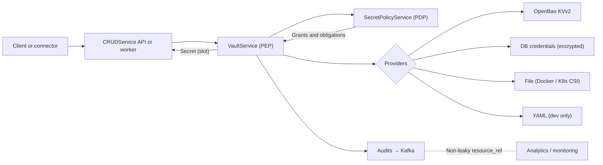
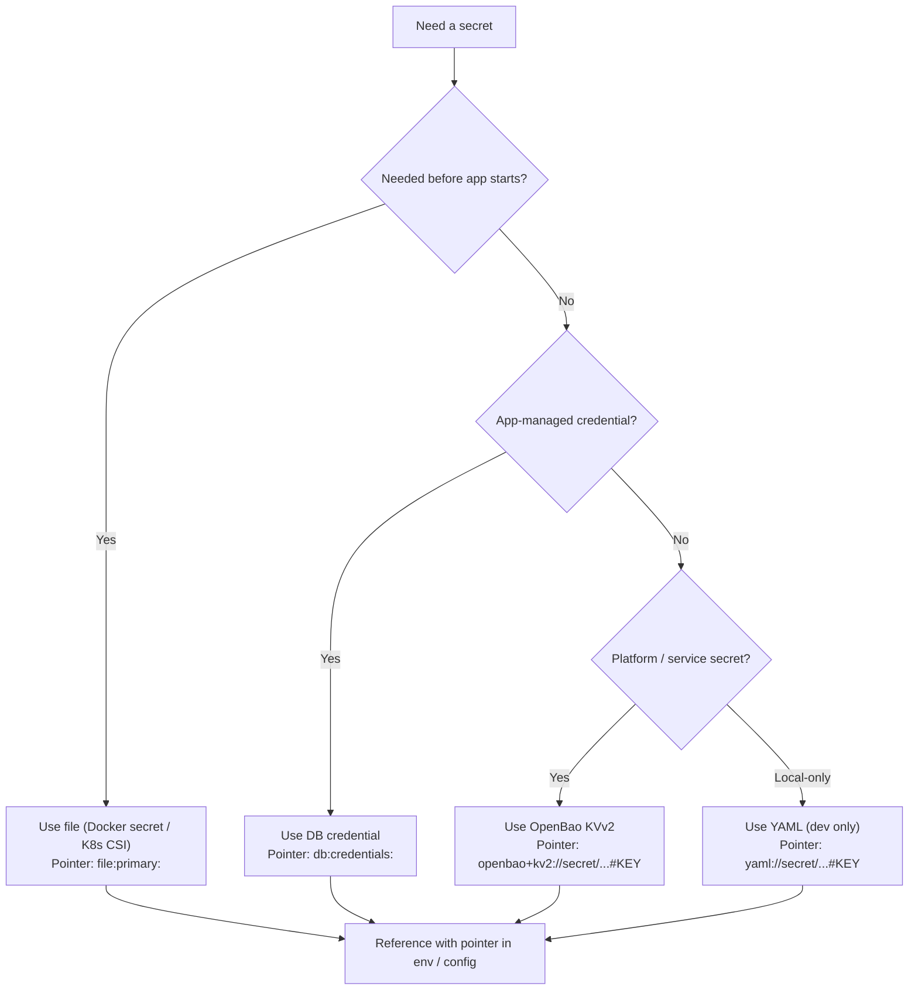
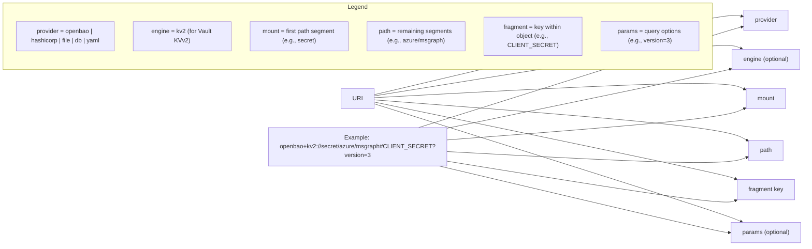
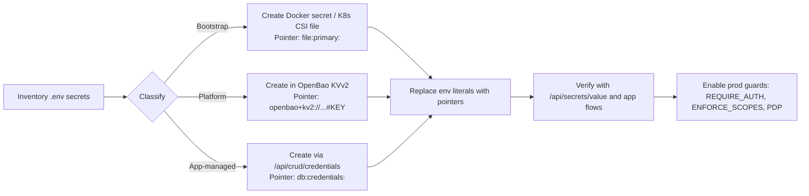

## Architecture flow — at a glance



## Decision tree — which store or pointer to use



## Canonical Secret URI anatomy



## Migration flow — from .env to pointers



## Quick cheat sheet

- Use file (Docker / K8s CSI) for bootstrap secrets: `file:primary:<name>`; set `FILE_MOUNT_PATH` for CSI.
- Use OpenBao KVv2 for platform / service secrets: `openbao+kv2://secret/<path>#KEY[?version=N]`.
- Use DB credential for app‑managed OAuth / API: `db:credentials:<uuid>`.
- Dev‑only YAML for quick iteration: `yaml://secret/<path>#KEY`.

## Verification

- Seed KVv2:
```bash
curl -s -X POST "http://localhost:8000/api/secrets" \
  -H "Content-Type: application/json" \
  -d '{"uri":"openbao+kv2://secret/crud#CREDENTIAL_ENCRYPTION_KEY","value":"<base64-or-random>"}'
```
- Read to confirm:
```bash
curl -s "http://localhost:8000/api/secrets/value?uri=openbao+kv2://secret/crud#CREDENTIAL_ENCRYPTION_KEY"
```
- Live events:
```bash
curl -N "http://localhost:8000/api/secrets/events"
```

## Production switches

- Set `SECRETS_API_REQUIRE_AUTH=true`, `SECRETS_ENFORCE_SCOPES=true`, `ENABLE_AUTHORIZATION=true`.
- Keep `TENANT_ALLOWED_MOUNTS=secret` and set strong `SECRET_TENANT_SALT`.

---

See also: [Providers](./providers), [Canonical URIs and policy](./canonical-uris-and-policy), [Security model](./security-model), [Migration guide](./SECRETS_MIGRATION_GUIDE).

If you want, I can embed these diagrams and a condensed narrative into `CRUDService/docs/guides/SECRETS_MIGRATION_GUIDE.md` as a “Visual Learner’s” section.