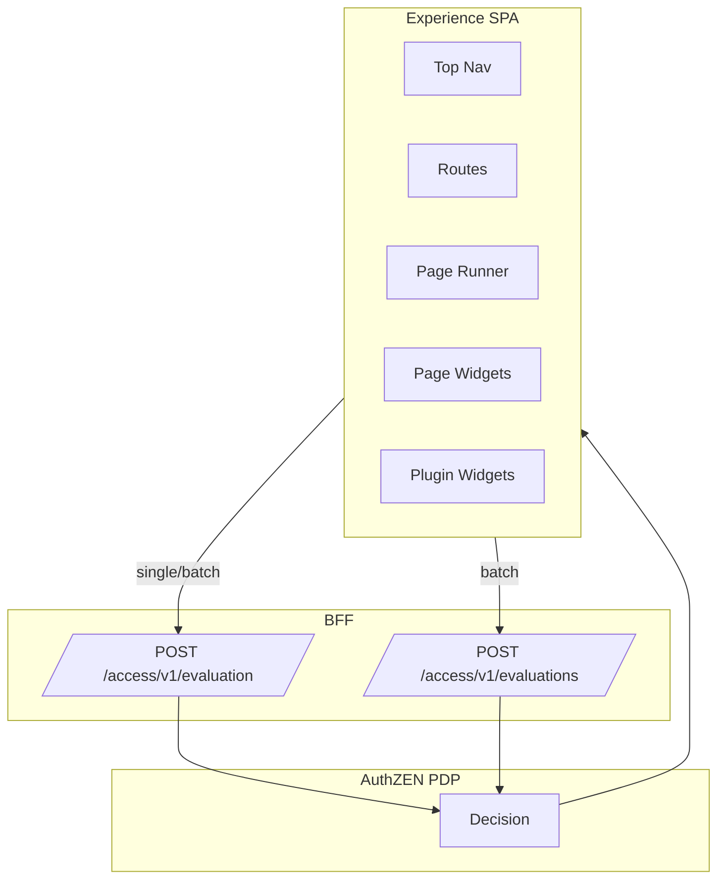
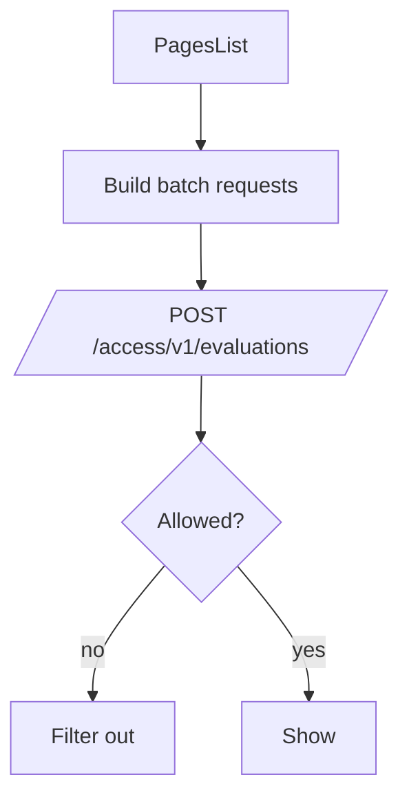

## Overview

Experience enforces authorization end‑to‑end through the BFF using OpenID AuthZEN. No PDP calls are made directly from the browser; all requests go to the BFF under preserved `/access/v1/*` paths using session cookies and CSRF headers.



## Client‑side mechanisms

- `useAuthorization(resourceType, actionName, eager)` — single decision with a short cache (e.g., 60s)
- `PDPStrategy.authorize(type, action, id?, context?)` — direct single evaluate with optional attributes
- `useBatchAuthorization(requests[])` — batch evaluate multiple decisions with a short cache

## PDP endpoints (via BFF)

- Single decision: `POST /access/v1/evaluation`
- Batch decisions: `POST /access/v1/evaluations`
- Paths are preserved exactly; the BFF forwards session cookies and requires CSRF headers for stateful calls.

## What is protected

- Top navigation
  - Workflows link: `useAuthorization('workflows','view_all')`
  - Pages link: `useAuthorization('pages','view_all')`
  - Data, IdP, PDP links: module toggle only (not PDP‑gated)

- Route access
  - Workflows list/runner: `useAuthorization('workflows','view_all')`
  - Tasks page: `useAuthorization('tasks','view_all')`
  - Pages list and page runner: `useAuthorization('pages','view_all')` for route; per‑page decision enforced in `PageRunner`
  - Dynamic plugin routes: `useAuthorization('plugin.route','view')` plus batch pre‑gating via `/access/v1/evaluations`

- Pages list (row‑level)
  - Uses batch authorization to decide which pages appear (per id): `pages:view`

- Page runner (per‑page)
  - Enforces `pages:view` for the specific page id before rendering, with enriched `resource.properties` and `context`

- Page widgets (per‑widget)
  - Grids and Actions batch‑evaluated as `page.widget:view` with widget metadata; unauthorized widgets are hidden

- Dashboard and plugin widgets
  - Core widgets: `tasks:view_summary`, `workflows:execute_quick`
  - Plugin widgets: batch pre‑gated via `/access/v1/evaluations` using `plugin.widget:<pluginId>:<widgetName>`



## Request examples

Nav/route gating (workflows top‑level):

```ts
const response = await fetch('/access/v1/evaluation', {
  method: 'POST',
  headers: {
    'Content-Type': 'application/json',
    'X-CSRF-Token': csrf,
    'X-CSRFToken': csrf,
    'X-Requested-With': 'XMLHttpRequest'
  },
  credentials: 'include',
  body: JSON.stringify({ resource: { type: res }, action: { name: act }, context: {} })
});
```

Pages list (batch per‑id visibility):

```ts
const batch = useBatchAuthorization(
  items.map((p: any) => ({
    key: String(p.id),
    resource: { type: 'pages', id: String(p.id) },
    action: { name: 'view' },
    context: { ui: { app: 'experience', module: 'pages' }, resourceAttributes: { title: p.title, name: p.name } }
  }))
);
```

Page runner (per‑page enforcement with enrichment):

```ts
const resp = await fetch('/access/v1/evaluation', {
  method: 'POST',
  credentials: 'include',
  headers: {
    'Content-Type': 'application/json',
    'X-CSRF-Token': csrf,
    'X-CSRFToken': csrf,
    'X-Requested-With': 'XMLHttpRequest'
  },
  body: JSON.stringify({
    resource: {
      type: 'pages',
      id: String(pageId),
      properties: { title: page?.title, name: page?.name, tags: page?.tags }
    },
    action: { name: 'view' },
    context: { ui: { app: 'experience', module: 'pages', pageId: String(pageId) } }
  })
});
```

Page widgets (batch per‑widget enforcement):

```ts
const reqs = [
  {
    key: `grid:${g.id || 'idx'}`,
    resource: {
      type: 'page.widget',
      id: `${pageId}:grid:${g.id || 'idx'}`,
      properties: { widgetType: 'grid', gridId: g.id, name: g.name }
    },
    action: { name: 'view' },
    context: { ui: { app: 'experience', module: 'pages', pageId, widgetId: `grid:${g.id || 'idx'}` } }
  },
  {
    key: `action:${a?.id || a?.label || 'idx'}`,
    resource: {
      type: 'page.widget',
      id: `${pageId}:action:${a?.id || a?.label || 'idx'}`,
      properties: { widgetType: 'action', actionId: a?.id, label: a?.label }
    },
    action: { name: 'view' },
    context: { ui: { app: 'experience', module: 'pages', pageId, widgetId: `action:${a?.id || a?.label || 'idx'}` } }
  }
];
```

Plugin widgets (batch pre‑gate):

```ts
const res = await fetch('/access/v1/evaluations', {
  method: 'POST',
  credentials: 'include',
  headers: { 'Content-Type': 'application/json' },
  body: JSON.stringify({ evaluations: evals })
});
```

## BFF configuration (PDP batch support)

`ServiceConfigs/BFF/config/routes.yaml` should include:

```yaml
- id: "authzen-evaluation"
  path: "/access/v1/evaluation"
  upstream_path: "/access/v1/evaluation"
  methods: ["POST", "OPTIONS"]
  auth: "session"
  preserve_path: true
- id: "authzen-evaluations"
  path: "/access/v1/evaluations"
  upstream_path: "/access/v1/evaluations"
  methods: ["POST", "OPTIONS"]
  auth: "session"
  preserve_path: true
```

## Enrichment semantics

- Subject: derived from session by the BFF/PDP; not sent explicitly by the client
- Resource: always includes `type`; often includes `id` (pages, widgets, plugins) and `properties` for pages/widgets
- Context: UI envelope `{ ui: { app, module, pageId, widgetId } }` added where available
- Decision compatibility: client accepts `decision`, `allowed`, or `allow`

## Batch utility (hook)

```ts
// useBatchAuthorization.ts — POST /access/v1/evaluations with { evaluations: [...] }
export function useBatchAuthorization(requests) {
  // 60s cache; returns { decisions, loading, error, refresh }
}
```

## Operations and tests

- Restart the BFF to load updated `routes.yaml`; build/reload the Experience app
- Policies should handle:
  - `pages:view` (by id/tags/owner/etc.)
  - `page.widget:view` (by widget type/slot/action)
  - `plugin.widget:view` and `plugin.route:view`
  - coarse `view_all`
- Tests:
  - Pages list filters unauthorized rows (batch)
  - PageRunner denies unauthorized page
  - Widgets hidden unless allowed (batch)
  - Batch route reachable in BFF

## See also

- Experience → Plugins: ./plugins.md
- BFF → Configure PDP: ../bff/how-to/configure-pdp.md
- BFF → PDP cache tuning: ../bff/how-to/pdp-cache-tuning.md
- BFF → Security model: ../bff/explanation/security-model.md
