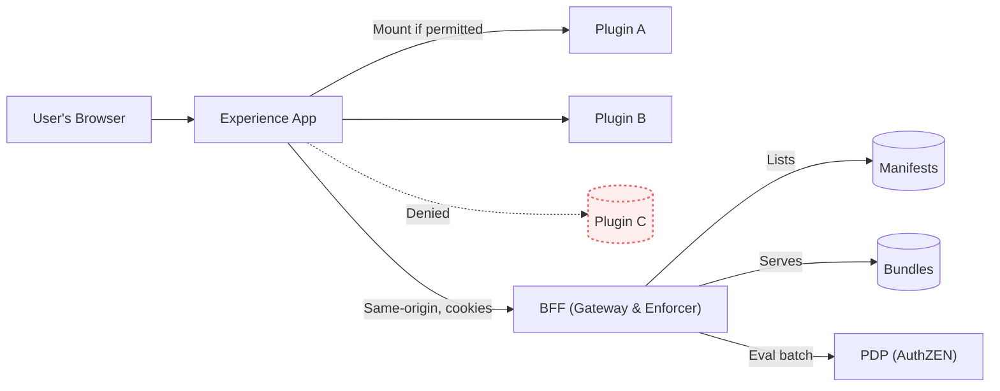
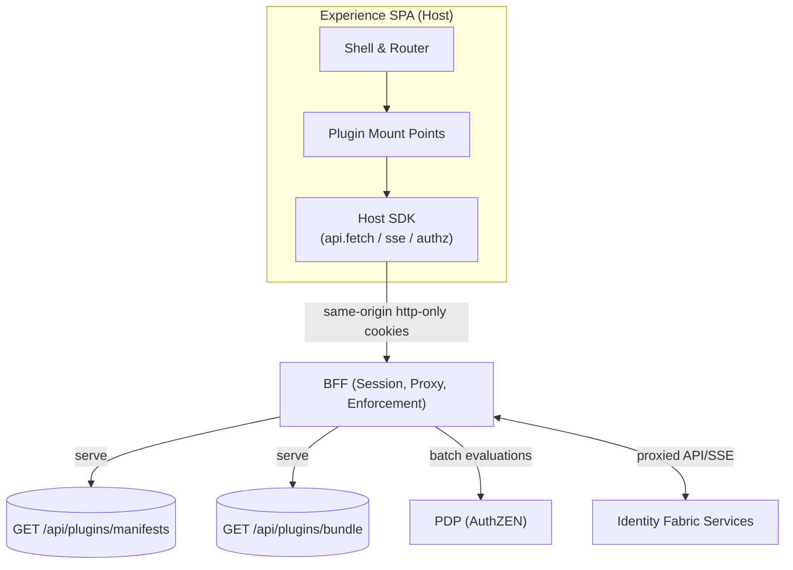
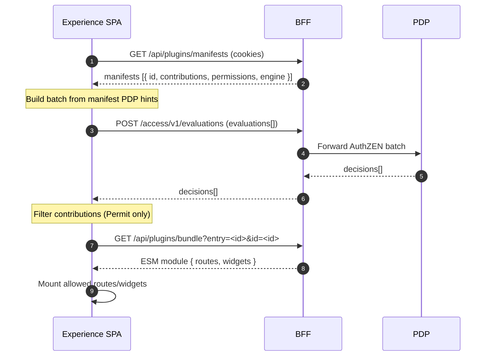
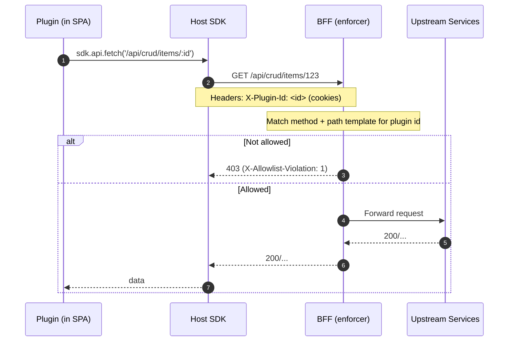
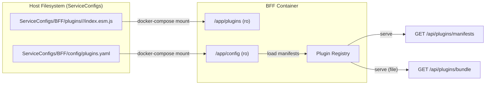

# EmpowerNow Experience — Plugin Architecture

> **30‑second pitch**
> Enterprises need tenant‑specific features without forks, risky redeploys, or brittle iframes. Our plugins are lightweight, same‑origin ESM UI modules the host loads on demand—pre‑authorized by policy and enforced at runtime by a BFF (no browser tokens, strict CSP) with instant quarantine rollback. Developer workflow fits existing CI/CD: build once, place a file under `ServiceConfigs`, register in `plugins.yaml`, and roll out per tenant—no host redeploy. Outcome: faster delivery and safer upgrades with centralized governance, auditability, and lower TCO, on standard web tech.

---

## Quick Navigation (by Role)

**Executives & PMs** → §§1–4, 20, 22
**Architects & Tech Leads** → Full doc; focus on §§5–9, 18–23
**Plugin Developers** → §§5–17 (esp. §§10–12)
**QA Engineers** → §§6–9, 14–15
**Operations Teams** → §§16–18, 21

---

## 1. Executive Summary

The EmpowerNow Experience plugin system enables customers to extend the platform with custom UI components **without modifying the core app**. Plugins are small, independently deliverable ESM modules declared by a manifest and loaded by the host SPA **only after** authorization.

### Business Impact

* **Faster delivery**: Customer‑specific features in days instead of quarters.
* **Zero‑downtime customization**: Enable/disable per tenant via manifests; no SPA redeploy.
* **Risk containment**: Isolated, pre‑gated UI; instant quarantine if issues arise.
* **Multi‑tenant fit**: Different tenants enable different plugins without code branches.

### Technical Excellence

* **Defense‑in‑depth**: Same‑origin ESM + strict CSP + PDP pre‑gating + BFF allow‑lists.
* **Future‑proof**: Independent versioning; semver guard via `engine.experience`.
* **AI‑ready**: Bounded surface (manifest + `routes`/`widgets` + SDK) for safe codegen.
* **Performance‑oriented**: Native `import()` with caching and no iframe overhead.

### What’s distinct

Unlike iframe‑centric models (e.g., many app ecosystems) or proprietary stacks, we use **standard web technologies** with enterprise‑grade security controls—yielding faster development, better UX, and lower TCO.

---

## 2. Key Concepts (Plain Language)

**Plugin** — A small UI extension (widget/page/mini‑app) that can be added without changing the core app.

**Tenant** — A customer org using our platform; each tenant can enable different plugins.

**Manifest** — A plugin’s “passport”: declares contributions (routes/widgets) and permissions (API/SSE allow‑lists), plus compatibility and PDP hints.

**Same‑origin** — Plugin code ships from the **same domain** as the app; existing cookies work and CSP remains tight.

**ESM (ECMAScript Modules)** — Modern JS module format the browser can `import()` natively; no globals; tree‑shakable.

**CSP (Content‑Security‑Policy)** — Browser rules limiting executable sources (we keep `script-src 'self'`).

**PDP (Policy Decision Point)** — AuthZEN service answering, “Is subject S allowed to do action A on resource R?”

**BFF (Backend for Frontend)** — Same‑origin gateway that serves manifests/bundles and **enforces** plugin calls.

**Allow‑lists** — Per‑plugin allowed **method + path templates** (and SSE topics). If not on the list → 403.

---

## 3. The Problem We’re Solving

**Before plugins**: every customization meant core‑app changes, risky updates, and tangled branching logic; time‑to‑market 3–6 months.

**With plugins**: isolated, independently deployable extensions; core upgrades remain safe; each tenant gets exactly what they need; time‑to‑market 3–7 days.

**Real‑world scenarios**

* **Healthcare**: HIPAA‑aligned widget with specific data views, enabled only for that tenant.
* **Financial services**: Multi‑level approval routes as a plugin, not impacting other tenants.
* **Retail**: Inventory integration mini‑app targeting their backend via allow‑listed endpoints.

---

## 4. High‑Level How‑It‑Works

Think of a secure building: the **directory** (BFF) lists apartments (plugins), **security** (PDP) checks access **before doors open**, and all movement is logged; access can be revoked immediately.



---

## 5. System Architecture



**Roles**

* **Experience SPA (host)** — discovers manifests, pre‑gates with PDP, imports ESM bundles, mounts contributions, uses SDK for all I/O.
* **Plugin** — bundle + manifest; exports `routes`/`widgets`, declares allow‑lists.
* **BFF** — validates session, serves manifests/bundles, enforces allow‑lists using `X‑Plugin‑Id`, forwards PDP calls, enriches context.
* **PDP (AuthZEN)** — returns authorization decisions used pre‑mount and during interactions.

---

## 6. Lifecycle (Discovery → Pre‑gating → Load → Mount)



### Loader URL pattern (current)

- The host imports plugin bundles from:
  - `/api/plugins/bundle?entry=<pluginId>&id=<pluginId>`
- Examples:
  - `/api/plugins/bundle?entry=hello-page&id=hello-page`
  - `/api/plugins/bundle?entry=hello-widget&id=hello-widget`

Note: The BFF maps `id` to the configured `bundle.file` on disk and streams the file back as `text/javascript`.

Compatibility note: The SPA loader currently uses query params. If needed later, a path form (e.g., `/api/plugins/bundle/{pluginId}/{version}`) can run in parallel and migrate when convenient.

**Outcome**: **Permit** ⇒ contribution mounts; **Deny/error** ⇒ omitted (no flicker).

---

## 7. Security Model (Defense‑in‑Depth)

1. **Front door — CSP**: only same‑origin scripts; no external script tags or `unsafe-eval`.
2. **Security desk — PDP pre‑gating**: authorize routes/widgets **before** they render.
3. **Access control — BFF enforcement**: every call carries `X‑Plugin‑Id`; method + path‑template allow‑lists checked per request; SSE prefixes gated.
4. **Monitoring — Observability & kill‑switch**: labeled metrics (`{tenant, plugin_id}`); quarantine blocks bundle serving and API/SSE.

**Prevents**: data overreach (only allow‑listed endpoints), code injection (strict CSP), privilege escalation (AuthZEN checks), cross‑tenant bleed (per‑tenant filtering), and unsafe updates (quarantine & semver guard).

---

## 8. Authorization (OpenID AuthZEN)

**Why it matters**: standard request/response shapes, auditability, and consistency across routes, widgets, and actions.

**Endpoints (via BFF, cookies+CSRF)**

* `POST /access/v1/evaluation` (single)
* `POST /access/v1/evaluations` (batch)

**Subject (canonical)**

```json
{"type":"account","id":"auth:account:{provider}:{user_id}"}
```

Provider note: `{provider}` is resolved from the IdP `provider` alias defined in `idps.yaml` (falls back to the IdP entry `name`). Use the same alias across entries with the same issuer to keep ARNs stable across audiences.

**Resources**

* Route: `{"type":"plugin.route","id":"/hello"}`
* Widget: `{"type":"plugin.widget","id":"hello:HelloWidget"}`

**Single evaluation (example)**

```json
{
  "subject": { "type": "account", "id": "auth:account:empowernow:test" },
  "resource": { "type": "plugin.route", "id": "/hello" },
  "action": { "name": "view" },
  "context": {}
}
```

**Response**

```json
{ "decision": "Permit" }
```

**Batch (pre‑gating) example**

```json
{
  "evaluations": [
    { "subject": { "type": "account", "id": "auth:account:empowernow:test" }, "resource": { "type": "plugin.route", "id": "/hello" }, "action": { "name": "view" }, "context": {} },
    { "subject": { "type": "account", "id": "auth:account:empowernow:test" }, "resource": { "type": "plugin.widget", "id": "hello:HelloWidget" }, "action": { "name": "view" }, "context": {} }
  ]
}
```

**Batch response**

```json
{ "decisions": [ { "decision": "Permit" }, { "decision": "Deny" } ] }
```

Notes: The BFF enriches context (`context.client.ip`, `context.client.user_agent`) when absent. Deny/error ⇒ fail‑closed; contributions aren’t mounted.

---

## 9. Runtime Enforcement (Calls)



**Model**: Allow‑lists are **method + path templates** (e.g., `/api/crud/items/:id`) with optional param shapes (e.g., `uuid`), compiled to safe regex after **path normalization**. SSE topics are gated by declared prefixes.

---

## 10. Plugin Development Guide

**What can a plugin be?**

* **Widgets** — PDP‑gated components in dashboard slots (e.g., `dashboard.main`).
* **Pages (routes)** — full screens mounted at declared paths.
* **Mini‑apps** — multiple routes forming a cohesive feature (list → detail → settings).

**Structure**

* **Manifest** — declares contributions and permissions.
* **Bundle (ESM)** — exports React components in `routes` and/or `widgets` records.

**Simple manifest**

```yaml
id: "sales-analytics"
version: "1.0.0"
contributions:
  widgets:
    - slot: "dashboard.main"
      component: "SalesWidget"
permissions:
  api:
    - method: "GET"
      path: "/api/sales/*"
```

**Simple bundle**

```ts
export const widgets = {
  SalesWidget: () => <div>Sales data visualization here</div>
}
```

Constraints & best practices:

* Do **not** create a top‑level Router; the host owns routing (use `/plugins/{pluginId}/…`).
* All HTTP/SSE/AuthZ via **Host SDK**.
* Follow Neon Flux via `@empowernow/ui`; no global CSS; no external scripts/styles.
* Gate sensitive actions with PDP at render time and rely on BFF enforcement at request time.

---

## 11. Component Library (`@empowernow/ui`)

**Why**: Consistency, accessibility, theming, and security.

**Categories**

* Layout: Container, Grid, Stack
* Input: TextField, Select, DatePicker
* Display: Table, Card, Chart
* Feedback: Alert, Toast, Modal
* Navigation: Tabs, Breadcrumb, Menu

**Requesting new components**

1. **Request** with use case & UX (screens), accessibility needs, tokens, and any PDP/security considerations.
2. **Design review** for Neon Flux fit and API ergonomics.
3. **Implementation** with tokens/docs/stories; no CSP relaxations; semver.
4. **Adoption** by updating plugin dependency (host imports global CSS once).
5. **Support** via tracked bugs/enhancements and documented deprecations.

**Temporary gaps & workarounds**: Prefer composing existing primitives. Narrow ESM utilities (e.g., `zod`, lightweight charts) are fine if CSP‑safe and tree‑shakable, with **no global CSS**.

---

## 12. Development Best Practices

**DO**

* Use `@empowernow/ui` components.
* Use the SDK for all calls; implement error boundaries and loading states.
* Test with varied permissions (Permit/Deny).
* Keep bundles small and focused; treat peers as externals.

**DON’T**

* Import third‑party UI kits directly (MUI/Chakra/AntD/Tailwind runtime frameworks).
* Create your own top‑level Router or inject global CSS.
* Make direct API calls or store sensitive data in the browser.

**Checklist**

* [ ] All API calls use the SDK
* [ ] No external UI kits; `@empowernow/ui` only
* [ ] Error boundaries present
* [ ] Loading/empty states handled
* [ ] Permissions respected (pre‑gating + actions)

---

## 13. Theming & Branding (Neon Flux)

* Host loads customer theme from `/api/configs/ui` (live via `/api/configs/stream`).
* `@empowernow/ui` applies tokens/props and theme classes.
* Plugins inherit branding automatically—no per‑tenant CSS in plugins.

Not supported: CSP overrides, external styles/scripts, or injected global CSS.

---

## 14. Version Management (Compatibility)

Plugins declare a host compatibility range via `engine.experience` (semver); the host enforces it at runtime.

**Stable contract**

* Manifest keys/types: `id`, `version`, `engine.experience`, `contributions.routes/widgets`, `permissions.api/sse`.
* Bundle exports: `routes` & `widgets` records of React components.
* SDK surface: `sdk.api.fetch`, `sdk.sse.subscribe`, `sdk.authz.evaluate` (same‑origin, credentials, `X‑Plugin‑Id`).
* PDP naming: `plugin.route:view`, `plugin.widget:view`.

**Guard behavior**

* Not satisfied ⇒ skip import, omit contributions, log diagnostic (optional dev banner off‑prod).
* Near boundary/pre‑release ⇒ allow with warning.

**Breaking vs. additive**

* Additive: new optional manifest fields, optional SDK methods, new contribution slots.
* Breaking: removing/renaming manifest keys, changing required types/semantics, removing SDK methods, changing PDP semantics.

**Example**

```json
{ "engine": { "experience": ">=1.2.0 <2.0.0" } }
```

---

## 15. Testing & Quality Assurance

**Functional**: loads without errors; features work as specified; data correct; forms submit.

**Security**: cannot access unauthorized APIs; no sensitive data exposed; CSP clean; permission boundaries respected.

**Performance**: acceptable load times; no memory leaks; UI smoothness; handles large data.

**Integration**: plays well with other plugins; theming applies; navigation/session correct.

---

## 16. Deployment Process

```
Development → Testing → Staging → Production
```

1. **Development**: build locally; mock data; validate requirements.
2. **Testing**: deploy to test; QA verification; security scan.
3. **Staging**: deploy; customer UAT; performance validation.
4. **Production**: enable per tenant; monitor metrics; allow gradual rollout.

**Rollback**

* Immediate: **Quarantine** (blocks bundle and API/SSE; 403 with `X-Plugin-Quarantined: 1`).
* Fast: disable in manifest.
* Complete: remove plugin entry.

**Import maps & peers (host‑provided)**

```html
<script type="importmap">
{
  "imports": {
    "react": "/vendor/react@18.esm.js",
    "react-dom": "/vendor/react-dom@18.esm.js",
    "@empowernow/ui": "/vendor/empowernow-ui@x.y.esm.js"
  }
}
</script>
```

Benefits: React dedupe, smaller bundles, fewer runtime mismatches, strict CSP. Treat peers as externals.

**SBOM**: CI can emit CycloneDX (`npm run sbom`); publish as artifact (no runtime coupling).

### Developer workflow (Build → Place → Configure → Deploy → Verify)

1. **Build**
   - Author routes and/or widgets and export as ESM.
   - Externalize `react`, `react-dom`, and `@empowernow/ui` (host provides peers via import maps).
   - Produce a single file bundle, for example `index.esm.js`.

   Build examples (turnkey):

   - esbuild (CLI one‑liner):

     ```bash
     npx esbuild src/index.tsx --bundle --format=esm --platform=browser --target=es2020 \
       --outfile=dist/index.esm.js \
       --external:react --external:react-dom --external:@empowernow/ui
     ```

   - esbuild (Node script `build.mjs`):

     ```javascript
     import { build } from 'esbuild';

     await build({
       entryPoints: ['src/index.tsx'],
       bundle: true,
       format: 'esm',
       platform: 'browser',
       target: 'es2020',
       outfile: 'dist/index.esm.js',
       external: ['react', 'react-dom', '@empowernow/ui'],
       jsx: 'automatic',
     });
     ```

   - Rollup (`rollup.config.mjs`):

     ```javascript
     import resolve from '@rollup/plugin-node-resolve';
     import commonjs from '@rollup/plugin-commonjs';
     import esbuild from 'rollup-plugin-esbuild';

     export default {
       input: 'src/index.tsx',
       external: ['react', 'react-dom', '@empowernow/ui'],
       output: { file: 'dist/index.esm.js', format: 'esm' },
       plugins: [
         resolve({ browser: true }),
         commonjs(),
         esbuild({ jsx: 'automatic', target: 'es2020' }),
       ],
     };
     ```

   Place the resulting `dist/index.esm.js` at `ServiceConfigs/BFF/plugins/<pluginId>/<version>/index.esm.js`.
2. **Place**
   - Copy the built bundle to `ServiceConfigs/BFF/plugins/<pluginId>/<version>/index.esm.js`.
3. **Configure**
   - Add or update the entry under `ServiceConfigs/BFF/config/plugins.yaml`:
     - Set `id`, `version`, `engine.experience`.
     - Set `bundle.file` to `/app/plugins/<pluginId>/<version>/index.esm.js`.
     - Add `contributions` and `permissions` (method+path allow‑lists and optional SSE prefixes).
4. **Deploy**
   - BFF containers mount:
     - `../ServiceConfigs/BFF/plugins:/app/plugins:ro`
     - `../ServiceConfigs/BFF/config:/app/config:ro`
   - Restart/reload the BFF to pick up config changes and bundles.
5. **Verify**
   - `GET /api/plugins/manifests` shows your plugin.
   - SPA loads `/api/plugins/bundle?...` with 200 and strong caching headers.
   - PDP pre‑gating permits your contributions; widgets/routes render.

---

## 17. Operations Guide

**Monitoring dashboard** (labels: `{tenant, plugin_id}`): active plugins per tenant, error rates, load times, authorization denials.

**Common tasks**

| Task                    | How                    | Time    |
| ----------------------- | ---------------------- | ------- |
| Enable/disable plugin   | Update manifest        | \~1 min |
| Quarantine/unquarantine | API call               | Instant |
| Check plugin health     | View dashboard         | Instant |
| Update permissions      | Adjust PDP/allow‑lists | \~5 min |

**Troubleshooting**

* **Plugin won’t load**: check `/api/plugins/manifests`; verify PDP; check console; confirm version guard.
* **403s**: ensure `X‑Plugin‑Id` header; review allow‑list templates; confirm PDP rules; look for `X-Allowlist-Violation: 1`.
* **Performance**: inspect bundle size; API call frequency; backend latency; memory leaks.

### Operational procedures

- **Atomic rollout (recommended)**: stage new bundles under `ServiceConfigs/BFF/plugins/.staged/...` and flip to `/app/plugins/<id>/<version>` in one step to avoid broken references.
- **Integrity management (optional, recommended)**: compute sha256 of the final ESM and set `bundle.integrity: "sha256:<hex>"`; on mismatch the BFF fails closed with 409 and `X-Integrity-Error: 1`.
- **Quarantine**: immediate kill switch to block serving and use.
  - `POST /api/plugins/quarantine/{plugin_id}`
  - `POST /api/plugins/unquarantine/{plugin_id}`
- **Hot reload of manifests**: `POST /api/plugins/refresh` reloads `plugins.yaml` without container rebuilds.
- **Monitoring (minimum)**: track bundle serve outcomes/latencies and allow‑list denials by `{tenant, plugin_id, version}`; alert on quarantine/integrity errors.
- **Backups**: treat `ServiceConfigs` as configuration SoT; ensure your normal config backup processes include the plugins folder and `plugins.yaml`.

---

## 18. Configuration Management (BFF Stores & Serves)

**Source‑of‑truth config** (`ServiceConfigs/BFF/config`)

* `routes.yaml` — public/internal endpoints and service targets
* `settings.yaml` — CORS/dev origins, redirect origins, security toggles
* `plugins.yaml` — plugin manifest entries (YAML)

### Storage layout (source of truth)

- Host filesystem (checked into your configuration repo):
  - `ServiceConfigs/BFF/plugins/<pluginId>/<version>/index.esm.js`
- Container mount (BFF):
  - `/app/plugins` (read‑only)
- Configuration (BFF):
  - `ServiceConfigs/BFF/config/plugins.yaml` declares each plugin plus its bundle file path

Storage & mounts (visual)



#### Compose mounts (BFF)

- `docker-compose-authzen4.yml`:
  - `../ServiceConfigs/BFF/plugins:/app/plugins:ro`
  - `../ServiceConfigs/BFF/config:/app/config:ro`
- `docker-compose-nowconnect.yml`:
  - `../ServiceConfigs/BFF/plugins:/app/plugins:ro`
  - `../ServiceConfigs/BFF/config:/app/config:ro`

### Plugin config (`ServiceConfigs/BFF/config/plugins.yaml`)

Example (hello, page, and widget plugins):

```yaml
tenants:
  experience.ocg.labs.empowernow.ai:
    - id: hello
      version: "1.0.0"
      engine:
        experience: ">=1.0.0"
      bundle:
        file: "/app/plugins/hello/1.0.0/index.esm.js"
        # integrity: "sha256:<optional_hex_hash>"
      permissions:
        api:
          - method: GET
            path: /api/plugins/secure-echo
          - method: POST
            path: /api/plugins/telemetry
        sse: []
      contributions:
        routes:
          - path: /hello
            component: Hello
            resource: plugin.route
            action: view
        widgets:
          - slot: dashboard.main
            component: HelloWidget
            resource: plugin.widget
            action: view

    - id: hello-page
      version: "1.0.0"
      engine:
        experience: ">=1.0.0"
      bundle:
        file: "/app/plugins/hello-page/1.0.0/index.esm.js"
      permissions:
        api:
          - method: GET
            path: /api/plugins/secure-echo
        sse: []
      contributions:
        routes:
          - path: /hello-page
            component: HelloPage
            resource: plugin.route
            action: view

    - id: hello-widget
      version: "1.0.0"
      engine:
        experience: ">=1.0.0"
      bundle:
        file: "/app/plugins/hello-widget/1.0.0/index.esm.js"
      permissions:
        api:
          - method: POST
            path: /api/plugins/telemetry
        sse: []
      contributions:
        widgets:
          - slot: dashboard.main
            component: HelloWidget
            resource: plugin.widget
            action: view
```

Key fields:

- `id`/`version`/`engine.experience` — identity and compatibility range
- `bundle.file` — absolute file path inside the container under `/app/plugins`
- `bundle.integrity` (optional) — content hash enforced at serve time
- `permissions` — allow‑list of method+path templates and SSE prefixes
- `contributions` — routes and/or widgets with PDP hints

### Runtime view

- Manifests are served as JSON from `GET /api/plugins/manifests` (`PluginManifest[]`), scoped by tenant host.
- Bundles are served same‑origin from `GET /api/plugins/bundle?entry=<id>&id=<id>` as ESM (`text/javascript`).
- Enforcement data is derived from manifest permissions: method + path templates (optional `params` shapes like `uuid`); compiled to safe regex after path normalization; evaluated per request in memory.

### BFF serving logic

- For each request to `/api/plugins/bundle?...` the BFF:
  - Checks quarantine ⇒ 403 with `X-Plugin-Quarantined: 1` if blocked.
  - Resolves `id` to the configured `bundle.file` (from `plugins.yaml`).
  - Root‑jails: only serves files under `/app/plugins` (prevents traversal).
  - Integrity (optional): if `integrity` is set, verify the sha256 of file content; on mismatch, return 409 with `X-Integrity-Error: 1`.
  - Serves via file streaming with headers:
    - `Content-Type: text/javascript; charset=utf-8`
    - `ETag: sha256-<hex>`
    - `Cache-Control: public, max-age=31536000, immutable`
    - `X-Content-Type-Options: nosniff`
    - `Cross-Origin-Resource-Policy: same-origin`
- Authentication: the bundle route is `auth: session` in `routes.yaml`; an authenticated session is required to fetch bundles.
- Security: Same‑origin ESM means no CSP relaxation.

### Response formats

- `/api/plugins/manifests` → `application/json` → `PluginManifest[]`
- `/api/plugins/bundle` → `text/javascript` → ESM module with `routes`/`widgets` exports

### Operations endpoints

- `POST /api/plugins/refresh` — reload manifests from config (`plugins.yaml`)
- `POST /api/plugins/quarantine/{id}` — immediate block of serving and enforcement for a plugin
- `POST /api/plugins/unquarantine/{id}` — unblock a quarantined plugin

**Related deep dives**: `experience_plugins.md`, `../ms_bff_spike/ms_bff/docs/bff_config.md`, `e2e.md`.

---

## 19. Security Details (Headers & Auth Flow)

**Baseline headers**

```http
Content-Security-Policy: default-src 'self'; script-src 'self'; style-src 'self'; img-src 'self' data:; font-src 'self'; connect-src 'self'; frame-ancestors 'none'; base-uri 'none'; object-src 'none'; require-trusted-types-for 'script'; trusted-types react empowernow-sdk;
Permissions-Policy: accelerometer=(), autoplay=(), camera=(), geolocation=(), gyroscope=(), magnetometer=(), microphone=(), payment=(), usb=()
Vary: Cookie, X-Plugin-Id
```

**Auth flow**

1. User logs into Experience; session cookie is **httpOnly + secure**.
2. All plugin requests include cookie; SDK stamps `X‑Plugin‑Id`.
3. BFF validates session and allow‑lists; forwards PDP checks; no browser tokens.

**Edge hardening**: Permissions‑Policy deny‑by‑default; Trusted Types in **report‑only** to surface unexpected sinks.

---

## 20. Business Benefits (Guidance & Placeholders)

> **Important:** The section below is a template. Replace every placeholder with **measured data** from your deployments. We intentionally avoid unverified claims.

### Cost & Speed

* Summarize *actual* time-to-value deltas (e.g., prototype → production) from specific projects/tenants.
* Note any reduction in change requests or maintenance incidents attributable to plugins.
* Document instances where plugins were upgraded independently of the host (date, scope, outcome).

### Potential Revenue Levers (If Applicable)

* List monetized plugins or add-ons and the pricing model.
* Describe partner ecosystem or onboarding improvements **with sourced metrics**.

### Case Studies (Insert Real Data)

* **Case #1 — \<tenant/project>**: objectives, plugin scope, measured outcomes, dates, and a link to the source (dashboard, ticket, or doc).
* **Case #2 — \<tenant/project>**: objectives, plugin scope, measured outcomes, dates, and source link.
* **Case #3 — \<tenant/project>**: …

> Tip: Cite dashboards or reports (e.g., RUM, APM, data warehouse) beside each metric to ensure auditability.

## 21. Operational Excellence (SLOs & DR Framework)

> **Important:** The figures here are *templates*. Set targets with Ops/SRE after establishing baselines. Do not publish numeric targets without a source.

### SLO Framework

Define and track the following (per tenant and per `plugin_id` where relevant):

* **Plugin load time** (p95)
* **BFF API latency** (p50/p95)
* **Availability** (host + BFF)
* **Error rate** (by `plugin_id`)

Provide a baseline + target table with owners and data sources:

| Metric                    | Baseline | Target | Owner    | Source             |
| ------------------------- | -------- | ------ | -------- | ------------------ |
| Plugin load time (p95)    | \[TBD]   | \[TBD] | Web Perf | RUM dashboard      |
| BFF API latency (p50/p95) | \[TBD]   | \[TBD] | Platform | APM                |
| Availability              | \[TBD]   | \[TBD] | SRE      | Status/SLI service |
| Error rate                | \[TBD]   | \[TBD] | SRE      | Logs/metrics       |

### Monitoring & Alerting (Minimum Set)

Track: plugin load failures, PDP denials, allow‑list violations, API error rates/latency by `plugin_id`.

Alerting examples (customize to your baselines):

* Error rate thresholds (warning/critical)
* Load time thresholds
* Any **security violation** ⇒ page on‑call

### Disaster Recovery

Document your organization’s DR parameters and procedures here:

* **RTO**: \[TBD]
* **RPO**: \[TBD]
* **Backup cadence/retention**: \[TBD]
* **Quarantine procedure**: supported via `/api/plugins/quarantine/{id}` (immediate); include runbook link.

## 22. Competitive Context

| Feature       | EmpowerNow                | Salesforce        | ServiceNow        | Microsoft Teams    |
| ------------- | ------------------------- | ----------------- | ----------------- | ------------------ |
| Technology    | Standard React/ESM        | Proprietary       | Proprietary       | iFrames            |
| Security      | Multi‑layer (CSP+PDP+BFF) | Platform‑confined | Platform‑confined | Cross‑origin seams |
| Performance   | Native import()           | Good              | Good              | Iframe overhead    |
| Dev speed     | Days                      | Weeks             | Weeks             | Days               |
| Customization | Strong                    | Limited           | Limited           | Strong (iframe)    |
| Upgrade path  | Independent               | Platform‑tied     | Platform‑tied     | Complex            |

**Our advantages**: no vendor lock‑in; better UX (no iframe seams); stronger centralized enforcement; familiar tools.

---

## 23. Roadmap (Forward Look)

**Near‑term**: import‑map rollout for peers, enhanced analytics, gradual marketplace, A/B testing hooks.
**Mid‑term**: visual plugin builder, AI‑assisted scaffolds, cross‑tenant sharing options, richer permission templates.
**Long‑term**: ML integrations, NL interfaces, predictive customization, collaborative features.

---

## Appendix A — Glossary

Allow‑list • AuthZEN • BFF • Bundle • CSP • ESM • Manifest • PDP • Plugin • SDK • Tenant • Widget.

---

## Appendix B — Quick Reference

**Important URLs**

* Manifests: `/api/plugins/manifests`
* Bundles: `/api/plugins/bundle`
* Authorization: `/access/v1/evaluations`
* Quarantine: `/api/plugins/quarantine/{id}`
* Unquarantine: `/api/plugins/unquarantine/{id}`
* Refresh manifests: `/api/plugins/refresh`

**Key headers**

* `X‑Plugin‑Id` — identifies calling plugin
* `X‑Plugin‑Quarantined` — present when blocked
* `X‑Allowlist‑Violation` — permission denied marker
* `X‑Integrity‑Error` — integrity hash mismatch on bundle serve

Bundle response headers:

* `Content-Type: text/javascript; charset=utf-8`
* `ETag: sha256-<hex>`
* `Cache-Control: public, max-age=31536000, immutable`
* `X-Content-Type-Options: nosniff`
* `Cross-Origin-Resource-Policy: same-origin`

**Contacts**

* Dev Support: `dev-support@empowernow`
* Operations: `ops-team@empowernow`
* Security: `security@empowernow`
