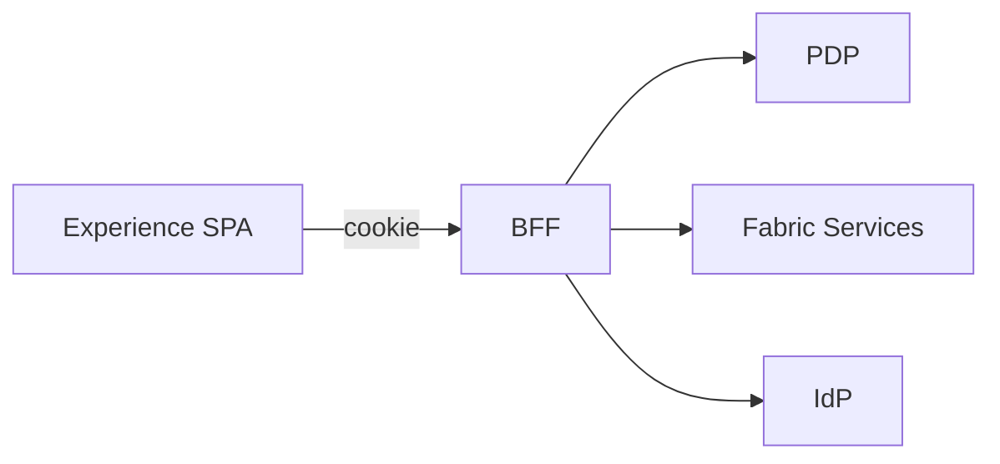

The Experience app is the end‑user portal for the EmpowerNow Identity Fabric Suite. It enables or disables modules dynamically and calls all backends strictly through the BFF.

Quick links:

- Overview & Spec → Experience React App
- Plugins → Experience Plugin System

> Canonical reference for the plugin architecture: `./experience_plugins`

## Executive overview

- 30‑second pitch: A unified, policy‑aware end‑user portal that turns the Identity Fabric into a live product surface — zero tokens in the browser, strict CSP, and instant governance of tenant‑specific features via plugins.
- Business impact: faster delivery (days, not quarters), zero‑downtime customization per tenant, safer upgrades (quarantine/semver guard), centralized auditability and lower TCO.
- What’s distinct: same‑origin ESM plugins, PDP pre‑gating and BFF enforcement, not iframes or cross‑origin scripts.

How it works at a glance:

What to see in a demo:

- Tasks/approvals and workflow launch with live updates (SSE)
- PDP‑gated nav/routes/widgets and row‑level actions
- Plugin enable/disable per tenant; instant quarantine rollback
- Observability (events/metrics) and security headers baseline

Key links:

- Executive overview: `./executive-overview`
- Canonical plugin reference: `./experience_plugins`
- Quickstart: `./quickstart`
- Security reference: `./security-reference`
- Ops runbook: `./ops-runbook`
## What’s new

- Template‑based allow‑lists (method + path with param shapes); violations return `X-Allowlist-Violation: 1`
- Plugin quarantine endpoints; blocked responses include `X-Plugin-Quarantined: 1`
- Optional bundle integrity (`bundle.integrity: sha256:<hex>`); mismatch `X-Integrity-Error: 1`
- Import‑maps groundwork to externalize React/ReactDOM/@empowernow/ui peers
- CI: CycloneDX SBOM (`npm run sbom`) for the Experience SPA

## What is it?

Experience is a PDP‑aware, zero‑token React application that surfaces Fabric capabilities (pages, workflows, tasks, approvals) in one place. Every route, widget and action is authorized via OpenID AuthZEN through the BFF; no access tokens ever reach the browser.

## Why do we need it?

Modern identity programs ship multiple consoles (IdP, PDP, automation, inventory). Enterprises end up with fragmented UX, duplicated navigation, and security trade‑offs (tokens in the browser, CSP relaxations for third‑party widgets). Experience solves this by:

- Unifying product surfaces into a single portal with runtime module activation (via `/api/configs/ui` + SSE)
- Enforcing policy at the UX layer using the same PDP that protects APIs
- Preserving strict CSP by loading same‑origin plugin bundles through the BFF
- Eliminating browser token risk with the BFF session model (same‑origin cookies only)

## Industry challenges it addresses

- Fragmented, tile‑only “launchers” that don’t support policy‑guarded actions (common in SSO portals)
- Plugin ecosystems that require cross‑origin scripts or iframes, weakening CSP and auditability
- Inconsistent authorization between UI and API layers
- Tenants running different subsets of services, forcing forks or rebuilds per customer

## How Vibe Coding helps

Vibe Coding is our delivery discipline built around the Neon Flux design system (`@empowernow/ui`) and app scaffolds. It provides:

- A consistent component library and tokens for premium UX with zero bespoke CSS
- A starter wiring (`@empowernow/bff-auth-react`, React Query, SSE helpers) to remove boilerplate
- Guardrails (CSP, routing, auth/session patterns) so teams focus on features—not plumbing

## Market landscape and how we compare

- App launchers (Okta, ForgeRock, others) typically provide SSO tiles; Experience adds policy‑guarded pages, workflow execution, and PDP‑aware widgets
- ITSM portals expose tickets and request forms; Experience executes identity workflows with AuthZEN enforcement and CAEP/OTEL observability end‑to‑end
- Micro‑frontend frameworks often rely on remote scripts/iframing; our BFF‑proxied, same‑origin plugin model keeps CSP `script‑src 'self'` and enables per‑plugin allow‑lists, rate‑limits, and telemetry

## Primary use cases

- Tasks & approvals (CRUD Service) with live counters via SSE
- Workflow launch and monitoring with resume/cancel
- Page runner for search, tables and actions grounded in YAML page configs
- Announcements and PDP‑aware dashboard widgets (including plugin‑contributed)

## Personas

- End users: complete tasks and approvals; run workflows they are allowed to run
- App owners / COEs: publish pages and workflows to business users with policy guardrails
- Security / Platform: enforce PDP, observe CAEP/OTEL, and govern plugins via allow‑lists

